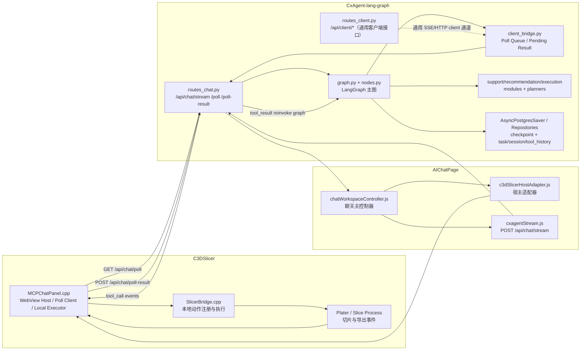
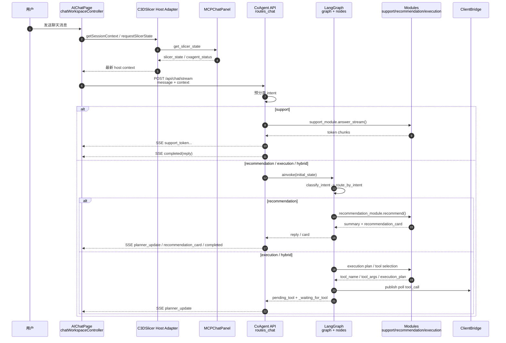
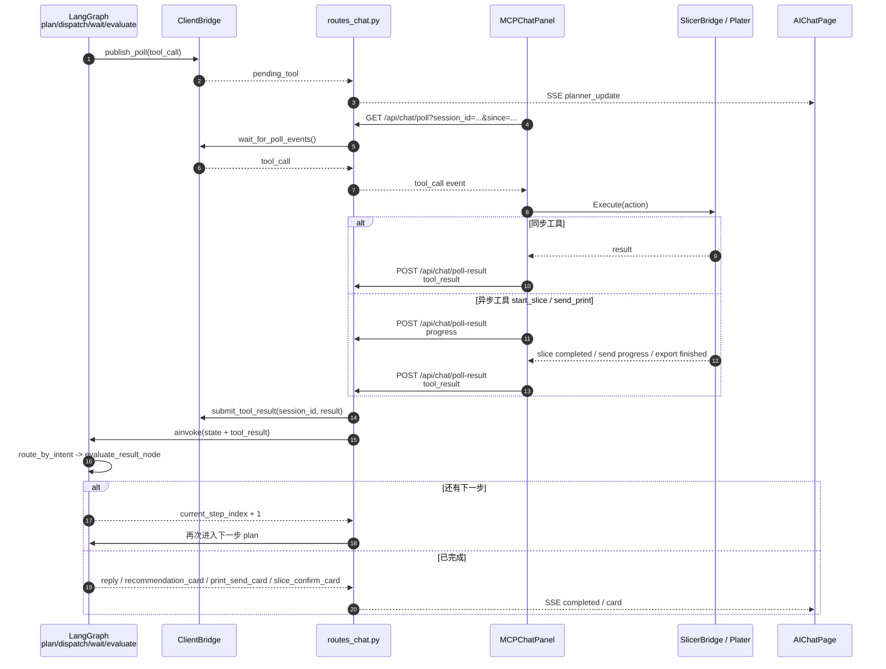

# C3DSlicer / AIChatPage / CxAgent-lang-graph 调用关系图与时序图

## 1. 文档目标

本文档用于梳理以下三个项目之间在当前实现下的真实协作关系：

- `C3DSlicer`
- `CrealityCommunity/AIChatPage`
- `CxAgent-lang-graph`（仓库路径：`D:\my-project\CxAgent-lang-graph\CxAgent`）

重点回答四个问题：

- 聊天主请求现在到底从哪里发起
- 本地切片器动作到底由谁执行
- `session_id / client_id` 在新架构下由谁持有和同步
- `planner_update / tool_call / tool_result` 在三边如何流转

## 2. 关键结论

- `AIChatPage` 仍然是聊天 UI 和聊天主控制器。
- `MCPChatPanel` 仍然不是聊天主请求的唯一入口，它更像 `WebView Host + JS/C++ Bridge + 本地动作执行器 + 长轮询客户端适配层`。
- 新 `CxAgent` 的核心已经从旧的命令式 `Orchestrator + ToolRouter + WebSocket`，切换为 `LangGraph StateGraph + ClientBridge + SSE/HTTP`。
- 当前聊天主链路的主入口是 `POST /api/chat/stream`，不是旧的 `WS push tool_call` 主导模式。
- `support` 意图在当前实现中会直接走 `support_module.answer_stream()`，通常绕过 LangGraph 主图。
- `recommendation / execution / hybrid` 才会进入 LangGraph 主图。
- 工具调用的当前主链路不是旧的 `server -> WebSocket -> client`，而是：
  - `server graph -> ClientBridge poll queue -> /api/chat/poll -> MCPChatPanel -> SlicerBridge`
  - `MCPChatPanel -> /api/chat/poll-result -> ClientBridge -> routes_chat 重新调用 graph`
- 仓库里虽然已经有 `subgraphs/` 设计，但当前实际运行时 `enable_subgraphs=False`，所以真实行为是“主图 + 外层手工等待工具结果”的折中方案。

## 3. 三个项目的职责边界

### 3.1 C3DSlicer

核心文件：

- `src/slic3r/GUI/simple/MCPChatPanel.cpp`
- `src/slic3r/GUI/simple/MCPChatPanel.hpp`
- `src/slic3r/GUI/simple/bridge/CxAgentClientBridge.cpp`
- `src/slic3r/GUI/simple/bridge/SlicerBridge.cpp`

主要职责：

- 承载 AIChatPage 的 WebView 页面
- 提供 `window.wx.postMessage` 或 `window.chrome.webview.postMessage` 桥接
- 同步 slicer 场景状态、选中模型、切片结果、设备状态
- 轮询后端获取 `tool_call`
- 调用本地 `SlicerBridge` / `Plater` / UI 事件执行真实动作
- 将本地执行进度、工具结果、切片完成事件回传给后端
- 将后端返回的卡片和状态继续回推给前端页面

### 3.2 AIChatPage

核心文件：

- `src/controller/chatWorkspaceController.js`
- `src/host/c3dSlicerHostAdapter.js`
- `src/protocol/cxagentStream.js`
- `src/protocol/cxagentWebSocketClient.js`
- `src/actions/chatActions.js`
- `src/actions/actionHandlers.js`

主要职责：

- 承载聊天消息列表、planner 卡片、推荐卡片、动作按钮
- 组装聊天上下文并发起 `POST /api/chat/stream`
- 从宿主侧同步 `slicer_state / cxagent_status / session context`
- 渲染 `completed / recommendation_card / print_send_card / slice_confirm_card`
- 将前端动作转换成 host command 或确认类请求
- 在部分模式下仍可兼容旧的实时 client 通道，但已不是后端主流程的中心

### 3.3 CxAgent-lang-graph

核心文件：

- `sagent/main.py`
- `sagent/dependencies.py`
- `sagent/domain/state.py`
- `sagent/domain/graph.py`
- `sagent/domain/nodes.py`
- `sagent/api/routes_chat.py`
- `sagent/api/routes_client.py`
- `sagent/infra/client_bridge.py`
- `sagent/domain/planners/compound_planner.py`
- `sagent/domain/tools/registry.py`

主要职责：

- 维护基于 `LangGraph StateGraph` 的任务状态机
- 做意图识别、推荐生成、执行规划和工具选择
- 对复合操作拆步骤并维护 `execution_plan / current_step_index`
- 通过 `ClientBridge` 管理聊天主链路中的 `poll queue / pending tool / tool result`
- 通过 `SSE` 将聊天回复、planner 状态、卡片结果持续输出给前端
- 使用 PostgreSQL Checkpointer 持久化 LangGraph checkpoint
- 记录 `session / task / tool_history / interrupt_state / billing`

## 4. 当前真实调用关系图

## 5. 主时序图

说明：

- 这张图描述“用户发一条消息”后的当前主链路
- `support` 会直接流式回答
- `recommendation / execution / hybrid` 会进入 LangGraph 主图

## 6. 工具执行闭环时序图

说明：

- 这张图描述 execution/hybrid 请求真正进入本地动作执行后的闭环
- 当前真实实现不是“图内部阻塞等待”，而是 `routes_chat.py` 外层循环等待本地结果后再次调用 graph

## 7. 新架构下 session_id / client_id 的真实归属

当前新后端里，`session_id` 和 `client_id` 的地位已经发生变化：

### 7.1 session_id

- `session_id` 仍然是三边共享的主关联键
- `AIChatPage` 发起 `POST /api/chat/stream` 时会携带 `session_id`
- `routes_chat.py` 用它关联：
  - LangGraph `thread_id`
  - `ClientBridge` 的 SSE / poll 队列
  - `SessionDB / TaskDB / ToolHistory`
- 在当前桌面模式下，`session_id` 仍通常由宿主侧生成并同步给前端

### 7.2 client_id

- `client_id` 不再是旧 WebSocket 架构里的核心实时身份
- 它现在更多是：
  - `POST /api/session/init`
  - `POST /api/client/hello`
  - `SessionDB.client_id`
  里的附属标识
- 当前聊天主链路的核心调度不依赖 `client_id`

这意味着：

- `session_id` 仍是当前主流程的关键主键
- `client_id` 已从“实时 WS client owner”退化为“可选客户端标识”
- 桌面宿主侧依旧负责把身份信息同步给前端，但后端图执行主要围绕 `session_id` 运转

## 8. planner_update / tool_call / tool_result 的当前真实流转

### 8.1 planner_update

主链路里主要走：

- `graph/nodes` 产出 `planner_message`
- `routes_chat.process_result_and_push_events()` 转为 SSE `planner_update`
- `AIChatPage` 渲染 planner UI

同时仓库里还保留了一条辅助路径：

- 某些节点会直接调用 `SSEEventBridge.publish("planner_update")`
- 这条路径更偏向 `/api/client/events`

当前要特别注意：

- `ClientBridge` 主链路
- `SSEEventBridge` 通用链路

两套桥在仓库里并存，存在事件来源不完全一致的风险

### 8.2 tool_call

当前真实主链路：

- `dispatch_tool_node()` 生成 `tool_call`
- `ClientBridge.publish_poll(session_id, "tool_call", tool_call)`
- 本地 client 通过 `GET /api/chat/poll` 取到事件
- `MCPChatPanel -> SlicerBridge` 执行本地动作

### 8.3 tool_result

当前真实主链路：

- `MCPChatPanel` 执行完本地动作
- 通过 `POST /api/chat/poll-result` 回传：
  - `tool_result`
  - 或 `progress`
  - 或 `context_update`
- `routes_chat.py` 将结果写入 `ClientBridge`
- `chat.stream` 背景循环检测到 `tool_result`
- 重新构造 state 并再次 `ainvoke()` graph
- graph 进入 `evaluate_result_node`

## 9. 关键源码定位

### 9.1 C3DSlicer

- `MCPChatPanel` 初始化 WebView 与 bridge：`src/slic3r/GUI/simple/MCPChatPanel.cpp`
- 注册 JS 指令路由：`RegisterAllHandlers()`
- 处理 host / cxagent 消息：`HandleIncomingMessage()` 一类逻辑
- 切片完成回调：`OnSliceProcessCompleted()`、`OnExportFinished()`
- 状态回推前端：`SendCommandToJS()`、`NotifyCxAgentStatus()`
- slicer 动作注册与执行：`src/slic3r/GUI/simple/bridge/SlicerBridge.cpp`

### 9.2 AIChatPage

- 主控制器：`AIChatPage/src/controller/chatWorkspaceController.js`
- 宿主桥接：`AIChatPage/src/host/c3dSlicerHostAdapter.js`
- SSE 聊天：`AIChatPage/src/protocol/cxagentStream.js`
- 动作映射：`AIChatPage/src/actions/chatActions.js`
- 响应映射：`AIChatPage/src/protocol/cxagentMessageMapper.js`

### 9.3 CxAgent-lang-graph

- FastAPI 入口：`D:\my-project\CxAgent-lang-graph\CxAgent\sagent\main.py`
- 依赖容器：`D:\my-project\CxAgent-lang-graph\CxAgent\sagent\dependencies.py`
- Agent 状态：`D:\my-project\CxAgent-lang-graph\CxAgent\sagent\domain\state.py`
- LangGraph 主图：`D:\my-project\CxAgent-lang-graph\CxAgent\sagent\domain\graph.py`
- 当前主图节点：`D:\my-project\CxAgent-lang-graph\CxAgent\sagent\domain\nodes.py`
- 聊天主入口：`D:\my-project\CxAgent-lang-graph\CxAgent\sagent\api\routes_chat.py`
- 通用 client API：`D:\my-project\CxAgent-lang-graph\CxAgent\sagent\api\routes_client.py`
- poll / pending result 桥：`D:\my-project\CxAgent-lang-graph\CxAgent\sagent\infra\client_bridge.py`
- 通用 SSE 桥：`D:\my-project\CxAgent-lang-graph\CxAgent\sagent\infra\sse_bridge.py`
- 复合步骤规划：`D:\my-project\CxAgent-lang-graph\CxAgent\sagent\domain\planners\compound_planner.py`
- 工具注册表：`D:\my-project\CxAgent-lang-graph\CxAgent\sagent\domain\tools\registry.py`
- Checkpointer：`D:\my-project\CxAgent-lang-graph\CxAgent\sagent\infra\async_pg_saver.py`

## 10. 当前实现中的重点注意事项

- `support` 当前通常绕过 LangGraph 主图，因此“所有请求都走 graph”并不成立。
- 仓库里已经存在 `subgraphs/support_graph.py`、`recommendation_graph.py`、`execution_graph.py`，但容器实际编译图时 `enable_subgraphs=False`，当前生产逻辑以主图为准。
- `nodes.py` 与 `nodes_simple.py` 存在两套并行实现，测试覆盖里对 `nodes_simple.py` 的关注度较高，存在实现漂移风险。
- `ClientBridge` 与 `SSEEventBridge` 两套桥并存，当前聊天主链路主要靠 `ClientBridge`，但部分节点仍向 `SSEEventBridge` 发事件。
- `send_print` 已经被做成场景化工作流：
  - 有有效 gcode：正常下发 `send_print`
  - 有模型但未切片：先返回 `slice_confirm_card`
  - 无有效 gcode：直接返回 `print_send_card(error)`
- `start_slice` 成功后，后端会把结果进一步转成 `slice-complete` 推荐卡片，而不是只返回简单文本。
- `client_id` 在新架构里已经不是主调度主键，不能再按旧 WebSocket owner 的思路理解它。

## 11. 推荐后续改造方向

- 明确当前正式链路到底以 `routes_chat + ClientBridge` 为准，还是要进一步收敛到 `/api/client/* + interrupt()` 的纯 LangGraph 模式，避免双轨长期并存。
- 给 `tool name -> host command -> slicer action` 维护单一真相表，减少 `ToolRegistry / AIChatPage / C++` 三边漂移。
- 把“support 绕过 graph”与“recommendation/execution 进入 graph”的边界显式写清，避免前后端误以为所有请求都能用统一恢复机制处理。
- 收敛 `nodes.py / nodes_simple.py`，否则后续修一个分支、跑的是另一个分支，会持续制造排障成本。
- 统一 `planner_update` 的唯一发布源，避免 `ClientBridge` 和 `SSEEventBridge` 混发导致前端观察结果不一致。

## 12. 一句话总结

当前新架构已经不是“AIChatPage 直接连一个旧式 Agent + WebSocket”。

真实形态是：

- `AIChatPage` 负责聊天 UI 和 `POST /api/chat/stream`
- `MCPChatPanel` 负责宿主桥接、本地动作执行和 `poll / poll-result`
- `CxAgent-lang-graph` 负责 LangGraph 状态机、工具规划、结果评估和卡片化输出

三者通过 `HTTP/SSE + Poll Queue + 本地执行回传` 共同组成完整闭环。

---

## 13. AI/simple 创想云设备发送的当前真实链路（2026-04）

在当前阶段，AI/simple 的创想云设备发送已经不是“前端 send page 补收尾”的旧路径，而是下面这条真实闭环：

1. `CxAgent` 输出 `send_to_printer` 或相关 planner card
2. `AIChatPage` 渲染 send card，并通过宿主桥触发发送
3. `MCPChatPanel` 把发送动作转给 `AISendWorkflowService`
4. `AISendWorkflowService` 组装 `print_data`
5. `EasyPrintSender` 负责上传 GCode
6. 上传成功后，如果当前目标被判定为 Cloud 且云闭环开启：
   - 进入 `CxCloudPrintExecutor`
   - 执行 `set_print_calibration`
   - 轮询 `get_gcode_detail`
   - 多色时执行 `parse_gcode / query_parse_gcode`
   - 最终调用 `add_single_task`
7. 执行结果再回推给 `AISendWorkflowService`
8. `AISendWorkflowService` 再把进度与结果同步给 AIChatPage 卡片

### 13.1 本阶段新增的关键代码角色

与云设备发送直接相关的当前主文件：

- `src/slic3r/GUI/simple/sendWorkflow/AISendWorkflowService.cpp`
- `src/slic3r/GUI/simple/sendWorkflow/EasyPrintSender.cpp`
- `src/slic3r/GUI/simple/sendWorkflow/CxCloudPrintExecutor.cpp`
- `src/slic3r/GUI/simple/sendWorkflow/CxCloudPrintClient.cpp`
- `src/slic3r/GUI/simple/filamentMapping/ImGuiFilamentPanel.cpp`

它们之间的职责边界是：

- `AISendWorkflowService`：组装 AI/simple 发送上下文与卡片状态
- `EasyPrintSender`：上传入口与云闭环切入点
- `CxCloudPrintExecutor`：云设备后半段执行状态机
- `CxCloudPrintClient`：创想云相关 API 封装
- `ImGuiFilamentPanel`：导出 `color_match_info` 与原始 `cId`

### 13.2 本阶段最关键的业务修正：`cId` 最终收口

本阶段联调确认，AI/simple 云设备发送中最大的实际风险点之一，不是上传本身，而是最终 `filamentsList` 里的 `cId` 是否正确。

因此当前实现已经增加双层收口：

- 第一层：`AISendWorkflowService` 在构造 `print_data.color_match_info` 后，对目标云设备视角下的 `cId` 做回填。
- 第二层：`CxCloudPrintExecutor` 在构造 `addSingleTask payload` 时，再结合 `query_parse_gcode` 的 `filamentsList` 结果做最终修正。

当前最终 `cId` 优先级为：

1. 已有 `cId`
2. 云设备 `boxColorInfos` 对应 `cId`
3. `query_parse_gcode` 返回的 `filamentsList[].cId`
4. `slotLabel -> cId` 推导

### 13.3 当前阶段的联调约束

由于专业模式在同 MAC 双通道场景下更接近“LAN 优先尝试”，而当前阶段我们需要先单独验证云链路，所以 AI/simple 联调代码中加入了测试宏：

- `C3D_AI_SIMPLE_FORCE_CLOUD_DEVICE_FOR_TEST`
- `C3D_AI_SIMPLE_FORCE_CLOUD_CLOSED_LOOP_FOR_TEST`

这两个宏仅用于当前阶段验证 AI/simple 的创想云设备发送闭环，不应直接等同于正式版最终优先级策略。

### 13.4 当前阶段建议重点观察的日志

联调这条链路时，建议优先关注 `D:/log.txt` 中以下日志：

- `stage=start_send_internal`
- `query_parse_gcode state attempt=...`
- `query_parse_gcode filamentsList=...`
- `resolve_material_cid extruder_id=...`
- `addSingleTask payload=...`

它们能直接回答以下问题：

- 当前是否已经进入云闭环
- GCode 是否已 ready
- 多色解析是否完成
- 最终任务中的 `cId` 是否为空
- 当前失败究竟发生在上传后哪一段

## 14. 云发送与局域网发送的日志判定速查（2026-04）

后续联调 AI/simple 发送时，最先看一条 `stage=start_send_internal` 就够了。优先关注这几个字段：

- `target_device.deviceType`
- `target_device.address`
- `cloud_workflow_active`
- `cloud_closed_loop_enabled`
- `print_data.upload_device_key`

### 14.1 一眼判断云发送

如果是云发送，通常会同时满足：

- `target_device.deviceType=1`
- `cloud_workflow_active=true`
- `upload_device_key` 不是局域网 IP，而是云设备地址 / `deviceName`
- 上传完成后进入 `EasyPrintSender::startPrintCloud`
- 后续出现 `CxCloudPrintExecutor`
- 后续出现云闭环关键日志：
  - `wait_cloud_gcode_ready`
  - `parse_gcode_start`
  - `query_parse_gcode`
  - `addSingleTask payload=...`

典型成功结果还会出现：

- `Cloud closed-loop executor accepted the request.`
- `Cloud print task created.`

### 14.2 一眼判断局域网发送

如果是局域网发送，通常会同时满足：

- `target_device.deviceType=0`
- `target_device.address` 是局域网 IP，例如 `172.x.x.x`、`192.168.x.x`
- `cloud_workflow_active=false`
- `upload_device_key` 也是局域网 IP
- 上传完成回包更接近 LAN 风格，例如：
  - `{ "code": 200, "message": "OK" }`
- `EasyPrintSender::startPrint` 会明确打印：
  - `Upload result does not contain cloud task metadata. Falling back to LAN print.`
- 后续进入 `EasyPrintSender::startPrintLan`
- 末尾通常还能看到：
  - `PrinterState] DeviceType=0, IP=...`

### 14.3 不要误判的三个点

- 不能只看设备管理页视觉上像“云设备”，就认定本次发送走云。
- 同一台机器在同 MAC 双通道场景下，本次真正走哪条链路，要以 `start_send_internal` 里选中的 `target_device` 为准。
- `cloud_closed_loop_enabled=true` 只表示“如果本次被判定为 Cloud，则允许走新云闭环”；它本身不能单独证明这次一定是云发送。
