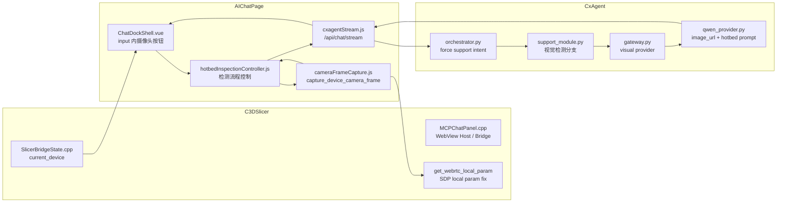
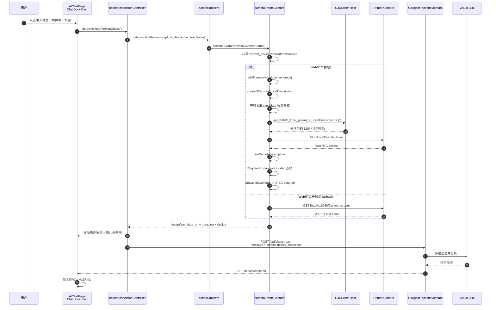

# AIChatPage 热床异物检测链路说明

## 1. 文档目标

本文档记录“AI 切片助手输入框内摄像头按钮”的实现链路，覆盖以下问题：

- 按钮在哪里渲染、何时可点击。
- 摄像头截图由谁发起、通过什么 toolcall 执行。
- WebRTC / MJPEG 截图路径如何选择。
- 图片如何随聊天请求发送给 CxAgent。
- CxAgent 如何识别这是热床异物检测，而不是普通切片问答。
- 为什么检测后的后续普通提问不会继续复用上一张热床图片。

## 2. 关键结论

- 热床检测按钮属于 `CrealityCommunity/AIChatPage` 的新聊天页，不再维护旧 `resources/web/chat/chat.js` 页面逻辑。
- 摄像头抓帧被抽成通用本地 toolcall：`capture_device_camera_frame`。热床检测只是该 toolcall 的一个调用方，后续其他视频截图能力也应该复用它。
- 当前截图按设备能力选择 WebRTC 或 MJPEG：新机型优先 WebRTC，本地参数修正依赖 C3DSlicer 宿主动作 `get_webrtc_local_param`；老机型或明确不支持 WebRTC 的设备走 MJPEG。
- AIChatPage 直接把图片作为 `context.device_inspection.images[].data_url` 发给 `CxAgent /api/chat/stream`。
- CxAgent 看到 `context.device_inspection.kind == "hotbed_foreign_object_check"` 时，强制走 `support` 路径，并使用视觉模型处理图片。
- `device_inspection` 是一次性上下文，CxAgent 不会把它持久化到 session，避免检测完成后普通聊天继续返回上一张图的检测结果。

## 3. 涉及项目与文件

### 3.1 C3DSlicer

- `src/slic3r/GUI/simple/MCPChatPanel.cpp`
- `src/slic3r/GUI/simple/bridge/SlicerBridgeState.cpp`
- `resources/web/chat/aichatpage.host.html`

主要职责：

- 承载 AIChatPage WebView，正式代码加载 `resources/web/chat/aichatpage.host.html`。
- 提供 `get_webrtc_local_param` 宿主动作，供前端 WebRTC 抓帧前修正本地 SDP 参数。
- 在 `get_slicer_state` 中提供 `current_device`，供前端判断是否有当前绑定设备、设备是否在线、设备 LAN 地址是否可用。
- 生产模式下通过 `aichatpage.host.html` 加载 AIChatPage 前端产物。

### 3.2 CrealityCommunity / AIChatPage

- `AIChatPage/src/layout/ChatDockShell.vue`
- `AIChatPage/src/controller/chatWorkspaceController.js`
- `AIChatPage/src/controller/hotbedInspection/hotbedInspectionController.js`
- `AIChatPage/src/actions/actionHandlers.js`
- `AIChatPage/src/actions/chatActions.js`
- `AIChatPage/src/actions/cameraFrameCapture.js`
- `AIChatPage/src/widgets/MessageBubble.vue`
- `AIChatPage/src/state/chatWorkspaceStore.js`

主要职责：

- 在输入框左下角渲染摄像头线条图标按钮。
- 根据设备状态、流式回复状态、抓图状态控制按钮禁用。
- 点击后调用 `capture_device_camera_frame`。
- 把抓到的 JPEG 以缩略图显示在用户消息中。
- 构造 `context.device_inspection` 并发起 `/api/chat/stream`。
- 将检测结果以普通 assistant 消息流式渲染。

### 3.3 CxAgent

- `server/app/domain/services/orchestrator.py`
- `server/app/domain/modules/support_module.py`
- `server/app/domain/llm/gateway.py`
- `server/app/domain/llm/providers/qwen_provider.py`

主要职责：

- 将热床检测上下文强制归类为 `support`。
- `SupportModule` 跳过知识库提示和普通排障模板，直接调用 LLM gateway。
- LLM gateway 对热床检测切到视觉 provider。
- Qwen provider 将 `data_url` 组装成多模态 `image_url` 消息，并使用热床专用提示词。
- session 持久化时过滤 `device_inspection`。

## 4. 总体调用关系



## 5. 点击检测按钮时序



## 6. 摄像头抓帧 toolcall

### 6.1 Tool 名称

```text
capture_device_camera_frame
```

### 6.2 调用方

当前直接调用方是：

- `AIChatPage/src/controller/hotbedInspection/hotbedInspectionController.js`

间接注册与映射位置：

- `AIChatPage/src/actions/actionHandlers.js`
- `AIChatPage/src/actions/chatActions.js`

### 6.3 返回结构

```json
{
  "source_action": "capture_device_camera_frame",
  "mime_type": "image/jpeg",
  "data_url": "data:image/jpeg;base64,...",
  "name": "hotbed.jpg",
  "transport": "webrtc",
  "captured_at": "2026-04-16T00:00:00.000Z",
  "slicer_state": {},
  "device": {
    "name": "K2 Plus",
    "address": "192.168.x.x",
    "device_type": 0,
    "online": true
  }
}
```

`transport` 当前可能值：

- `webrtc`
- `mjpeg`

### 6.4 设备校验

抓帧前端按 `current_device` 做基础校验：

- `valid == true` 或 `has_bound_device == true`
- `address` 非空
- `online == true`

失败时不发送聊天请求，只在聊天区显示错误。

### 6.5 WebRTC 抓帧细节

新机型本地摄像头通常走 WebRTC，而不是 MJPEG。当前抓帧实现刻意对齐设备页的本地 WebRTC 播放逻辑，关键点如下：

- `RTCPeerConnection` 使用 `{ iceServers: [] }`。
- video transceiver 使用 `sendrecv`，不要用 `recvonly`。
- `createOffer()` 后先 `setLocalDescription()`。
- 等待 ICE candidate 收集完成，再把最终 `peer.localDescription.sdp` 交给宿主。
- 宿主动作 `get_webrtc_local_param` 负责把 SDP 中 mDNS candidate 地址替换成本机局域网 IP，并处理加密视频信令。
- 非加密设备再由前端 `POST http://<ip>:8000/call/webrtc_local`。
- 加密设备由宿主侧请求 `https://<ip>/call/webrtc_local`，前端直接使用宿主返回的 answer。
- 收到 answer 后 `setRemoteDescription()`，再等待 video track 真正输出首帧。

这几个点里，`sendrecv` 和“等待 ICE candidate 收集完成”是新机型能否真正推流的关键。如果过早发送 offer，可能出现以下状态：

- `answer received` 成功。
- `remote description set` 成功。
- `track received` 成功。
- 但 track 一直 `muted=true`，没有实际视频帧。
- 最终 canvas 抓帧等待 `video.videoWidth / video.videoHeight` 超时。

因此不能只以“是否收到 track”判断 WebRTC 成功，必须等到首帧可渲染。

### 6.6 首帧渲染策略

WebView 对离屏、极小或不可见 video 可能不会稳定解码首帧。当前实现不再把临时 video 放到 `-20000px` 且设置为 `1px`，而是：

- 在页面内创建一个临时 video。
- 设置为 `160x90`。
- 设置极低透明度和不可点击，避免影响用户操作。
- 调用 `video.play()`。
- 等待 `loadedmetadata`。
- 优先等待 `requestVideoFrameCallback()`，不支持时等待 `loadeddata`。
- 最后确认 `video.videoWidth >= 64 && video.videoHeight >= 64` 后再 `canvas.drawImage()`。

如果 `ImageCapture.grabFrame()` 失败，会降级到 video + canvas 截图。

### 6.7 WebRTC 与 MJPEG 选择

当前选择策略：

- 支持 WebRTC 的新机型优先走 WebRTC。
- `old_printer == true` 或明确不支持 WebRTC 的设备才允许 MJPEG fallback。
- 新机型 WebRTC 失败时，不再用 `MJPEG stream failed` 覆盖真实错误。
- 如果确实进入 MJPEG fallback，错误中会保留原始 WebRTC 错误，并追加 MJPEG fallback 失败原因。

这样可以避免把新机型 WebRTC 问题误判成 MJPEG 问题。

## 7. 图片发送给 CxAgent 的上下文

热床检测不是通过普通附件态发送，而是在聊天上下文中注入一次性对象：

```json
{
  "context": {
    "source": "c3dslicer_web_chat",
    "slicer_state": {},
    "device_inspection": {
      "kind": "hotbed_foreign_object_check",
      "images": [
        {
          "mime_type": "image/jpeg",
          "data_url": "data:image/jpeg;base64,...",
          "name": "hotbed.jpg",
          "transport": "webrtc"
        }
      ],
      "device": {
        "name": "K2 Plus",
        "address": "192.168.x.x",
        "device_type": 0
      }
    }
  }
}
```

固定用户问题为：

```text
请判断当前热床可打印区域是否有异物或残留，我现在能不能直接开始打印，是否需要先清理。
```

## 8. CxAgent 视觉检测分支

### 8.1 Intent 归类

`orchestrator.py` 中只要检测到：

```python
context["device_inspection"]["kind"] == "hotbed_foreign_object_check"
```

就直接返回 `TaskIntent.SUPPORT`，不再依赖普通意图分类。

### 8.2 SupportModule

`support_module.py` 中检测到热床上下文后：

- 不走知识库检索。
- 不走普通“机型、材料、层高、支撑”等排障模板。
- 直接调用 `llm_gateway.stream_answer_support()`。

### 8.3 LLM Gateway

`gateway.py` 中热床检测会选择 visual provider：

- 普通 support 仍走默认 provider。
- `device_inspection.kind == "hotbed_foreign_object_check"` 时走视觉 provider。

### 8.4 Qwen Provider

`qwen_provider.py` 中专门处理：

- `answer_support()`
- `stream_answer_support()`

热床检测时会构造多模态消息：

- `type=text`：用户请求和设备信息。
- `type=image_url`：`data_url` 图片。

提示词要求：

- 只判断可见的热床可打印表面。
- Logo、警告文字、擦嘴区、边缘结构、正常纹理、反光、阴影、规则标记不算异物。
- 不假设热床一定有网格线。
- 喷头、导轨、相机外壳等前景硬件默认忽略，除非明确有杂物落在可打印表面。
- 看不清、过暗、遮挡、模糊时必须说无法判断。
- 不输出切片参数建议。
- 输出两行短结论，结论只能是：`建议开始打印 / 不建议开始打印 / 无法判断`。

## 9. Session 上下文污染处理

问题现象：

- 点击一次热床检测后，后续无论问什么，都会继续回复上一张图片的检测结论。

根因：

- `device_inspection` 被写入 session `context_snapshot` 后，后续普通聊天请求又合并了旧上下文。

当前处理：

- `orchestrator.py` 增加 persistent context 过滤。
- `device_inspection` 只用于当前请求。
- 保存 session、更新 session、合并旧 session 上下文时都会移除 `device_inspection`。

效果：

- 热床检测请求仍然能走视觉分支。
- 后续普通问题不会继承上一张热床图片。

## 10. UI 行为

按钮位置：

- 位于聊天输入框内部左下角。
- 使用线条摄像头图标。
- 外层是浅色圆形边框。

发送按钮：

- 位于输入框内部右下角。
- 使用向上箭头图标，不再显示“发送”文字。

禁用条件：

- 正在流式回复。
- 正在热床检测。
- 没有当前绑定设备。
- 当前设备没有局域网地址。
- 当前设备离线。

检测中状态：

- `state.isHotbedDetecting = true`
- 按钮禁用。
- 检测结束或失败后在 `finally` 中恢复。

## 11. 宿主页面与抓帧能力

### 11.1 宿主页面加载

C3DSlicer 加载：

```text
resources/web/chat/aichatpage.host.html
```

该 host 页面负责加载 AIChatPage 前端产物。热床检测入口、按钮状态、抓帧 toolcall 调用和消息发送逻辑都维护在 `CrealityCommunity/AIChatPage` 源码中。

### 11.2 WebRTC 抓帧宿主能力

新机型 WebRTC 抓帧需要 C3DSlicer 提供宿主动作：

```text
get_webrtc_local_param
```

该动作负责：

- 接收 AIChatPage 生成的 WebRTC offer SDP。
- 将 SDP 中 mDNS candidate 地址替换成本机局域网 IP。
- 按设备视频加密能力处理 `/call/webrtc_local` 信令。
- 返回可用于 `setRemoteDescription()` 的 answer SDP。

AIChatPage 侧拿到 answer 后等待 video track 首帧，再通过 canvas 导出 JPEG `data_url`。该能力是通用摄像头抓帧能力，热床异物检测只是当前第一个调用场景。

## 12. 排障要点

### 12.1 按钮提示“当前没有已绑定设备”

重点检查：

- `get_slicer_state` 返回的 `current_device.valid`
- `current_device.has_bound_device`
- `current_device.address`
- 准备页设备是否已经同步到 `DM::DataCenter::Ins().get_current_device_data()`
- 若 `cur_dev.valid == false`，是否能通过 `DM::DeviceMgr::Ins().GetCurrentDevice()` 找回当前选择设备

### 12.2 摄像头画面获取超时

重点检查：

- WebRTC 设备的 `http://<ip>:8000/call/webrtc_local` 是否可达。
- `get_webrtc_local_param` 是否返回成功。
- 浏览器侧 `setRemoteDescription` 是否报 SDP m-line 顺序错误。
- 日志是否已经出现 `camera WebRTC track received`。
- 如果已经出现 `track received`，继续看 `camera video element attached` 中 `trackMuted` 是否长期为 `true`。
- 如果 `trackMuted=true` 且没有 `camera video frame ready`，说明信令成功但设备没有推实际帧，重点检查是否使用了 `sendrecv`、是否等待 ICE candidate 收集完成后再发 offer。
- 如果出现 `camera video frame ready`，说明截图链路成功，后续问题应转向图片上传或 CxAgent 分析。
- MJPEG fallback `http://<ip>:8080/?action=stream` 是否可访问。

### 12.3 已经截图但聊天请求失败

重点检查：

- AIChatPage 当前 `apiBase` 是否指向 `http://127.0.0.1:8787`。
- CxAgent 是否启动。
- CxAgent `.env` 中视觉模型配置是否可用。
- 视觉模型是否支持 `image_url` / data URL。

### 12.4 回答变成普通排障模板

重点检查：

- 请求上下文是否包含 `context.device_inspection.kind = "hotbed_foreign_object_check"`。
- `support_module.py` 是否识别热床检测并跳过知识库。
- `gateway.py` 是否切到 visual provider。
- `qwen_provider.py` 是否进入 `_build_hotbed_inspection_messages()`。

### 12.5 检测后普通聊天仍返回检测结果

重点检查：

- session `context_snapshot` 中是否残留 `device_inspection`。
- `orchestrator.py` 的 persistent context 过滤是否生效。

## 13. 验证清单

- AIChatPage `npm run build` 通过。
- C3DSlicer `libslic3r_gui` 编译通过。
- CxAgent `/healthz` 返回 `{"status":"ok"}`。
- 有在线 LAN 设备时，输入框左下角摄像头按钮可点击。
- 点击后用户消息中显示缩略图。
- CxAgent 收到的请求含 `context.device_inspection.images[0].data_url`。
- 检测回复只包含热床是否有异物、是否建议开始打印，不给切片参数建议。
- 检测完成后按钮恢复可点击。
- 检测完成后再问普通问题，不再复用上一张热床图片。
