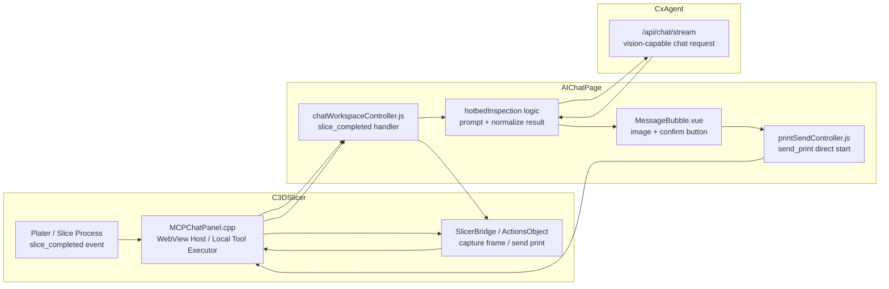
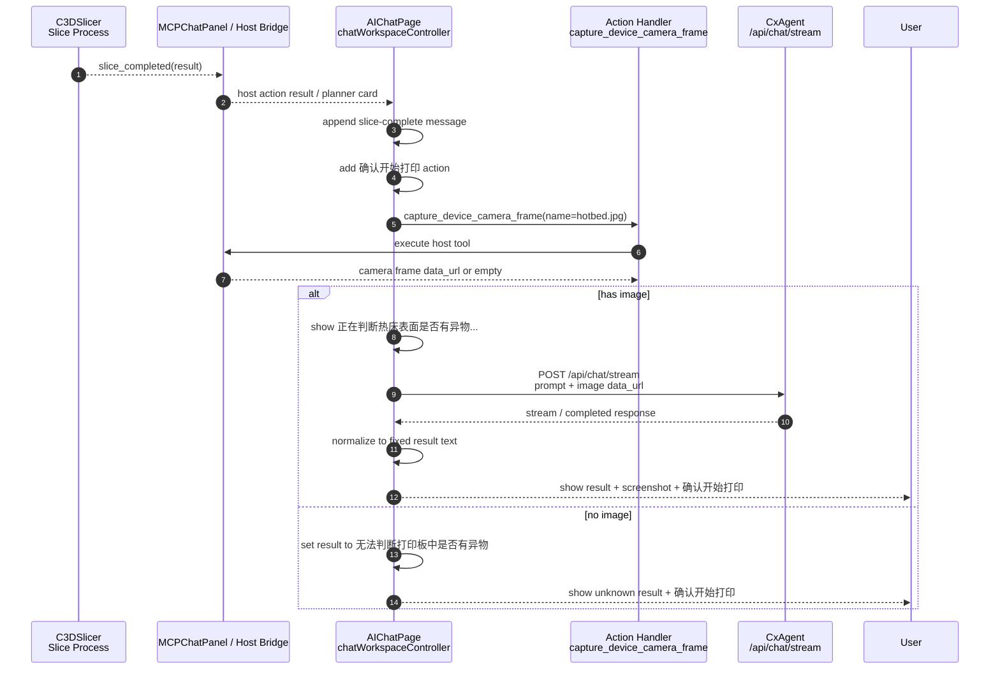
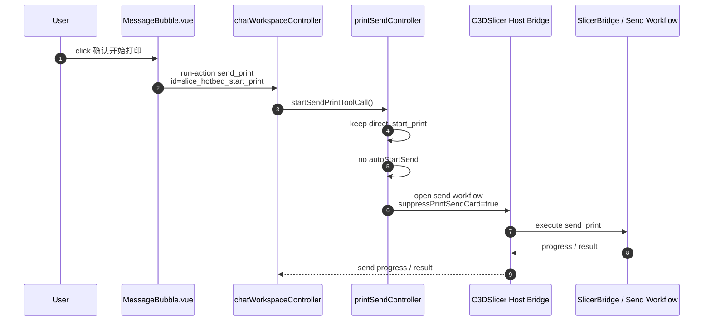

# AIChatPage 切片后热床检测与确认开始打印流程

## 1. 文档目标

本文档用于梳理本阶段 `AIChatPage` 中“切片完成后自动进行热床异物判断，并由用户确认后再开始打印”的真实实现关系。

重点回答四个问题：

- 切片完成后热床检测从哪里触发
- 热床截图由谁获取，视觉判断由谁完成
- “确认开始打印”按钮如何绕过耗材映射并直接发送打印
- 当前 UI 展示规则和最小改动边界是什么

涉及项目：

- `C3DSlicer`
- `CrealityCommunity/AIChatPage`
- `CxAgent`

## 2. 关键结论

- 切片完成后的热床检测主逻辑在 `AIChatPage/src/controller/chatWorkspaceController.js`。
- 切片完成事件仍来自宿主侧，前端接收到 `slice_completed` 或 `slice-complete` 卡片后，追加热床检测消息并启动截图检测。
- 热床截图通过宿主工具 `capture_device_camera_frame` 获取，底层仍由 `C3DSlicer` 的设备/视频能力提供。
- 图片识别请求走现有 `POST /api/chat/stream`，不是新增一套独立视觉接口。
- 检测结果只归一成三类文案：
  - `检测到打印板中有异物,请及时清理!`
  - `未检测到打印板中有明显异物。`
  - `无法判断打印板中是否有异物`
- 无截图时必须显示 `无法判断打印板中是否有异物`，不能默认显示“未检测到”。
- 不管检测结果如何，都显示 `确认开始打印` 按钮。
- 用户点击 `确认开始打印` 后才触发 `send_print`，切片完成本身不会自动发送打印。
- `send_print` 保留 `direct_start_print: true`，并关闭 `autoStartSend`，用于避免跳到耗材映射确认卡后才发送。
- 本阶段已撤回以下非最小改动：
  - 不隐藏 `No renderable content returned. Please try again.`
  - 不过滤 `bed_temperature_too_high_than_filament / 1000C001`
  - 不移除红色风险字样式

## 3. 相关文件与职责边界

### 3.1 AIChatPage 控制层

核心文件：

- `AIChatPage/src/controller/chatWorkspaceController.js`
- `AIChatPage/src/controller/hotbedInspection/hotbedInspectionController.js`
- `AIChatPage/src/controller/printSend/printSendController.js`

主要职责：

- 监听 `slice_completed` host action result
- 对 `slice-complete` 消息补充热床检测状态
- 调用 `capture_device_camera_frame` 获取热床截图
- 组装带图片的 CxAgent 视觉检测上下文
- 将 CxAgent 返回内容归一为三句固定结果
- 给切片完成消息补充 `确认开始打印` 动作
- 点击确认后触发 `send_print`

### 3.2 AIChatPage 渲染层

核心文件：

- `AIChatPage/src/widgets/MessageBubble.vue`
- `AIChatPage/src/widgets/PrintCheckCard.vue`
- `AIChatPage/src/renderers/printCheckCardRenderer.js`
- `AIChatPage/src/layout/ChatDockShell.vue`

主要职责：

- 渲染热床检测文字
- 渲染热床截图，截图作为消息内容的一部分展示
- 渲染 `确认开始打印` 按钮
- 对 `slice-complete` 卡片隐藏发送确认卡自身的风险确认按钮
- 保留普通风险项的原始展示能力，包括红色风险字
- 输入栏热床检测入口继续用于手动检测

### 3.3 AIChatPage 工具层

核心文件：

- `AIChatPage/src/actions/cameraFrameCapture.js`
- `AIChatPage/src/actions/actionHandlers.js`

主要职责：

- 将 `capture_device_camera_frame` 映射为宿主工具调用
- 优先使用宿主返回的摄像头截图
- 在可用时兼容 MJPEG / `linux_video_url` 截图
- 返回 `data_url / mime_type / transport / device` 等检测上下文

### 3.4 C3DSlicer 宿主侧

核心文件：

- `src/slic3r/GUI/simple/MCPChatPanel.cpp`
- `src/slic3r/GUI/simple/bridge/SlicerBridge.cpp`
- `src/slic3r/GUI/simple/bridge/SlicerBridgeActionsObject.cpp`

主要职责：

- 承载 AIChatPage WebView
- 向前端同步切片完成事件和切片结果
- 执行前端发起的本地工具调用
- 提供设备截图、切片状态、发送打印等宿主能力

## 4. 当前真实调用关系图

## 5. 切片完成后热床检测时序图

## 6. 确认开始打印时序图

## 7. UI 展示规则

### 7.1 切片完成消息

切片完成后展示：

- `切片已完成!`
- `预计使用耗材...g`
- `打印时间：...`
- 原有打印时间过长提示文案
- 热床检测结果
- 热床截图（如果有）
- `确认开始打印` 按钮

### 7.2 热床检测结果

当前只允许出现三类检测文案：

- 检测到异物：`检测到打印板中有异物,请及时清理!`
- 未检测到明显异物：`未检测到打印板中有明显异物。`
- 无法判断：`无法判断打印板中是否有异物`

其中，无截图或截图获取失败必须走“无法判断”，不能显示“未检测到”。

### 7.3 风险项展示

本阶段为了保持最小改动，不再额外处理以下行为：

- 不隐藏 `No renderable content returned. Please try again.`
- 不过滤 `bed_temperature_too_high_than_filament / 1000C001`
- 不取消红色风险字样式

如果后续仍要隐藏或过滤，应作为单独需求处理，避免混在切片后检测流程里。

## 8. 关键代码改动摘要

### 8.1 `chatWorkspaceController.js`

主要新增/调整：

- `buildSliceHotbedStartPrintAction`
- `ensureSliceHotbedStartPrintAction`
- `inspectHotbedAfterSliceCompleted`
- `buildSliceHotbedPayload`
- `normalizeSliceHotbedInspectionText`
- 切片完成后触发热床检测
- 对 `slice-complete` 消息补充 `确认开始打印` 动作

### 8.2 `hotbedInspectionController.js`

主要新增/调整：

- 手动热床检测与切片后检测使用同一套三句式判断口径
- 有截图才让视觉模型判断
- 无截图时归一为无法判断

### 8.3 `cameraFrameCapture.js`

主要新增/调整：

- 增强摄像头帧捕获
- 兼容 `linux_video_url` / MJPEG 截图路径
- 返回可用于视觉请求的 `data_url`

### 8.4 `printSendController.js`

主要新增/调整：

- 不再删除 `payload.direct_start_print`
- 不再设置 `autoStartSend`
- 保留 `suppressPrintSendCard: true`

这保证点击 `确认开始打印` 后走直接发送打印，而不是切回耗材映射确认流程，也不会在切片完成时自动发送。

### 8.5 `MessageBubble.vue`

主要新增/调整：

- 支持消息级 `imagePreviewUrl`
- 展示热床截图
- 对 `slice_hotbed_start_print` 动作使用专门按钮样式
- 按钮文案为 `确认开始打印`

### 8.6 `PrintCheckCard.vue`

主要新增/调整：

- `slice-complete` 卡片使用切片完成展示结构
- 隐藏 `slice-complete` 内部确认/知道了按钮
- 保留普通 `print-check` 风险卡原有确认区域

### 8.7 `printCheckCardRenderer.js`

主要新增/调整：

- 支持 `slice-complete`
- `title` 默认不再强制显示 `打印风险评估`
- 风险过滤逻辑已撤回，保持最小改动

## 9. 当前实现中的重点注意事项

- 切片完成不等于发送打印，必须等用户点击 `确认开始打印`。
- 有无热床异物由用户最终判断，前端只展示模型判断结果。
- CxAgent 视觉模型不可用、接口失败、无截图时，都应显示“无法判断”。
- 检测结果更新时要避免先显示上一次缓存结果，应先显示 pending 文案，再替换为本次结果。
- `direct_start_print` 是确认打印按钮能直接发送的关键字段，不应在 `printSendController` 中删除。
- `autoStartSend` 会造成切片完成后自动发送风险，当前不应恢复。
- 旧的通用风险展示仍保留，和热床检测结果不是同一层逻辑。

## 10. 验证清单

- [ ] 切片完成后不会自动发送打印。
- [ ] 切片完成后会出现热床检测文案。
- [ ] 有截图时展示截图，并基于截图输出三句之一。
- [ ] 无截图时显示 `无法判断打印板中是否有异物`。
- [ ] 不管检测结果如何，都显示 `确认开始打印`。
- [ ] 点击 `确认开始打印` 后直接发送打印，不跳到耗材映射确认卡。
- [ ] 二次切片时不会先显示上一次检测结果。
- [ ] 普通风险项仍可显示红色风险字。
- [ ] `No renderable content returned. Please try again.` 未被本流程额外隐藏。
- [ ] `bed_temperature_too_high_than_filament / 1000C001` 未被本流程额外过滤。

## 11. 风险与回退

风险等级：`中`

潜在影响：

- 摄像头截图依赖设备能力，不同机型可能无图或图像质量不稳定。
- 视觉模型结果受图片视角、光线、热床遮挡影响，不能作为强制阻断打印依据。
- `send_print` 直接发送链路依赖 `direct_start_print`，如果后端或宿主侧语义变化，可能重新回到耗材映射路径。
- `slice-complete` 消息和 planner 更新可能同时到达，需要继续关注重复渲染和缓存覆盖问题。

回退方案：

- 回退 `chatWorkspaceController.js` 中切片完成后自动检测和 `slice_hotbed_start_print` 动作逻辑。
- 回退 `MessageBubble.vue` 中热床截图和确认按钮展示逻辑。
- 回退 `printSendController.js` 中 `direct_start_print` 保留逻辑。
- 保留手动热床检测入口时，可单独保留 `hotbedInspectionController.js`，不影响切片后流程回退。

## 12. 一句话总结

当前实现把切片完成后的发送动作改成了“先展示热床截图检测结果，再由用户点击确认开始打印”的显式确认闭环。

真实形态是：

- `C3DSlicer` 负责切片完成事件、设备截图和真实发送动作
- `AIChatPage` 负责检测流程编排、结果归一、截图和按钮展示
- `CxAgent` 负责基于截图给出热床异物判断文本

三者通过 `host action result + capture_device_camera_frame + POST /api/chat/stream + send_print` 组成切片后的安全确认链路。
