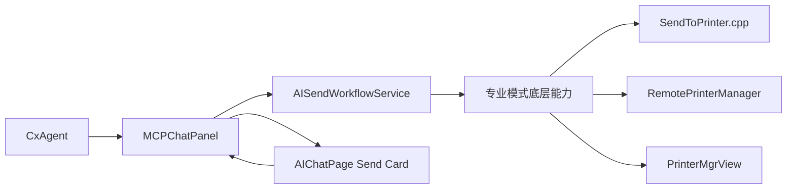

# AI 模式复用专业模式发送流程的最小抽象方案

## 1. 文档目标

基于《专业模式发送流程全链路梳理》与现有《AI 发送卡片架构方案》，本文进一步收敛出一份可落地的“最小抽象方案”。

这里的“最小抽象”强调三点：

- 最大化复用专业模式已有发送业务链路
- 最小化 AI 模式新增协议、状态机和前后端耦合
- 当前阶段不改动 `SendToPrinterPage` 工程代码，而是在 AI 模式侧新增一层轻量封装

本文面向的直接目标是：

- 在 AI 聊天窗口中承载“单盘 GCode 发送卡片”
- 让用户可以看预览、切换盘、确认耗材映射、开始打印或仅发送
- 底层尽量仍走专业模式已经验证过的发送能力

## 2. 设计边界

### 2.1 本期纳入范围

- AI 模式下的单盘发送
- 盘切换
- 盘预览图展示
- 耗材映射展示与必要修正
- `开始打印`
- `仅发送`
- `取消`
- 上传进度、结果回显

### 2.2 本期不纳入范围

- 多设备选择
- 全盘发送
- 多设备批量发送
- 专业模式大页面整体复用
- 直接改造 `SendToPrinterPage`
- 把专业模式所有零散协议照搬到 AI 模式

## 3. 核心判断

AI 模式不应该复制专业模式页面编排逻辑，而应该复用其底层业务能力。

更准确地说，AI 模式要复用的是：

- 专业模式的“发送执行链”
- 专业模式的“盘数据快照生成”
- 专业模式的“耗材映射与预览刷新能力”
- 专业模式的“上传进度与结果回推”

AI 模式不应该复用的是：

- 专业模式的大量页面状态管理
- 专业模式的设备轮询与设备选择编排
- 专业模式把业务逻辑散落在多个 Vue 组件里的方式

所以，最小抽象的目标不是“复刻 SendToPrinterPage”，而是：

- 在 C++ 侧抽出一个 AI 发送工作流协调层
- 在 Vue 侧只保留一张轻量卡片
- 在 Agent 侧只关心“发起发送任务”和“拿到用户最终结果”

## 4. 最小抽象原则

### 4.1 以“工作流”抽象，而不是以“页面”抽象

不把 `PrintFile.vue / Plate.vue / ColorMatch.vue` 原样抽出来给 AI 用，而是抽成一个单一工作流：

- `打开发送卡片`
- `选择盘`
- `查看/调整映射`
- `开始发送`
- `观察结果`

### 4.2 以“卡片快照”抽象，而不是以“零散事件”抽象

专业模式大量使用事件流：

- `update_plate_data`
- `update_plate_preview_img`
- `notify_send_complete`
- `notify_upload_status`
- `display_upload_progress`

AI 模式不建议继续把这些底层事件直接暴露给前端，而是统一收敛为：

- 卡片快照
- 卡片状态变更
- 卡片进度
- 卡片结果

### 4.3 以“当前默认设备”抽象，而不是以“设备选择器”抽象

AI 模式当前目标用户是小白，且本期只做单盘发送，所以设备选择不应出现在卡片内。

因此最小模型里只保留：

- `当前发送目标设备`
- `当前设备可用性`
- `当前设备耗材盒信息`

设备挑选仍由宿主或已有逻辑决定，不在 AI 卡片中展开。

## 5. 推荐的最小分层



### 5.1 Agent 层

Agent 只需要表达高层意图：

- 为当前模型/当前盘创建发送卡片
- 等待用户确认
- 获取用户最终操作结果

Agent 不应该参与：

- 盘数据拼装
- 颜色映射细节
- 上传流程编排
- 局域网/云通道差异判断

### 5.2 `MCPChatPanel` / 宿主桥接层

职责：

- 接收 Agent 发起的发送请求
- 创建 AI 发送工作流实例
- 把工作流快照推给 AIChatPage
- 接收卡片操作回传
- 在流程完成后把结果回传给 Agent

它本质上是“工作流入口”和“结果回收器”。

### 5.3 `AISendWorkflowService`

这是最小抽象里的核心新增层，建议放在 C++ 侧。

职责：

- 生成卡片初始快照
- 管理单卡片状态机
- 调用已有发送底层能力
- 屏蔽专业模式复杂分支
- 用统一结果回推前端

它不负责绘制 UI，只负责提供：

- 当前状态
- 当前盘快照
- 当前映射信息
- 当前进度
- 当前结果

### 5.4 专业模式底层能力层

这一层不是新建，而是复用现有能力：

- 盘数据生成能力
- 盘预览图更新能力
- 耗材映射能力
- `send_gcode`
- `send_start_print_cmd`
- `cancel_send`
- 上传进度回调
- 结果回调

## 6. 最小复用能力清单

## 6.1 必须复用

### A. 盘数据快照能力

复用目标：

- 当前盘列表
- 当前盘预览图
- 文件名
- 打印时间
- 重量
- 耗材长度
- 温度信息

来源上优先复用 `SendToPrinter.cpp` 中现有的盘数据组装思路，而不是在 AI 页面重新拼。

### B. 盘缩略图更新能力

复用目标：

- 根据映射结果刷新预览图

这部分已经被专业模式验证过，AI 模式只需要换一层更高语义的协议包裹起来。

### C. 上传能力

复用目标：

- `send_gcode`
- 底层上传队列与判型
- 上传进度
- 上传状态
- 上传完成

这部分应尽量原样复用 `RemotePrinterManager` 及已有 C++ 上传路径。

### D. 开始打印能力

复用目标：

- `send_start_print_cmd`
- 下游 `PrinterMgrView` 对开始打印的承接

### E. 取消能力

复用目标：

- `cancel_send`
- 取消状态码与关闭逻辑

## 6.2 当前不直接复用

### A. 专业模式设备选择逻辑

原因：

- AI 模式本期不展示设备选择
- 专业模式设备轮询与合并逻辑很重

### B. 专业模式完整页面状态机

原因：

- AI 卡片只有单盘发送，不需要承载多设备、多盘、多入口状态

### C. `useWanOnlySend.js` 的页面态实现

原因：

- 其中大量逻辑是页面态、云端轮询态、弹窗控制态的混合
- AI 模式更适合由 C++ 工作流统一管控，再把结果回推给卡片

## 7. 最小数据模型

建议定义一个统一的 `AISendCardSnapshot`。

```json
{
  "card_id": "ai-send-001",
  "status": "ready",
  "device": {
    "name": "Current Printer",
    "online": true
  },
  "plates": {
    "selected_plate_index": 0,
    "available": [
      {
        "plate_index": 0,
        "label": "01",
        "preview_image": "data:image/png;base64,...",
        "selectable": true
      }
    ]
  },
  "plate": {
    "plate_index": 0,
    "file_name": "cube_pla_18m20s",
    "print_time": "18m20s",
    "total_weight": "6.2g",
    "preview_image": "data:image/png;base64,..."
  },
  "mapping": {
    "required": true,
    "complete": true,
    "items": [
      {
        "extruder_id": 1,
        "model_color": "#FFAA00",
        "filament_type": "PLA",
        "mapped_slot": "T1A",
        "mapped_color": "#FFAA00"
      }
    ]
  },
  "actions": {
    "can_start_print": true,
    "can_send_only": true,
    "can_cancel": true,
    "can_switch_plate": true
  },
  "progress": {
    "stage": "idle",
    "percent": 0,
    "speed": 0,
    "text": ""
  }
}
```

## 8. 最小状态机

建议 AI 卡片状态只保留以下几个：

- `ready`
- `mapping_required`
- `switching_plate`
- `uploading`
- `starting_print`
- `send_only_done`
- `print_started`
- `failed`
- `canceled`

说明：

- `ready`：卡片已生成，可操作
- `mapping_required`：映射不完整，不允许开始打印
- `switching_plate`：用户正在切盘，等待新快照
- `uploading`：上传中
- `starting_print`：上传成功后进入开始打印阶段
- `send_only_done`：仅发送成功
- `print_started`：发送并打印成功
- `failed`：失败，可重试
- `canceled`：用户取消

不建议把专业模式内部的所有细粒度阶段全暴露出来，否则 AI 卡片会被页面状态拖复杂。

## 9. 最小协议设计

## 9.1 前端 -> C++

AI 模式建议只保留这组高层命令：

- `ai_send_card_open`
- `ai_send_card_select_plate`
- `ai_send_card_update_mapping`
- `ai_send_card_start_print`
- `ai_send_card_send_only`
- `ai_send_card_cancel`
- `ai_send_card_retry`

### 示例

```json
{
  "command": "ai_send_card_select_plate",
  "card_id": "ai-send-001",
  "plate_index": 1
}
```

## 9.2 C++ -> 前端

AI 模式建议只保留这组回推事件：

- `ai_send_card_snapshot`
- `ai_send_card_progress`
- `ai_send_card_result`
- `ai_send_card_error`

### 示例

```json
{
  "command": "ai_send_card_progress",
  "card_id": "ai-send-001",
  "data": {
    "status": "uploading",
    "stage": "uploading",
    "percent": 42.5,
    "speed": 1.8,
    "text": "Uploading"
  }
}
```

## 9.3 协议设计原则

- 对前端暴露业务语义，不暴露专业模式内部散碎命令
- 一次回推尽量给完整快照，而不是只给几个局部字段
- 卡片始终通过 `card_id` 追踪
- 前端不自己推导复杂发送状态，只做渲染与按钮触发

## 10. 最小内部实现建议

## 10.1 C++ 侧新增统一入口

建议新增一个 AI 发送控制器，例如：

- `AISendWorkflowService`

建议对外提供以下接口语义：

- `openSendCardForCurrentContext()`
- `selectPlate(cardId, plateIndex)`
- `updateMapping(cardId, mappingPayload)`
- `startPrint(cardId)`
- `sendOnly(cardId)`
- `cancel(cardId)`
- `retry(cardId)`

### 内部职责拆分

- `buildSnapshot()`
- `buildPlateSnapshot(plateIndex)`
- `buildMappingSnapshot(plateIndex)`
- `applyMappingAndRefreshPreview()`
- `startUpload()`
- `startPrintAfterUpload()`
- `emitSnapshot()`
- `emitProgress()`
- `emitResult()`

## 10.2 盘切换策略

盘切换时不要让前端自己重新拼盘数据，应走：

1. 前端发 `select_plate`
2. C++ 设置当前工作流盘索引
3. C++ 重新生成该盘的完整快照
4. C++ 统一回推新的 `snapshot`

这样能保证：

- 预览图
- 文件名
- 耗材映射
- 允许操作状态

始终来自同一份可信上下文。

## 10.3 耗材映射策略

建议分两级：

- 默认自动映射
- 必要时轻量人工修正

AI 卡片不应暴露专业模式完整映射面板，而是只暴露：

- 映射摘要
- 有问题的挤出机项
- 可选替换槽位

底层仍由已有映射与预览刷新逻辑承接。

## 10.4 上传和开始打印策略

### 开始打印

工作流内部应拆成两个阶段：

1. 上传
2. 开始打印

这样可以复用专业模式的真实链路，而不是把“上传成功”误当成“开始打印成功”。

### 仅发送

只做到上传完成即可返回成功结果：

- `send_only_done`

### 开始打印

上传成功后再继续触发：

- `send_start_print_cmd`

并最终返回：

- `print_started`

## 11. 与专业模式的复用边界

## 11.1 推荐复用方式

建议采用“底层复用 + 上层重组”：

- 底层继续使用专业模式已验证过的发送执行链
- AI 模式只新增工作流协调层和卡片协议层

## 11.2 不推荐复用方式

不建议：

- 直接把 `SendToPrinterPage` 页面嵌进 AI 聊天区
- 直接复制 `PrintFile.vue` 的编排逻辑到 AI 项目
- 让 AI 页面继续面对大量 `window.handleStudioCmd` 零散命令

原因是这会把专业模式的历史复杂度完整带入 AI 模式。

## 12. 第一阶段最小落地方案

推荐按以下最小步骤落地：

1. 在 C++ 侧新增 `AISendWorkflowService`
2. 先只接单盘 GCode
3. 先只接当前默认设备
4. 先支持：
   - 打开发送卡片
   - 切盘
   - 映射摘要展示
   - 开始打印
   - 仅发送
   - 取消
   - 上传进度
   - 结果回传
5. AIChatPage 新增一张发送卡片组件
6. MCPChatPanel 负责把 Agent 请求接入该工作流

这是最稳妥、最容易验证的一版。

## 13. 第二阶段可扩展方向

等第一阶段跑稳后，再考虑逐步扩展：

- 更丰富的映射编辑能力
- 失败后的更细粒度重试策略
- 创想云特殊路径的更强封装
- 支持更多设备类型差异
- 多卡片并发
- 全盘发送

## 14. 关键收益

采用这套最小抽象后，AI 模式能获得这些收益：

- 业务链路复用专业模式，风险最低
- AI 页面不再承接专业模式级别的复杂状态机
- C++ 成为发送业务中台，后续更容易演进
- Agent 与前端协议更稳定、更高层
- 后续即便专业模式继续演进，AI 模式也能通过中间工作流层保持相对稳定

## 15. 最终建议

当前最合理的路线不是“把专业模式页面搬到 AI 模式”，而是：

- 保留专业模式作为业务能力来源
- 在 C++ 侧加一层 AI 发送工作流最小抽象
- 在 AIChatPage 上用一张小而强的发送卡片承载交互

一句话概括就是：

`复用专业模式的发送能力，不复用专业模式的页面复杂度。`
