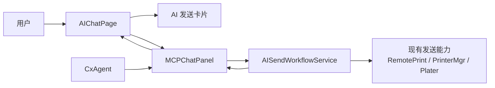
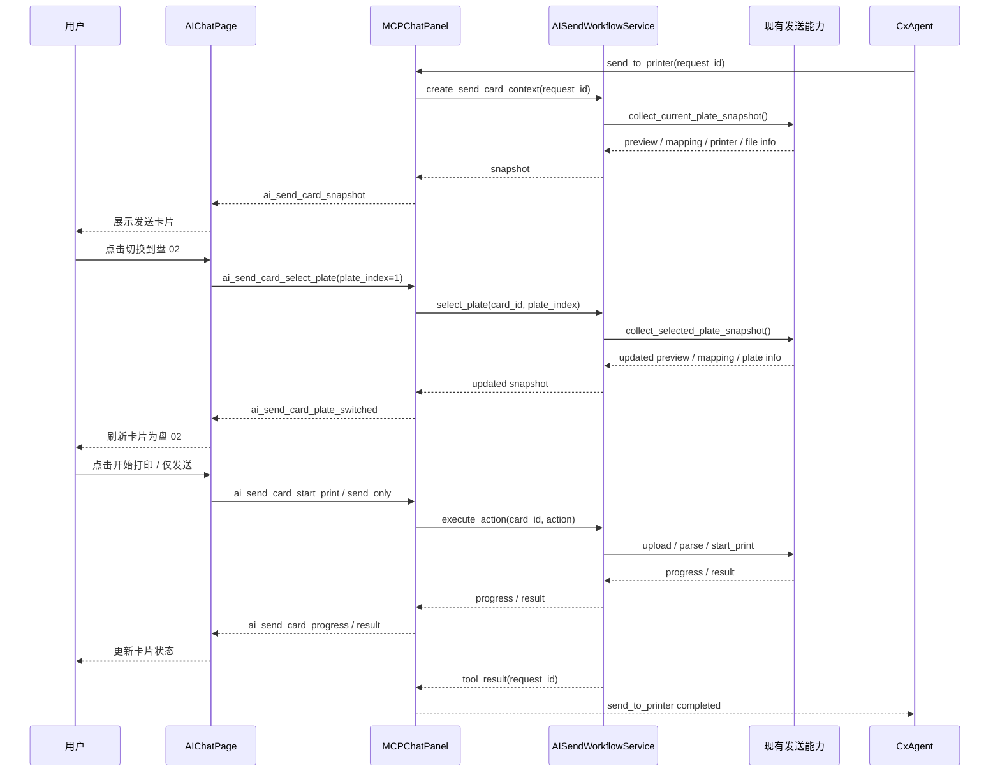

# AI 发送卡片架构方案

## 1. 背景

当前系统中已经存在两条与打印发送相关的链路：

1. `专业模式发送页`
   - 由 `SendToPrinterPage` 承载完整发送业务流程。
   - 覆盖设备选择、单盘/全盘、耗材映射、上传、开始打印、取消、重试、云端/局域网差异等复杂场景。
   - 已经是成熟业务实现，但前端与 C++ 间消息交互较多，页面侧承担了较多业务编排职责。

2. `AI 聊天发送链路`
   - 由 `AIChatPage -> CxAgent -> MCPChatPanel -> SlicerBridge` 组成。
   - 当前在点击“确认并发送”后，会进入 C++ 侧的当前盘/单盘发送流程。
   - 但现阶段 AI 模式缺少一个适合小白用户的、可视化且可交互的发送承接层。

本方案目标是在 `AI 模式` 下引入一张轻量的“发送卡片”，让 AI 推荐动作在聊天窗口内被业务化承接。

## 2. 设计目标

### 2.1 产品目标

- 面向小白用户，降低发送与打印前确认的理解成本。
- 在 AI 聊天窗口内完成“发送前确认 -> 耗材映射确认 -> 开始打印/仅发送 -> 进度反馈”。
- 通过卡片替代直接执行，提升可解释性和安全感。

### 2.2 技术目标

- 尽量复用现有专业模式发送业务能力。
- 当前版本不直接改动 `SendToPrinterPage` 工程代码。
- 收敛 AI 模式前端与 C++ 之间的交互粒度，避免复制专业模式的大量零碎消息协议。
- 让 C++ 成为 AI 发送工作流的“业务中台”，Vue 主要负责展示和少量用户输入。

## 3. 当前边界与约束

### 3.1 明确范围

本期 `AI 发送卡片` 仅覆盖：

- 单盘 G-code 发送
- 当前可发送盘之间的切换
- 当前已激活/默认打印机
- 预览图展示
- 耗材映射展示与必要修正
- `开始打印`
- `仅发送`
- `取消`
- 发送进度/结果反馈

### 3.2 明确不做

本期不覆盖：

- 设备选择
- 多设备发送
- 全盘发送
- 多盘同时发送
- 复杂高级参数配置
- 将 `SendToPrinterPage` 直接整体嵌入 `AIChatPage`
- 直接改动 `SendToPrinterPage` 现有业务代码

### 3.3 关键原则

- `SendToPrinterPage` 先作为参考实现与能力来源，不作为本期改造目标。
- AI 模式不复制专业模式页面，而是抽取能力，重新构造轻量卡片体验。
- AI 模式不沿用“前端自己编排所有发送流程”的方式，而改为“C++ 主导工作流、前端承载卡片”。

## 4. 用户体验方案

## 4.1 入口变化

当前 AI 聊天中的“确认并发送”，建议在 AI 模式下调整为以下语义之一：

- `准备发送`
- `进入发送`
- `查看发送确认`

原因：

- 当前“确认并发送”容易让用户误以为点击后会直接开始发送。
- 新方案中，点击后应先展开发送卡片，再由用户决定“开始打印”或“仅发送”。

## 4.2 卡片结构

AI 发送卡片建议包含以下信息区块：

1. `头部摘要`
   - 标题：`准备发送到当前打印机`
   - 当前打印机名称
   - 当前盘编号

2. `预览区`
   - 当前盘缩略图
   - 文件名
   - 预计打印时间
   - 预计耗材重量

3. `耗材映射区`
   - 模型颜色/耗材 与 CFS 槽位的映射结果摘要
   - 映射状态：完整 / 缺失 / 不匹配
   - 如有缺失，允许最小化修正

4. `设置区`
   - 打印校准开关
   - 必要时展示耗材模式摘要

5. `操作区`
   - `开始打印`
   - `仅发送`
   - `取消`

6. `状态区`
   - 上传中
   - 解析中
   - 已发送
   - 打印已开始
   - 失败可重试

## 4.4 AI 发送卡片中的盘切换设计

### 4.4.1 目标

在不引入“全盘发送”与“复杂盘管理”的前提下，允许用户在 AI 卡片中切换当前目标盘，以便快速确认：

- 我现在要发送的是哪一盘
- 当前盘的预览图是否正确
- 当前盘的耗材映射是否正确

### 4.4.2 设计原则

- 允许换盘，但始终保持“单盘发送”。
- 切换盘的目的仅是确认和选择当前发送目标，不扩展为多盘操作面板。
- 切换后卡片整体刷新，而不是前端自行局部拼装业务数据。
- 仅允许切换到“已切片且可发送”的盘，避免用户进入不可执行分支。

### 4.4.3 推荐 UI 方案

建议采用“主预览图 + 下方轻量缩略盘条”的方式：

1. 主区域显示当前选中盘的大预览图。
2. 下方显示可发送盘的缩略条，例如：`01`、`02`、`03`。
3. 当前盘高亮。
4. 用户点击某一盘后，卡片刷新为该盘的完整快照。

推荐原因：

- 对小白用户更直观。
- 能快速确认盘面内容。
- 相比左右箭头切换，缩略条的可发现性更强。

### 4.4.4 切换后的刷新内容

切换盘后，以下内容应整体刷新：

- 当前盘预览图
- 当前文件名
- 当前盘预计打印时间
- 当前盘预计耗材重量
- 当前盘耗材映射结果
- 当前盘是否允许直接开始打印

### 4.4.5 不建议加入的盘相关能力

本期不建议在 AI 卡片中加入：

- 全盘发送
- 多盘勾选
- 盘重命名
- 盘删除/新增
- 盘切片
- 盘内模型编辑

这些能力都应继续留在专业模式中。

## 4.3 交互原则

- 默认优先自动映射，用户只在必要时介入。
- 不把专业模式全部细节暴露给 AI 模式用户。
- 卡片优先展示“结果与确认”，而不是“配置与学习”。
- 失败提示要短、直接、可恢复。

## 5. 总体架构建议

## 5.1 核心判断

AI 发送卡片不应继续采用“Vue 页面主导业务编排，C++ 提供很多零碎命令”的模式。

更适合的架构是：

- `C++` 负责发送工作流编排
- `AIChatPage` 负责卡片渲染和操作回传
- `CxAgent` 负责任务编排，但不介入具体发送页细节

即：

- `专业模式`：偏页面应用
- `AI 模式`：偏宿主驱动的业务卡片

## 5.2 推荐分层

### A. C++ 层

新增一个 AI 发送工作流服务层，建议命名之一：

- `AISendWorkflowService`
- `AISendCardController`
- `SinglePlateSendCoordinator`

职责：

- 生成 AI 卡片所需的发送快照
- 管理单盘发送状态机
- 封装对现有发送能力的调用
- 向 WebView 推送卡片状态更新
- 将最终结果回填给 Agent 请求

### B. MCP / 宿主桥接层

建议由 `MCPChatPanel` 负责：

- 接住来自 `CxAgent` 的 `send_to_printer`
- 不立即直执行业务发送
- 改为进入“挂起中的 AI 发送工作流”
- 通知前端打开 AI 发送卡片
- 等待用户在卡片上完成真实发送动作
- 在流程完成后将结果回传给 `CxAgent`

### C. Vue 层

建议在 `AIChatPage` 内新增轻量卡片模块，例如：

- `SendCard.vue`
- `sendCardController.js`
- `sendCardHostAdapter.js`

职责：

- 渲染发送卡片
- 响应用户点击
- 将操作回传给宿主
- 不自行编排复杂发送逻辑

## 5.3 组件关系图



## 6. 能力复用策略

## 6.1 复用什么

建议复用以下“业务能力”，而不是复用整页：

- 当前盘发送快照生成能力
  - 预览图
  - 文件名
  - 时间
  - 重量
  - 当前盘耗材信息

- 耗材映射相关能力
  - 默认映射计算
  - 映射结果校验
  - 映射变更后的缩略图刷新

- 发送执行能力
  - 上传 G-code
  - 开始打印
  - 仅发送
  - 取消
  - 重试

- 状态反馈能力
  - 上传进度
  - 解析状态
  - 完成结果
  - 错误码

## 6.2 不直接复用什么

不建议直接复用以下内容：

- `SendToPrinterPage` 的整页组件结构
- `PrintFile.vue` 中完整页面级状态管理
- 大量页面级轮询与复杂 UI 分支
- 专业模式的设备选择交互

## 6.3 抽取方向

建议以“协议与服务”为抽取中心，而不是以“页面组件”为抽取中心。

优先抽：

- 数据模型
- 状态机
- C++ 工作流接口
- AI 卡片使用的最小业务能力

暂不抽：

- 专业模式大页面 UI
- 设备选择页
- 多设备发送页

## 7. AI 发送卡片的数据模型建议

## 7.1 快照模型

```json
{
  "card_id": "send-card-001",
  "task_id": "task-xxx",
  "request_id": "req-xxx",
  "status": "ready",
  "printer": {
    "name": "Creality K2 Plus",
    "address": "current_device"
  },
  "plates": {
    "selected_plate_index": 0,
    "available": [
      {
        "plate_index": 0,
        "label": "01",
        "selectable": true,
        "preview_image": "data:image/png;base64,..."
      },
      {
        "plate_index": 1,
        "label": "02",
        "selectable": true,
        "preview_image": "data:image/png;base64,..."
      }
    ]
  },
  "plate": {
    "index": 0,
    "label": "01",
    "preview_image": "data:image/png;base64,...",
    "file_name": "sphere_PLA_25m34s",
    "print_time": "25m34s",
    "total_weight": "7.83g"
  },
  "mapping": {
    "complete": true,
    "items": [
      {
        "extruder_id": 1,
        "model_color": "#F4D400",
        "filament_type": "PLA",
        "mapped_slot": "3A"
      }
    ]
  },
  "settings": {
    "print_calibration": true
  },
  "capabilities": {
    "can_start_print": true,
    "can_send_only": true,
    "can_edit_mapping": true
  }
}
```

## 7.2 状态模型

建议卡片状态收敛为：

- `ready`
- `mapping_required`
- `switching_plate`
- `uploading`
- `parsing`
- `starting_print`
- `send_only_done`
- `print_started`
- `failed`
- `canceled`

## 8. 前后端消息协议建议

## 8.1 前端 -> C++

建议 AI 模式只保留高层命令：

- `ai_send_card_open`
- `ai_send_card_select_plate`
- `ai_send_card_update_mapping`
- `ai_send_card_toggle_calibration`
- `ai_send_card_start_print`
- `ai_send_card_send_only`
- `ai_send_card_cancel`
- `ai_send_card_retry`

## 8.2 C++ -> 前端

建议 C++ 向 AI 页面推送以下事件：

- `ai_send_card_snapshot`
- `ai_send_card_plate_switched`
- `ai_send_card_mapping_updated`
- `ai_send_card_progress`
- `ai_send_card_result`
- `ai_send_card_error`

## 8.3 协议设计原则

- 业务语义优先，不传过多底层细节。
- 前端拿到的是“可渲染状态”，而不是“需要自己再拼业务”的零散字段。
- 同一个卡片始终通过 `card_id` 或 `request_id` 追踪。
- 盘切换由前端发起，但盘的合法性、可发送性和刷新内容由 C++ 统一判定并回传。

## 8.4 盘切换相关协议建议

### 前端 -> C++

```json
{
  "command": "ai_send_card_select_plate",
  "card_id": "send-card-001",
  "plate_index": 1
}
```

### C++ -> 前端

返回完整快照，而不是只返回单个局部字段：

```json
{
  "event": "ai_send_card_plate_switched",
  "card_id": "send-card-001",
  "snapshot": {
    "status": "ready",
    "plates": {
      "selected_plate_index": 1,
      "available": [
        {
          "plate_index": 0,
          "label": "01",
          "selectable": true,
          "preview_image": "data:image/png;base64,..."
        },
        {
          "plate_index": 1,
          "label": "02",
          "selectable": true,
          "preview_image": "data:image/png;base64,..."
        }
      ]
    },
    "plate": {
      "index": 1,
      "label": "02",
      "preview_image": "data:image/png;base64,...",
      "file_name": "plate02_PLA_32m15s",
      "print_time": "32m15s",
      "total_weight": "11.24g"
    },
    "mapping": {
      "complete": true,
      "items": []
    }
  }
}
```

协议原则：

- 前端只表达“我要切到哪一盘”。
- C++ 负责判断该盘是否合法、是否可选。
- 返回新的完整快照，避免前端做跨盘业务拼装。

## 9. 工作流时序建议



## 10. 与现有系统的职责划分

## 10.1 AIChatPage

负责：

- 卡片挂载
- 卡片展示
- 用户操作转发
- 聊天上下文中的卡片状态呈现

不负责：

- 上传业务编排
- 轮询设备
- 决定本地/云发送链路
- 复杂状态机

## 10.2 MCPChatPanel

负责：

- Agent 工具调用接入
- 挂起/恢复 `send_to_printer`
- 与前端页面通信
- 向 Agent 回传结果

不负责：

- 发送卡片的具体业务规则
- 页面数据拼装细节

## 10.3 AI 发送工作流服务

负责：

- 生成单盘发送卡片快照
- 发送工作流状态机
- 调用现有发送相关能力
- 错误转换与结果归一化

## 10.4 现有发送能力

继续保留：

- `Plater`
- `PrinterMgrView`
- `RemotePrint`
- 现有专业模式发送逻辑实现

AI 版通过新服务层调用这些能力，而非复制整套实现。

## 11. 推荐实施路径

## 11.1 Phase 1：能力封装

目标：

- 在 C++ 中新增 `AISendWorkflowService`
- 把“当前盘快照生成”和“发送执行入口”封装为 AI 可调用接口
- 暂不改动 `SendToPrinterPage`

产出：

- 快照接口
- 工作流状态机
- 高层事件协议

## 11.2 Phase 2：AI 卡片接入

目标：

- 在 `AIChatPage` 中加入 `SendCard.vue`
- 卡片支持展示预览图、映射、校准、开始打印、仅发送、取消
- 接入 `MCPChatPanel` 的挂起式 `send_to_printer`

产出：

- 聊天里的卡片交互
- 进度与结果展示

## 11.3 Phase 3：体验打磨

目标：

- 优化映射修正交互
- 优化失败提示与重试
- 增加从 AI 卡片跳转专业模式的兜底入口

## 12. 风险与注意事项

## 12.1 最大风险

如果 AI 模式继续沿用专业模式的碎片化命令协议，最终会把 `AIChatPage` 也演化成一个复杂页面应用，失去“轻量卡片”的初衷。

## 12.2 兼容性风险

- 现有发送能力内部对本地/云链路区分较多
- 专业模式中部分业务状态由页面端维护
- AI 版抽取时可能出现职责重复

建议通过 C++ 新增统一服务层来隔离。

## 12.3 产品风险

如果 AI 卡片里加入设备选择、全盘发送、多设备流程，卡片复杂度会迅速膨胀，最终退化成“聊天里的专业模式页面”。

因此本期必须坚守范围。

## 13. 结论

AI 发送卡片的正确方向不是“复刻专业模式发送页”，而是：

- 以专业模式现有能力为基础
- 不改动 `SendToPrinterPage`
- 在 C++ 新增 AI 发送工作流中台
- 在 `AIChatPage` 中做一张只聚焦“单盘发送、可轻量切换盘”的轻量卡片

这条路径兼顾：

- 用户体验简化
- 架构清晰
- 风险可控
- 后续可演进

本期最重要的约束是：

- 只做单盘
- 可以切盘，但一次只发一盘
- 不做设备选择
- 不改专业模式发送页
- 前端轻、C++ 重

这将是 AI 模式下发送能力最合适的第一阶段落地方式。
