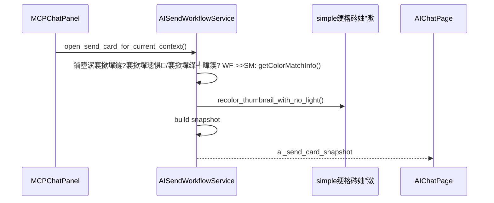

# AI 鍙戦€佸伐浣滄祦缁撳悎鐗堣惤鍦拌璁?
## 1. 鏂囨。鐩爣

鏈枃鏄湪鍓嶉潰鍑犱唤鏂囨。鍩虹涓婅繘涓€姝ユ敹鏁涘嚭鐨勨€滅粨鍚堢増鈥濊惤鍦拌璁★紝鏍稿績鐩爣鏄妸涓ゆ潯绾跨粨鍚堣捣鏉ワ細

- 鍙戦€佷笟鍔＄殑鐪熷疄瀛楁銆佽澶囧彂閫侀摼璺€佸紑濮嬫墦鍗板懡浠わ紝鍙傝€冧笓涓氭ā寮?`SendToPrinterPage`
- 鑰楁潗鏄犲皠銆侀瑙堝浘閲嶇潃鑹层€佸€欓€夐」绛涢€夌瓑鑳藉姏锛屽惛鏀?`simple` 鐩綍涓嬪凡娌夋穩鐨勭畻娉曟ā鍧?
鎹㈠彞璇濊锛岃繖浠借璁＄殑鍩烘湰鍘熷垯鏄細

`鍙戦€佸瓧娈典笌璁惧閾捐矾瀵归綈涓撲笟妯″紡锛屾槧灏勭畻娉曚笌棰勮鑳藉姏鍚告敹 simple 妯″潡锛孉I 妯″紡鍙噸缁勫伐浣滄祦涓庡崱鐗囦氦浜掋€俙

## 2. 璁捐鍘熷垯

## 2.1 涓氬姟鐪熷€兼潵鑷笓涓氭ā寮?
AI 妯″紡鍚庣画鐪熸钀藉湴鏃讹紝浠ヤ笅鍐呭浼樺厛瀵归綈涓撲笟妯″紡锛?
- 涓婁紶鍒拌澶囨椂浼犲摢浜涘瓧娈?- 寮€濮嬫墦鍗版椂浼犲摢浜涘瓧娈?- 瀛楁鍛藉悕鍙ｅ緞
- GCode / 3MF 鐨勮矾寰勬嫾鎺ユ柟寮?- `send_gcode` / `send_start_print_cmd` 鐨勪笅娓搁摼璺?
鍘熷洜寰堢畝鍗曪細

- 杩欎簺鏄疄闄呭凡缁忓湪绾胯矾涓婅窇杩囩殑鐪熷疄涓氬姟瀛楁
- 缁х画娌跨敤鑳芥渶澶у寲闄嶄綆鍜岃澶囧疄闄呰涓虹殑鍋忓樊

## 2.2 浜や簰鑳藉姏鍜岀畻娉曞惛鏀?`simple`

AI 妯″紡涓嶉渶瑕佸鍒?ImGui 甯搁┗闈㈡澘锛屼絾闈炲父閫傚悎澶嶇敤锛?
- `match_color.*`
- `ThumbnailDataRecolor.*`
- `ResidentFilamentMappingPopupPolicy.*`
- `ResidentFilamentMappingLogic.*`
- `ResidentFilamentMappingAdapter.*` 涓殑鏁版嵁鎷艰鎬濊矾

## 2.3 AI 妯″紡鍙仛鏈€灏忓伐浣滄祦閲嶇粍

AI 妯″紡涓嶅啀寤剁画锛?
- 涓撲笟妯″紡鈥滃ぇ椤甸潰缂栨帓涓€鍒団€濈殑鏂瑰紡
- ImGui 甯搁┗闈㈡澘鐨勪氦浜掑舰鎬?
AI 妯″紡鍙繚鐣欙細

- 涓€寮犲彂閫佸崱鐗?- 涓€涓?C++ 宸ヤ綔娴佹湇鍔?- 涓€濂楁洿楂樺眰鐨勫揩鐓т笌缁撴灉鍗忚

## 3. 缁撳悎鐗堟€讳綋鏋舵瀯

```mermaid
flowchart LR
    A[CxAgent] --> B[MCPChatPanel]
    B --> C[AISendWorkflowService]
    C --> D[涓撲笟妯″紡鍙戦€佸瓧娈典笌閾捐矾]
    C --> E[simple 鏄犲皠涓庨瑙堢畻娉昡

    D --> F[send_gcode / send_start_print_cmd]
    D --> G[SendToPrinter.cpp]
    D --> H[RemotePrinterManager]
    D --> I[PrinterMgrView]

    E --> J[match_color]
    E --> K[ThumbnailDataRecolor]
    E --> L[PopupPolicy / Logic / Adapter]

    B --> M[AIChatPage Send Card]
    M --> B
```

## 4. `AISendWorkflowService` 鐨勫畾浣?
`AISendWorkflowService` 搴旇鏄?AI 鍙戦€佸崱鐗囪儗鍚庣殑 C++ 宸ヤ綔娴佷腑鍙帮紝鑰屼笉鏄竴涓?UI 鎺т欢锛屼篃涓嶆槸涓€涓函绠楁硶妯″潡銆?
瀹冪殑鑱岃矗鏄細

- 浠庡綋鍓?slicer 涓婁笅鏂囩敓鎴?AI 鍙戦€佸崱鐗囧揩鐓?- 绠＄悊褰撳墠鍗＄墖瀵瑰簲鐨勫崟鐩樺彂閫佺姸鎬?- 璋冪敤 simple 鐨勬槧灏勭畻娉曠敓鎴愯嚜鍔ㄦ槧灏勭粨鏋?- 璋冪敤 simple 鐨勯噸鐫€鑹茬畻娉曠敓鎴愰瑙堝浘
- 鎶婃渶缁堝彂閫佸弬鏁版暣鐞嗘垚涓撲笟妯″紡璁ゅ彲鐨勫瓧娈?- 璋冪敤鐜版湁 `send_gcode`銆乣send_start_print_cmd`銆乣cancel_send` 閾捐矾
- 鎶婁笂浼犺繘搴︺€佺粨鏋滅粺涓€鍥炴帹缁?AIChatPage

瀹冧笉璐熻矗锛?
- 鑷繁缁?UI
- 璁?Agent 鍙備笌搴曞眰鍙戦€佺姸鎬佺粏鑺?- 閲嶅啓涓撲笟妯″紡鏁翠釜鍙戦€佷笟鍔?
## 5. C++ 绫昏璁¤崏鍥?
## 5.1 涓荤被寤鸿

```cpp
class AISendWorkflowService final {
public:
    AISendWorkflowService();
    ~AISendWorkflowService();

public:
    std::string open_send_card_for_current_context(const AISendOpenRequest& req);

    bool has_session(const std::string& card_id) const;
    AISendCardSnapshot get_snapshot(const std::string& card_id) const;

    AISendCardSnapshot select_plate(const std::string& card_id, int plate_index);
    AISendCardSnapshot auto_match_mapping(const std::string& card_id);

    std::vector<AISendMappingOption> get_mapping_options(
        const std::string& card_id,
        int extruder_id) const;

    AISendCardSnapshot apply_mapping_selection(
        const std::string& card_id,
        int extruder_id,
        const std::string& selection_token);

    void start_send_only(const std::string& card_id);
    void start_send_and_print(const std::string& card_id);
    void cancel(const std::string& card_id);
    void retry(const std::string& card_id);

public:
    void on_upload_progress(
        const std::string& card_id,
        float progress,
        double speed);

    void on_upload_status(
        const std::string& card_id,
        int status_code);

    void on_upload_complete(
        const std::string& card_id,
        const AISendUploadCompletePayload& payload);

private:
    AISendSession&       require_session(const std::string& card_id);
    const AISendSession& require_session(const std::string& card_id) const;

    void rebuild_snapshot(AISendSession& session);
    void rebuild_mapping(AISendSession& session);
    void rebuild_preview(AISendSession& session);

    void dispatch_send_gcode(AISendSession& session);
    void dispatch_start_print(AISendSession& session);
    void dispatch_cancel(AISendSession& session);

    void emit_snapshot(const AISendSession& session);
    void emit_progress(const AISendSession& session);
    void emit_result(const AISendSession& session);
    void emit_error(const AISendSession& session, const std::string& error_code);

private:
    std::unordered_map<std::string, AISendSession> m_sessions;
};
```

## 5.2 杈呭姪绫诲瀷寤鸿

### 鎵撳紑鍙戦€佸崱鐗囪姹?
```cpp
struct AISendOpenRequest {
    std::string request_id;
    bool        use_current_device = true;
    bool        force_single_plate = true;
};
```

### 浼氳瘽鐘舵€?
```cpp
enum class AISendSessionStatus {
    Ready = 0,
    MappingRequired,
    SwitchingPlate,
    Uploading,
    StartingPrint,
    SendOnlyDone,
    PrintStarted,
    Failed,
    Canceled
};
```

### 鍙戦€佹ā寮?
```cpp
enum class AISendActionType {
    None = 0,
    SendOnly,
    SendAndPrint
};
```

### 浼氳瘽瀵硅薄

```cpp
struct AISendSession {
    std::string             card_id;
    std::string             request_id;
    AISendSessionStatus     status = AISendSessionStatus::Ready;
    AISendActionType        action = AISendActionType::None;

    int                     selected_plate_index = -1;
    std::vector<int>        available_plate_indices;

    DM::Device              target_device;
    std::vector<AISendSceneItem>      scene_items;
    std::vector<AISendMappingItem>    mapping_items;
    std::vector<AISendMappingOption>  cached_options;

    std::string             upload_file_name;
    std::string             upload_file_path;
    std::string             start_print_file_name;

    bool                    open_cfs = false;
    int                     print_calibration = 0;
    bool                    all_plate = false;

    float                   progress = 0.f;
    double                  speed = 0.0;
    std::string             status_text;

    ThumbnailData           lit_thumbnail;
    ThumbnailData           no_light_thumbnail;
    std::string             preview_image_base64;
};
```

## 5.3 鍏抽敭渚濊禆寤鸿

### A. 鏄犲皠绠楁硶渚濊禆

- 鐩存帴璋冪敤 `ColorMatch::getColorMatchInfo(...)`

### B. 棰勮鍥鹃噸鐫€鑹蹭緷璧?
- 鐩存帴璋冪敤 `GUI::recolor_thumbnail_with_no_light(...)`

### C. 鏄犲皠鍊欓€夐」绛栫暐渚濊禆

- 浠?`ResidentFilamentMappingPopupPolicy` 鎶界瓥鐣?- 浠?`ResidentFilamentMappingAdapter` 鍚告敹鍊欓€夌洰褰曟瀯閫犳€濊矾

### D. 鐪熷疄鍙戦€侀摼璺緷璧?
- 瀵归綈涓撲笟妯″紡 `send_gcode`
- 瀵归綈涓撲笟妯″紡 `send_start_print_cmd`
- 瀵归綈涓撲笟妯″紡 `cancel_send`

## 6. AI 鍐呴儴鏁版嵁妯″瀷

## 6.1 鍦烘櫙鑰楁潗椤?
```cpp
struct AISendSceneItem {
    int         extruder_id = 0;
    std::string extruder_color_hex;
    std::string filament_type;
    double      filament_length = 0.0;
    std::string label;
};
```

鏉ユ簮寤鸿锛?
- 褰撳墠鐩樹娇鐢ㄧ殑鎸ゅ嚭鏈?- 褰撳墠鐩樿€楁潗闀垮害
- 褰撳墠鐩橀鑹?
## 6.2 鏄犲皠缁撴灉椤?
```cpp
struct AISendMappingItem {
    int         extruder_id = 0;
    std::string extruder_color_hex;
    std::string extruder_filament_type;

    std::string match_color_hex;
    std::string mapped_slot_label;
    int         box_id = -1;
    int         material_id = 0;
    int         c_id = -1;

    bool        matched = false;
    int         match_status_code = 1;
    std::string reason;

    int         rfid_state = 1;
    int         percent = 100;
    double      remaining_length = 0.0;
};
```

### 瀛楁鏉ユ簮璇存槑

- 杩欎竴灞傚瓧娈佃璁¤鍚告敹 `simple/match_color.*` 鐨勭粨鏋滅粨鏋?- 鍚屾椂淇濈暀涓撲笟妯″紡寮€濮嬫墦鍗版椂鐪熸闇€瑕佺殑瀛楁

## 6.3 鍊欓€夐」

```cpp
struct AISendMappingOption {
    std::string selection_token;
    std::string slot_label;
    std::string material_label;
    std::string material_type;
    std::string color_hex;
    bool        available = false;
    bool        disabled = false;
};
```

## 6.4 鍗＄墖蹇収

```cpp
struct AISendCardSnapshot {
    std::string                    card_id;
    std::string                    status;
    std::string                    status_text;

    int                            selected_plate_index = -1;
    std::vector<int>               available_plate_indices;

    std::string                    printer_name;
    bool                           printer_online = false;

    std::string                    file_name;
    std::string                    print_time;
    std::string                    total_weight;
    std::string                    preview_image_base64;

    std::vector<AISendMappingItem> mapping_items;

    bool                           can_start_print = false;
    bool                           can_send_only = false;
    bool                           can_cancel = false;
};
```

## 7. `AISendWorkflowService` 鍐呴儴澶勭悊娴佺▼

## 7.1 鎵撳紑鍙戦€佸崱鐗?


### 鎵撳紑闃舵鍋氱殑浜嬫儏

1. 纭畾褰撳墠鐩爣璁惧
2. 鏀堕泦褰撳墠鍙彂閫佺洏
3. 榛樿閫夊綋鍓嶇洏
4. 鏋勯€?`AISendSceneItem`
5. 璋冭嚜鍔ㄦ槧灏勭畻娉?6. 鐢熸垚棰勮鍥?7. 杈撳嚭棣栦釜蹇収

## 7.2 鍒囩洏

鍒囩洏鏃剁殑鍘熷垯鏄細

- 鍓嶇涓嶈嚜宸遍噸绠?- C++ 瀹屾暣閲嶅缓蹇収

澶勭悊姝ラ锛?
1. 鏇存柊 `selected_plate_index`
2. 閲嶅缓 `scene_items`
3. 閲嶈窇鑷姩鏄犲皠
4. 閲嶇敓鎴愰瑙堝浘
5. 鍥炴帹鏂扮殑蹇収

## 7.3 鎵嬪姩鏀规槧灏?
澶勭悊姝ラ锛?
1. 鏍规嵁 `extruder_id` 鍙栧€欓€夐」
2. 搴旂敤 `selection_token`
3. 鏇存柊 `mapping_items`
4. 閲嶇潃鑹茬缉鐣ュ浘
5. 鏇存柊鍗＄墖鐘舵€?6. 鍥炴帹鏂扮殑蹇収

## 7.4 寮€濮嬩粎鍙戦€?
澶勭悊姝ラ锛?
1. 鏍￠獙褰撳墠鏄犲皠鏄惁婊¤冻鍙戦€佽姹?2. 鏍规嵁涓撲笟妯″紡瀛楁瑙勫垯鏋勯€?`send_gcode` 鍙傛暟
3. 璋冪幇鏈変笂浼犻摼璺?4. 閫氳繃缁熶竴浜嬩欢鍥炴帹杩涘害鍜岀粨鏋?
## 7.5 寮€濮嬫墦鍗?
澶勭悊姝ラ锛?
1. 鍏堣蛋涓婁紶
2. 涓婁紶鎴愬姛鍚庡啀鏋勯€?`send_start_print_cmd`
3. 璋冪幇鏈夊紑濮嬫墦鍗伴摼璺?4. 鍥炴帹缁撴灉

杩欎竴鐐瑰繀椤诲拰涓撲笟妯″紡瀵归綈锛屼笉鑳芥妸鈥滀笂浼犳垚鍔熲€濊璁や负鈥滃紑濮嬫墦鍗版垚鍔熲€濄€?
## 8. 瀛楁鍙ｅ緞瀵归綈琛?
杩欎竴鑺傛槸鏈枃鏈€閲嶈鐨勯儴鍒嗕箣涓€銆? 
杩欓噷鏄庣‘ AI 鍐呴儴瀛楁濡備綍鏄犲皠鍒?`SendToPrinterPage` 鐨勭湡瀹炲彂閫佸瓧娈点€?
## 8.1 涓婁紶 GCode锛欰I 鍐呴儴瀛楁 -> `send_gcode`

涓撲笟妯″紡鍓嶇璋冪敤鍙傝€冿細

- [cppManager.js](/d:/my-project/CrealityCommunity/SendToPrinterPage/src/cppManager.js:143)
- [PrintFile.vue](/d:/my-project/CrealityCommunity/SendToPrinterPage/src/views/PrintFile.vue:633)

`send_gcode` 瀹為檯瀛楁濡備笅锛?
```json
{
  "command": "send_gcode",
  "ipAddress": "...",
  "plateIndex": 0,
  "uploadName": "...",
  "oldPrinter": false,
  "moonrakerPort": 0,
  "uploadTaskId": "..."
}
```

### 瀵归綈琛?
| AI 鍐呴儴瀛楁 | 涓撲笟妯″紡瀛楁 | 璇存槑 |
|---|---|---|
| `session.target_device.address` | `ipAddress` | 鐩存帴娌跨敤涓撲笟妯″紡鍛藉悕 |
| `session.selected_plate_index` | `plateIndex` | 蹇呴』鏄疄闄呯洏绱㈠紩 |
| `session.upload_file_name` | `uploadName` | 浠嶆寜涓撲笟妯″紡瑙勫垯琛?`.gcode` |
| `session.target_device.oldPrinter` | `oldPrinter` | 鍘熸牱閫忎紶 |
| `session.target_device.moonrakerPort` | `moonrakerPort` | 鍘熸牱閫忎紶 |
| `session.request_id` 鎴栨淳鐢熷€?| `uploadTaskId` | AI 妯″紡鍙€夊甫涓婏紝渚夸簬璺熻釜 |

### 璁捐寤鸿

- AI 妯″紡鍐呴儴鍙互鐢ㄦ洿娓呮櫚鐨勫瓧娈靛悕
- 浣嗗湪鐪熸鍙戠粰搴曞眰鍙戦€侀摼璺墠锛岃杞崲鍥炰笓涓氭ā寮忓瓧娈靛彛寰?
## 8.2 寮€濮嬫墦鍗帮細AI 鍐呴儴瀛楁 -> `send_start_print_cmd`

涓撲笟妯″紡鍓嶇璋冪敤鍙傝€冿細

- [cppManager.js](/d:/my-project/CrealityCommunity/SendToPrinterPage/src/cppManager.js:169)
- [PrintFile.vue](/d:/my-project/CrealityCommunity/SendToPrinterPage/src/views/PrintFile.vue:661)

涓撲笟妯″紡 `send_start_print_cmd` 瀹為檯鎵撳寘瀛楁濡備笅锛?
```json
{
  "command": "send_start_print_cmd",
  "data": {
    "open_cfs": 1,
    "printer_ip": "...",
    "upload_gcode_name": "...",
    "color_match_info": [],
    "print_calibration": 1,
    "allPlate": false
  }
}
```

### 瀵归綈琛?
| AI 鍐呴儴瀛楁 | 涓撲笟妯″紡瀛楁 | 璇存槑 |
|---|---|---|
| `session.open_cfs` | `open_cfs` | 寤鸿淇濇寔 0/1 璇箟 |
| `session.target_device.address` | `printer_ip` | 涓庝笓涓氭ā寮忎竴鑷?|
| `session.start_print_file_name` | `upload_gcode_name` | 蹇呴』娌跨敤涓撲笟妯″紡璺緞瑙勫垯 |
| `build_color_match_info(session.mapping_items)` | `color_match_info` | 鍏抽敭瀵归綈椤?|
| `session.print_calibration` | `print_calibration` | 寤鸿淇濇寔 0/1 |
| `session.all_plate` | `allPlate` | AI 鍗曠洏妯″紡閫氬父鍥哄畾 false |

## 8.3 `color_match_info` 瀵归綈

涓撲笟妯″紡閲岋紝寮€濮嬫墦鍗颁娇鐢ㄧ殑 `color_match_info` 椤圭粨鏋勬潵鑷細

- [PrintFile.vue](/d:/my-project/CrealityCommunity/SendToPrinterPage/src/views/PrintFile.vue:661)

瀛楁褰㈡€佷负锛?
```json
{
  "boxId": 1,
  "matchColor": "#RRGGBB",
  "materialId": 0,
  "extruderId": 1,
  "extruderFilamentType": "PLA"
}
```

### AI 鍐呴儴寤鸿鐨勬槧灏勮浆鎹㈠嚱鏁?
```cpp
struct AIStartPrintColorMatchInfo {
    int         boxId = -1;
    std::string matchColor;
    int         materialId = 0;
    int         extruderId = 0;
    std::string extruderFilamentType;
};
```

### 瀵归綈鍏崇郴

| AI 鍐呴儴瀛楁 | 涓撲笟妯″紡瀛楁 |
|---|---|
| `mapping_item.box_id` | `boxId` |
| `mapping_item.match_color_hex` | `matchColor` |
| `mapping_item.material_id` | `materialId` |
| `mapping_item.extruder_id` | `extruderId` |
| `mapping_item.extruder_filament_type` | `extruderFilamentType` |

### 璁捐寤鸿

- AI 鍐呴儴鍙互缁х画淇濈暀鏇翠赴瀵岀殑瀛楁
- 浣嗙湡姝ｄ笅鍙戠粰鎵撳嵃閾捐矾鏃讹紝蹇呴』杞崲鎴愪笓涓氭ā寮忓凡缁忛獙璇佽繃鐨勭粨鏋?
## 8.4 鑷姩鏄犲皠缁撴灉锛歴imple 绠楁硶瀛楁 -> AI 鍐呴儴瀛楁

simple 渚х粨鏋滄潵婧愶細

- [match_color.hpp](/c:/WORK/C3DSlicer/src/slic3r/GUI/simple/filamentMapping/match_color.hpp:34)

`MatchResult` 涓昏瀛楁锛?
- `extruderId`
- `extruderColor`
- `matchColor`
- `matchFilamentType`
- `materialId`
- `boxId`
- `cId`
- `matchStatusCode`
- `RFIDState`
- `percent`
- `remaining_length`

### 瀵归綈琛?
| simple `MatchResult` | AI 鍐呴儴瀛楁 |
|---|---|
| `extruderId` | `AISendMappingItem.extruder_id` |
| `extruderColor` | `AISendMappingItem.extruder_color_hex` |
| `matchColor` | `AISendMappingItem.match_color_hex` |
| `matchFilamentType` | `AISendMappingItem.extruder_filament_type` 鎴栨槧灏勭粨鏋滄憳瑕佸瓧娈?|
| `materialId` | `AISendMappingItem.material_id` |
| `boxId` | `AISendMappingItem.box_id` |
| `cId` | `AISendMappingItem.c_id` |
| `matchStatusCode` | `AISendMappingItem.match_status_code` |
| `RFIDState` | `AISendMappingItem.rfid_state` |
| `percent` | `AISendMappingItem.percent` |
| `remaining_length` | `AISendMappingItem.remaining_length` |

## 8.5 棰勮鍥惧瓧娈靛榻?
simple 渚ч瑙堝浘閲嶇潃鑹茶緭鍏ワ細

- [ThumbnailDataRecolor.hpp](/c:/WORK/C3DSlicer/src/slic3r/GUI/simple/filamentMapping/ThumbnailDataRecolor.hpp:26)

瀹冨疄闄呴渶瑕侊細

- `lit_reference`
- `no_light_reference`
- `extruder_colors`

### AI 鍐呴儴寤鸿

AI 妯″紡鍐呴儴涓嶇洿鎺ユ毚闇茶繖涓€灞傜粰鍓嶇锛岃€屾槸锛?
- 鍐呴儴鎸佹湁 `ThumbnailData`
- 瀵瑰墠绔彧杈撳嚭鏈€缁?`preview_image_base64`

杩欐牱 Vue 鍗＄墖涓嶆劅鐭ュ簳灞傞噸鐫€鑹茬粏鑺傘€?
## 9. 鍏抽敭杞崲鍑芥暟寤鸿

寤鸿鍦?`AISendWorkflowService` 鍐呴儴澧炲姞杩欎簺鈥滄ˉ鎺ュ嚱鏁扳€濓紝鎶?simple 妯″瀷鍜屼笓涓氭ā寮忓瓧娈典腑闂寸粺涓€璧锋潵锛?
```cpp
std::vector<ColorMatch::ModelColor> build_model_colors(const AISendSession& session);

ColorMatch::Device build_match_device(const AISendSession& session);

std::vector<AISendMappingItem> convert_match_results(
    const std::vector<ColorMatch::MatchResult>& results);

std::vector<GUI::RGB8> build_preview_extruder_colors(
    const AISendSession& session);

nlohmann::json build_send_gcode_payload(const AISendSession& session);

nlohmann::json build_start_print_payload(const AISendSession& session);

nlohmann::json build_color_match_info_payload(const AISendSession& session);
```

## 10. 鎺ㄨ崘瀹炴柦椤哄簭

### 绗竴闃舵

- 瀹氫箟 `AISendSession`
- 瀹氫箟 `AISendCardSnapshot`
- 鎺?`match_color.*`
- 鎺?`ThumbnailDataRecolor.*`
- 鍏堟妸鈥滃崟鐩樿嚜鍔ㄦ槧灏?+ 棰勮鍥惧埛鏂扳€濊窇閫?
### 绗簩闃舵

- 瀵归綈涓撲笟妯″紡鍙戦€佸瓧娈?- 璺戦€?`send_gcode`
- 璺戦€?`send_start_print_cmd`
- 璺戦€?`cancel`

### 绗笁闃舵

- 鎶?`PopupPolicy` 鎴?AI 鐗堝€欓€夐」瑙勫垯
- 鍋氱敤鎴锋墜鍔ㄦ敼鏄犲皠
- 缁х画瀹屽杽鍗＄墖鐘舵€佹満

## 11. 鏈€缁堝缓璁?
杩欏鈥滅粨鍚堢増鈥濇柟妗堢殑鍏抽敭涓嶆槸鍙戞槑涓€濂楀叏鏂扮殑 AI 鍙戦€佷綋绯伙紝鑰屾槸鎶婁袱杈瑰凡鏈夎祫浜ф斁鍦ㄥ悇鑷渶鍚堥€傜殑浣嶇疆锛?
- 涓撲笟妯″紡璐熻矗涓氬姟閾捐矾涓庣湡瀹炲彂閫佸瓧娈?- `simple` 璐熻矗鏄犲皠绠楁硶涓庨瑙堢畻娉?- `AISendWorkflowService` 璐熻矗鎶婁袱杈规嫾鎺ユ垚 AI 鍗＄墖鑳界敤鐨勫伐浣滄祦涓彴

濡傛灉鍚庨潰姝ｅ紡寮€濮嬪疄鐜帮紝寤鸿涓ユ牸鍧氭寔杩欎竴鍙ワ細

`AI 宸ヤ綔娴佽嚜宸辩淮鎶ゅ崱鐗囩姸鎬侊紝浣嗗彂閫佸瓧娈典竴瀹氬榻愪笓涓氭ā寮忥紱鏄犲皠浣撻獙鍙互鏇磋交锛屼絾绠楁硶灏介噺澶嶇敤 simple銆俙

