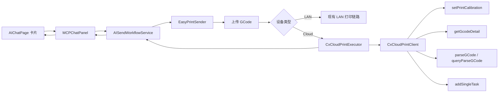

# AI/simple 云打印 C++ 闭环方案

## 1. 目标

这份文档聚焦一件事：

- 让 AI/simple 模式下“上传单盘 GCode 后直接发起云打印”的后半段，从 `SendToPrinterPage` 前端彻底脱钩
- 把云设备最终打印任务创建链路下沉到 C++
- 保持最终打印结果与专业模式一致

约束也保持明确：

- 不改 `SendToPrinterPage`
- 不破坏专业模式现有流程
- AI/simple 复用专业模式已经验证过的业务语义，但不再依赖专业模式前端页面去完成云打印收尾

---

## 2. 为什么必须改方向

当前 AI/simple 的前半段其实已经比较完整：

- 聊天卡片里完成耗材映射
- `AISendWorkflowService` 组装 `print_data`
- `EasyPrintSender` 执行上传

但云设备的后半段，之前还是借专业模式页面完成的：

1. 上传成功
2. C++ 向发送页注入 `notify_send_complete`
3. `SendToPrinterPage` 前端消费这条消息
4. 前端继续调用：
   - `setPrintCalibration`
   - `getGcodeDetail`
   - `parseGCode`
   - `queryParseGCode`
   - `addSingleTask`

这会带来两个问题：

- AI/simple 虽然有自己的卡片和流程，但云打印实质上还挂在专业模式页面语义上
- 后续演进会被 `SendToPrinterPage` 的生命周期和脚本注入时序绑住

---

## 3. 对旧“最小改动方案”的确认结论

这里把一个关键判断写清楚，避免后面再回到旧方案：

- 旧方案里，AI/simple 在云设备上传成功后，仍然依赖 `Plater::send_script_to_printer_dialog(...)`
- C++ 通过这条路径把 `notify_send_complete` 注入给隐藏的 `CxSentToPrinterDialog`
- 再由 `SendToPrinterPage` 前端继续走云打印后半段

问题不在于“有没有发送页实例”，而在于“页面是否已经 ready”。

我已经确认过当前代码行为：

1. `send_script_to_printer_dialog(...)` 会懒创建 `CxSentToPrinterDialog`
2. 但创建后只是 `Hide()`，随后立刻 `run_script(...)`
3. `CxSentToPrinterDialog::run_script(...)` 底层直接调用 `WebView::RunScript(...)`
4. 当前没有脚本排队机制，也没有页面 ready 后重放机制
5. 页面 `register_complete` 之后，C++ 补发的是 `update_send_page_content()`，不是之前那条 `notify_send_complete`

因此旧方案的真实结论是：

- 如果隐藏发送页刚好已经初始化完成，链路可能正常
- 但如果 AI/simple 从未打开过发送页，或者页面尚未 ready，`notify_send_complete` 可能直接丢失
- 一旦这条消息丢失，云设备发送的后半段就无法继续

也就是说，旧“最小改动方案”不是稳定闭环，只是机会型复用路径。

所以这个方向必须坚持：

- AI/simple 云打印后半段下沉到 C++
- 最终不再依赖 `SendToPrinterPage` 是否打开、是否加载完成、是否接住脚本注入

---

## 4. 与专业模式必须保持一致的结果口径

AI/simple 新链路不能只做到“能打”，而必须保证与专业模式结果一致。

真正要对齐的是这些业务结果：

1. 上传成功后，云端 GCode 记录必须先进入可用状态，再继续后续动作
2. 多色任务必须按专业模式语义先做云端解析，再创建打印任务
3. `print_calibration` 必须正确下发
4. `open_cfs` 必须正确映射到最终任务参数
5. 聊天窗口里手动改过的耗材映射，必须进入最终 `filamentsList`
6. 上传文件名、GCode ID、云端文件路径等关键字段口径必须和专业模式一致

如果这些不一致，就会出现：

- UI 看起来一致，但设备行为不一致
- 局域网设备正常，创想云设备异常
- 映射卡里显示是新的，最终打印任务拿到的却还是旧映射

---

## 5. 专业模式云打印后半段的真实语义

基于当前专业模式前端和 C++ 的现有实现，云设备上传成功后的关键步骤是：

1. 解析上传结果，拿到：
   - `id`
   - `filekey`
2. 生成 CDN 文件路径：
   - `https://file-cdn.creality.com/{filekey}`
3. 轮询 `getGcodeDetail(id)`，等待云端记录 ready
4. 如果是多色任务：
   - `setPrintCalibration(tbId, { enableSelfTest })`
   - `parseGCode(tbId, downloadLink)`
   - `queryParseGCode(tbId, downloadLink)` 直到解析完成
5. 最终 `addSingleTask(...)`

这里有两个字段语义不能混：

- `downloadLink` 用于云端解析
- `gcodeFilePath` 用于最终创建任务

---

## 6. 新架构总览



重心是：

- `AISendWorkflowService` 继续作为 AI 卡片工作流中台
- `EasyPrintSender` 继续负责上传入口
- 云设备上传成功后的后半段，不再经过 `SendToPrinterPage`
- 而是进入新的 `CxCloudPrintExecutor`

---

## 7. 第一版类设计

### 7.1 `AISendWorkflowService`

职责：

- 维护卡片 session
- 维护耗材映射、预览、发送信息快照
- 组装最终 `print_data`
- 调用 `EasyPrintSender`
- 接收上传进度、上传完成、云打印完成/失败回调
- 向前端发 `snapshot / progress / result / error`

不负责：

- 直接拼云接口 HTTP
- 直接做云端轮询

### 7.2 `EasyPrintSender`

职责：

- 上传 GCode
- 识别设备类型
- LAN 继续走现有 `send_print_cmd`
- Cloud 在上传成功后，把后半段转交给 `CxCloudPrintExecutor`

第一版落地策略：

- 先把“新闭环入口”预留进去
- 默认仍允许回退到旧路径
- 避免一次性切换导致当前流程失效

### 7.3 `CxCloudPrintExecutor`

职责：

- 接收 AI/simple 云打印请求
- 执行后半段状态机
- 推进阶段进度
- 向 `AISendWorkflowService` 回推成功/失败

第一版要求：

- 先稳定接口与回调结构
- 内部状态机步骤允许先返回 `not_implemented`
- 但类边界和数据结构必须先搭对

### 7.4 `CxCloudPrintClient`

职责：

- 封装创想云相关 API/RPC 调用
- 统一 headers / token / request id / base url
- 对上层暴露统一 `Result`

第一版要求：

- 先稳定方法签名
- HTTP 细节下一阶段再逐个补齐

---

## 8. 建议的数据结构

```cpp
struct CloudPrintMaterialItem {
    int         extruder_id = 0;
    int         box_id = -1;
    int         box_type = -1;
    int         material_id = -1;
    std::string filament_type;
    std::string extruder_color;
    std::string match_color;
    std::string c_id;
    std::string slot_label;
};

struct CloudPrintRequest {
    std::string                     device_name;
    std::string                     device_id;
    std::string                     tb_id;
    std::string                     upload_name;
    std::string                     upload_result_body;
    int                             open_cfs = 0;
    int                             print_calibration = 1;
    std::vector<CloudPrintMaterialItem> materials;
};

struct CloudUploadedFileInfo {
    int         status_code = -1;
    std::string gcode_id;
    std::string file_key;
    std::string task_name;
    std::string cdn_gcode_file_path;
};

struct CloudGcodeDetail {
    int         parse_state = -1;
    std::string download_link;
};
```

---

## 9. 第一版接口草图

### 9.1 `CxCloudPrintClient`

```cpp
class CxCloudPrintClient {
public:
    struct Result {
        bool           ok = false;
        int            http_status = 0;
        std::string    error;
        nlohmann::json body;
    };

    Result set_print_calibration(const std::string& tb_id, int enable_self_test) const;
    Result get_gcode_detail(const std::string& gcode_id) const;
    Result parse_gcode(const std::string& tb_id, const std::string& download_link) const;
    Result query_parse_gcode(const std::string& tb_id, const std::string& download_link) const;
    Result add_single_task(const nlohmann::json& payload) const;
};
```

### 9.2 `CxCloudPrintExecutor`

```cpp
class CxCloudPrintExecutor {
public:
    struct Callbacks {
        std::function<void(int progress, const std::string& stage, const std::string& message)> on_progress;
        std::function<void(const nlohmann::json& result)> on_success;
        std::function<void(const std::string& code, const std::string& message)> on_error;
    };

    explicit CxCloudPrintExecutor(CxCloudPrintClient client = {});

    void start(const CloudPrintRequest& request, Callbacks callbacks);
    void cancel();
};
```

---

## 10. `EasyPrintSender` 第一版接线原则

建议把 `EasyPrintSender` 做成下面这种结构：

1. `startPrint(...)`
   - LAN 继续走现有路径
   - Cloud 进入 `startPrintCloud(...)`

2. `startPrintCloud(...)`
   - 先尝试走新的 `CxCloudPrintExecutor`
   - 如果当前未启用闭环执行器，或者执行器尚未真正实现，再回退到旧 `notify_send_complete` 路径

这样做的好处是：

- 结构先立住
- 当前功能不被一次性打断
- 下一阶段补云接口时，只需要把回退开关逐步关掉

---

## 11. 第一版代码骨架落地原则

这一版代码骨架只做三件事：

1. 新增 `CxCloudPrintClient`
   - 先稳定接口形状
   - 暂不把 HTTP 细节一次性写满
   - 统一返回 `Result { ok, http_status, error, body }`

2. 新增 `CxCloudPrintExecutor`
   - 先稳定 `CloudPrintRequest / CloudUploadedFileInfo / CloudGcodeDetail`
   - 先把 `start()` 入口、进度回调、成功回调、错误回调接好
   - 内部状态机方法这一版允许先返回 `not_implemented`

3. 改 `EasyPrintSender`
   - 先预留“云闭环执行器入口”
   - 默认保持旧路径回退，避免打坏当前流程
   - 等下一阶段把 API 真正补齐后，再切到 C++ 闭环主路径

---

## 12. 当前阶段明确不做的事

为了降低风险，这一阶段不同时做下面这些：

- 重构专业模式发送页面
- 修改 `SendToPrinterPage`
- 把 LAN 和 Cloud 强行揉成一个超大函数
- 第一版就上复杂并发与取消恢复
- 在 AI/simple 里重做一整套专业模式 UI

---

## 13. 一句话结论

AI/simple 想真正从 `SendToPrinterPage` 脱钩，正确做法不是继续给 `notify_send_complete` 补字段，而是：

- 保留 `AISendWorkflowService` 作为 AI 工作流中台
- 保留 `EasyPrintSender` 作为上传入口
- 新增 `CxCloudPrintClient + CxCloudPrintExecutor`
- 把创想云设备上传后的“校准 / ready / 解析 / 创建任务”整段下沉到 C++

这样才能在不改专业模式页面的前提下，让 AI/simple 的云设备发送链路真正独立闭环，同时保证结果与专业模式一致。

---

## 14. 当前阶段已落地的主要修改（2026-04）

### 14.1 已跑通的 AI/simple 云设备发送闭环

本阶段已经把 AI/simple 的创想云设备发送，从“上传后依赖前端发送页收尾”收敛成“上传后由 C++ 继续完成后半段闭环”。

当前真实主链路为：

1. `AISendWorkflowService` 组装当前卡片快照与 `print_data`
2. `EasyPrintSender` 负责上传 GCode
3. 上传成功后，若命中云闭环条件，则进入 `CxCloudPrintExecutor`
4. `CxCloudPrintExecutor` 继续执行：
   - `set_print_calibration`
   - `get_gcode_detail` 轮询 ready
   - 多色任务时 `parse_gcode / query_parse_gcode`
   - `add_single_task`
5. 最终结果再回推给 AIChatPage send card

对应主要代码：

- `src/slic3r/GUI/simple/sendWorkflow/AISendWorkflowService.cpp`
- `src/slic3r/GUI/simple/sendWorkflow/EasyPrintSender.cpp`
- `src/slic3r/GUI/simple/sendWorkflow/CxCloudPrintExecutor.cpp`
- `src/slic3r/GUI/simple/sendWorkflow/CxCloudPrintClient.cpp`

### 14.2 本阶段对 `AISendWorkflowService` 的主要修改

- 在 `build_print_data()` 中统一输出云闭环所需字段：
  - `tb_id`
  - `device_type`
  - `is_multi_color_device`
  - `open_cfs`
  - `print_calibration`
  - `color_match_info`
- 新增 `backfill_cloud_device_color_match_info(...)`，在进入发送前对 `color_match_info` 做云设备视角下的回填。
- 在同 MAC 同时存在 LAN / Cloud 设备时，为本地联调增加“强制选云设备”的测试路径。
- 将云闭环过程态、成功态、失败态统一回推回 AI send card。

### 14.3 本阶段对 `EasyPrintSender` 的主要修改

- `EasyPrintSender` 继续作为上传入口。
- 上传成功后通过 `tryStartPrintCloudClosedLoop(...)` 组装 `CloudPrintRequest`。
- 将 `color_match_info` 中的每条映射转成 `CloudPrintMaterialItem`。
- 统一承接云闭环执行器的进度、成功、失败回调。

这意味着 `EasyPrintSender` 不再只是“上传完成通知器”，而是 AI/simple 云设备发送闭环的统一切入点。

### 14.4 本阶段对 `CxCloudPrintExecutor` 的主要修改

`CxCloudPrintExecutor` 本阶段已经从骨架类变成真实执行器，负责：

- 解析上传结果中的 `gcode_id / file_key / task_name`
- 轮询云端 GCode 就绪状态
- 为多色任务执行设备端 GCode 解析
- 构造最终 `addSingleTask` payload
- 通过标准回调上报 `progress / success / error`

同时补齐了阶段性日志，便于快速判断卡在哪个环节：

- `cloud_prepare`
- `cloud_set_calibration`
- `cloud_wait_ready`
- `cloud_parse_start`
- `cloud_parse_wait`
- `cloud_task_create`

### 14.5 本阶段最关键的业务修正：`cId` 对齐专业模式语义

本阶段最关键的修正之一，是把 AI/simple 云发送里的 `cId` 处理逻辑对齐到专业模式语义。

在专业模式里，多色任务最终发给云端的 `filamentsList` 里，`cId` 不能是空值；否则虽然任务可能创建成功，但设备端可能无法正确识别真实料槽耗材。

本阶段对 AI/simple 的修正策略为：

1. 优先使用 `color_match_info` 中已有的 `cId`
2. 若缺失，则根据目标云设备的 `boxColorInfos` 回填 `cId`
3. 若仍缺失，则根据 `slotLabel` 推导，例如：
   - `1D -> T1D`
   - `2B -> T2B`
4. 在 `query_parse_gcode` 返回 `filamentsList` 后，进一步使用云端解析结果中的 `cId` 修正最终 payload

最终 `addSingleTask` payload 中的 `cId` 采用以下优先级：

- 现有 `material.c_id`
- `query_parse_gcode` 返回的 `filamentsList[].cId`
- `slotLabel -> cId` 推导结果

对应修改点：

- `AISendWorkflowService.cpp` 中的 `backfill_cloud_device_color_match_info(...)`
- `CxCloudPrintExecutor.cpp` 中的 `resolve_material_cid_for_task(...)`

### 14.6 本地联调测试宏

为了在“同一台机器同时具备局域网与云设备形态”时强制验证云路径，本阶段加入了本地测试宏：

- `C3D_AI_SIMPLE_FORCE_CLOUD_DEVICE_FOR_TEST`
- `C3D_AI_SIMPLE_FORCE_CLOUD_CLOSED_LOOP_FOR_TEST`

作用是：

- AI/simple 发送时优先选同 MAC 的云设备
- 即使当前默认链路更接近 LAN，也强制进入云闭环执行器

注意：

- 这两个宏仅用于联调和验证 AI/simple 云路径
- 它们不代表最终正式版的设备优先级策略
- 正式策略仍应以专业模式现网语义为准

### 14.7 当前阶段的验证结论

截至本阶段，可以确认：

- AI/simple 的创想云设备发送主链路已经基本跑通
- 任务创建不再依赖 `SendToPrinterPage`
- `cId` 空值导致的多色任务异常，已经在 C++ 闭环里补做修正

联调时重点查看 `D:/log.txt` 中以下日志：

- `stage=start_send_internal`
- `query_parse_gcode state attempt=...`
- `query_parse_gcode filamentsList=...`
- `resolve_material_cid extruder_id=...`
- `addSingleTask payload=...`
