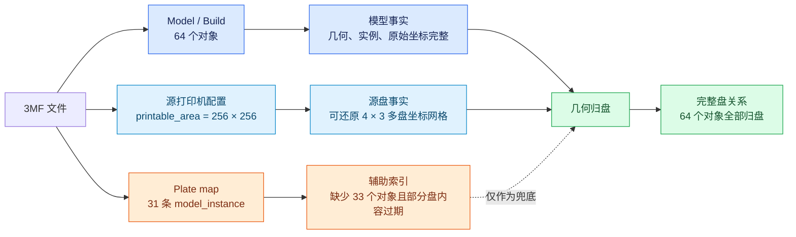
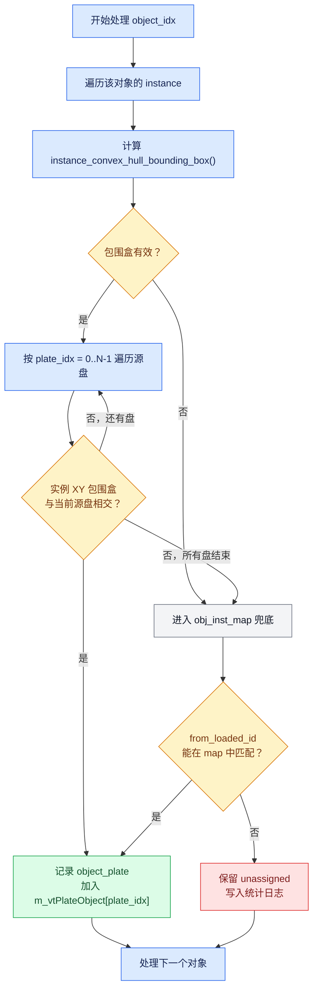

# Bug 修复记录：Bambu 3MF 归盘元数据不完整导致模型散落在盘外

> 可视化动态图解：[打开 HTML 交互演示](bug-17466-bambu-3mf-plate-rebuild-explainer.html)

## 1. 基本信息

- Bug ID：`17466`
- 标题：`【引入】拖入/双击打开附件第三方保存 3MF（BBL 保存），模型没有自动摆放在盘内`
- 禅道地址：https://zentao.creality.com/zentao/bug-view-17466.html
- 日期：`2026-07-28`
- 产品：`Creality Print`
- 模块：`文件操作`
- 所属执行：`CP7.2.1 20260730`
- Bug 类型：`代码错误`
- 严重程度：`严重`
- 优先级：`高`
- 状态：`激活`
- 影响版本：`CrealityPrint_7.2.1.5425_Beta`
- 分支：`release-260731`
- 关键文件：
  - `src/slic3r/GUI/Plater.cpp`
  - `src/slic3r/GUI/Check3mfVendor.hpp`
  - `src/slic3r/GUI/Check3mfVendor.cpp`

## 2. 问题现象

### 2.1 复现步骤

1. 启动 Creality Print。
2. 拖入或双击打开 Bug 附件中的 Bambu Studio 多盘 3MF。
3. 按第三方项目导入流程选择 Creality 打印机预设。
4. 等待模型和 12 个盘加载完成。

### 2.2 实际结果

- 一部分模型可以正常移动到对应盘并居中。
- 仍有大量模型保留在原始多盘坐标中，散落在当前盘外。
- 对象列表中模型并未丢失，但场景中的盘归属和位置不正确。
- 第 11、12 盘在配置的 `model_instance` 列表中为空，但 3MF 自带缩略图中仍能看到模型。

### 2.3 期望结果

- 导入第三方多盘 3MF 后，应恢复每个模型原本所属的盘。
- 每一盘的模型作为一个整体移动到 Creality Print 当前盘网格并居中。
- 同盘模型之间的相对布局应保持不变。
- 不应因为 plate 元数据缺失而把仍然存在的模型留在盘外。

## 3. 3MF 数据核查

问题文件并不是缺少模型几何，而是 plate 归属元数据不完整。

### 3.1 对象总数

检查 `Metadata/model_settings.config`：

- `<object>` 数量：`64`
- `<plate>` 数量：`12`
- 所有 plate 中 `<model_instance>` 合计：`31`
- 没有出现在 plate map 中的对象：`33`

检查 3MF 的其他结构：

- `3D/3dmodel.model` 的 `<build>` 包含全部 64 个对象。
- `<assemble>` 包含全部 64 个对象。
- 64 个对象均为正常模型部件，不是仅用于辅助计算的隐藏对象。

因此：

> 模型数据完整，缺失的是“对象属于哪个盘”的辅助索引。

### 3.2 原始 plate map

原始 `model_settings.config` 中各盘 `model_instance` 数量如下：

| 盘号 | 配置中的数量 |
| ---: | -----------: |
| 1 | 1 |
| 2 | 8 |
| 3 | 1 |
| 4 | 4 |
| 5 | 7 |
| 6 | 3 |
| 7 | 1 |
| 8 | 3 |
| 9 | 2 |
| 10 | 1 |
| 11 | 0 |
| 12 | 0 |
| 合计 | 31 |

其中第 11、12 盘的 map 为空，但对应缩略图仍有模型。这说明 map 不只是“少保存了几个对象”，而是已经不能代表完整的实际盘内容。

### 3.3 Bambu 重建后的结果

使用 Bambu Studio 自身重新加载并导出该 3MF，调试日志显示：

```text
PartPlateList::reload_all_objects:
m_model->objects.size() is 64
```

随后 64 个 object/instance 均成功命中某个 plate。重建后的每盘对象数为：

| 盘号 | Bambu 几何重建数量 |
| ---: | -----------------: |
| 1 | 1 |
| 2 | 11 |
| 3 | 7 |
| 4 | 6 |
| 5 | 16 |
| 6 | 2 |
| 7 | 3 |
| 8 | 4 |
| 9 | 5 |
| 10 | 4 |
| 11 | 2 |
| 12 | 3 |
| 合计 | 64 |

这组结果证明 Bambu 没有把 `model_instance` 当作唯一事实来源，而是在加载后重新计算了盘归属。

### 3.4 图例一：3MF 中三类数据的关系



图例说明：

| 颜色 | 含义 | 本 Bug 中的可信程度 |
| --- | --- | --- |
| 蓝色 | `Model`、`Build`、实例及原始 transformation | 高，64 个对象全部存在 |
| 橙色 | `plate_data[].obj_inst_map` / `model_instance` | 低，只包含 31 条且第 11、12 盘为空 |
| 浅蓝色 | 源打印机 `printable_area` | 高，可用于重建源多盘网格 |
| 绿色 | 根据实例包围盒得到的几何归盘结果 | 主结果，覆盖全部 64 个对象 |

这里最重要的认识是：`model_instance` 是可重新生成的索引，不是模型是否存在的依据。只要 Model、实例坐标和源盘边界仍然完整，就可以重新推导盘归属。

## 4. Bambu Studio 的处理方式

### 4.1 多盘源网格

该文件使用的源打印区域为：

```text
printable_area = 0x0, 256x0, 256x256, 0x256
```

即源盘尺寸为 `256 × 256 mm`。

Bambu 的多盘逻辑使用：

```cpp
LOGICAL_PART_PLATE_GAP = 1.0 / 5.0;
```

对于 12 个盘：

```text
列数 = ceil(sqrt(12)) = 4
X/Y 步长 = 256 × (1 + 1/5) = 307.2 mm
```

盘索引到源网格原点的关系为：

```text
row = plate_index / 4
col = plate_index % 4

origin_x = col × 307.2
origin_y = -row × 307.2
```

源 12 盘的实际网格可以表示为：

```text
                         X 方向
              0          307.2        614.4        921.6
              │            │            │            │
Y =    0   ┌────────┐   ┌────────┐   ┌────────┐   ┌────────┐
           │ P1: 1  │   │ P2: 11 │   │ P3: 7  │   │ P4: 6  │
           └────────┘   └────────┘   └────────┘   └────────┘

Y = -307.2 ┌────────┐   ┌────────┐   ┌────────┐   ┌────────┐
           │ P5: 16 │   │ P6: 2  │   │ P7: 3  │   │ P8: 4  │
           └────────┘   └────────┘   └────────┘   └────────┘

Y = -614.4 ┌────────┐   ┌────────┐   ┌────────┐   ┌────────┐
           │ P9: 5  │   │ P10: 4 │   │ P11: 2 │   │ P12: 3 │
           └────────┘   └────────┘   └────────┘   └────────┘
```

图中数字是 Bambu 几何重建后的对象数。相邻盘不是紧贴的，中间有：

```text
307.2 - 256 = 51.2 mm
```

的逻辑间隔。对象保留在源多盘坐标中时，落在第 2 至 12 盘的对象相对于当前显示盘会显得很远；这正是修复前“散落在盘外”的视觉来源。

### 4.2 全量几何归盘

Bambu 在建立 plate 列表后调用：

```cpp
PartPlateList::reload_all_objects()
```

其处理原则是：

1. 遍历 `m_model->objects` 中的全部对象。
2. 遍历每个对象的全部实例。
3. 调用 `instance_convex_hull_bounding_box()` 计算实例真实包围盒。
4. 按 plate 顺序与每个盘的 build volume 包围盒相交。
5. 命中第一个盘后调用 `add_instance()`，然后停止继续查找。
6. 没命中可打印盘时，再尝试放入 unprintable plate。

简化流程如下：

```text
全部 ModelObject
       │
       ▼
全部 ModelInstance
       │
       ▼
实例凸包包围盒
       │
       ▼
依次与源盘 1..N 相交
       │
       ├─ 命中 ─► 加入该盘并停止
       │
       └─ 未命中 ► 尝试 unprintable plate
```

关键区别是：

> Bambu 根据 64 个实例的真实几何位置恢复盘关系，而不是只遍历 31 条 `model_instance`。

## 5. Creality Print 原逻辑

### 5.1 导入调用链

相关调用顺序为：

```text
Plater::priv::load_files()
       │
       ├─ Model::read_from_archive()
       │      ├─ model
       │      ├─ config_loaded
       │      └─ plate_data
       │
       ├─ Check3mfVendor::updatePlateObject()
       │
       ├─ plate/config/preset 转换
       │
       └─ Check3mfVendor::centerModelToPlate()
```

### 5.2 原 `updatePlateObject()`

修复前的逻辑只遍历：

```cpp
plate_data[i]->obj_inst_map
```

再通过：

```cpp
item.first == model.objects[k]->from_loaded_id
```

找到 ModelObject，并把 object index 写入：

```cpp
m_vtPlateObject[i]
```

这个流程没有遍历完整的 `model.objects`，所以其上限就是配置中已有的 31 条归盘记录。

### 5.3 后续居中为什么没有处理 33 个对象

`centerModelToPlate()` 本身的逻辑没有丢对象：

```cpp
view3D->select_object_from_idx(m_vtPlateObject[i]);
sidebar->obj_list()->update_selections();
view3D->center_selected_plate(i);
```

但它只能处理 `m_vtPlateObject[i]` 中已有的对象。

缺少 `model_instance` 的 33 个对象从未进入任何 `m_vtPlateObject`：

```text
配置中没有 model_instance
       │
       ▼
obj_inst_map 中没有记录
       │
       ▼
updatePlateObject() 没有选中对象
       │
       ▼
centerModelToPlate() 无法移动该对象
       │
       ▼
对象保留源多盘坐标，表现为散落在盘外
```

### 5.4 图例二：修复前与修复后的数据流对比

```mermaid
flowchart TB
    subgraph OLD["修复前：plate map 是唯一输入"]
        O1["model_instance<br/>31 条"] --> O2["updatePlateObject()"]
        O2 --> O3["m_vtPlateObject<br/>只有 31 个对象"]
        O3 --> O4["centerModelToPlate()<br/>只移动 31 个对象"]
        O5["其余 33 个对象"] --> O6["从未进入选择组<br/>保留源坐标并散落盘外"]
    end

    subgraph NEW["修复后：几何归盘为主，plate map 兜底"]
        N1["Model<br/>64 个对象"] --> N4["遍历全部实例并计算包围盒"]
        N2["源 printable_area"] --> N3["建立 4 × 3 源盘网格"]
        N3 --> N5["包围盒与各源盘相交"]
        N4 --> N5
        N5 --> N6["m_vtPlateObject<br/>完整盘对象组"]
        N7["obj_inst_map"] -. "仅补充未命中对象" .-> N6
        N6 --> N8["centerModelToPlate()<br/>整盘移动并居中"]
        N8 --> N9["64 个对象进入对应目标盘"]
    end

    classDef old fill:#ffedd5,stroke:#ea580c,color:#7c2d12;
    classDef lost fill:#fee2e2,stroke:#dc2626,color:#7f1d1d;
    classDef input fill:#dbeafe,stroke:#2563eb,color:#172554;
    classDef fix fill:#dcfce7,stroke:#16a34a,color:#14532d;
    classDef center fill:#ede9fe,stroke:#7c3aed,color:#4c1d95;

    class O1,O2,O3,O4 old;
    class O5,O6 lost;
    class N1,N2,N3,N4 input;
    class N5,N6,N9 fix;
    class N7 old;
    class N8 center;
```



两条流程的差异不在最后的 `centerModelToPlate()`，而在其输入：

- 修复前输入是“不完整 map 过滤后的 31 个对象”；
- 修复后输入是“从完整 Model 和源盘网格推导出的 64 个对象”；
- 最后的居中函数保持不变，但它现在终于拿到了完整对象组。

## 6. 最终修复方案

### 6.1 设计原则

修复遵循以下原则：

1. 几何位置是第三方 3MF 归盘的主数据源。
2. `obj_inst_map` 只作为无法几何归盘时的兼容兜底。
3. 源 `printable_area` 只用于重建源多盘网格。
4. 不缩放模型，不做源/目标盘尺寸比例变换。
5. 复用现有 `centerModelToPlate()` 完成整盘居中。
6. 同一对象命中多个盘时，保持与 Bambu 相同的 first-hit 语义。

### 6.2 图例三：单个对象的归盘决策



相交判断使用区间重叠，而不是要求对象完全包含在盘内：

```cpp
instance_bbox.max.x() >= plate_min_x &&
instance_bbox.min.x() <= plate_max_x &&
instance_bbox.max.y() >= plate_min_y &&
instance_bbox.min.y() <= plate_max_y
```

可以将一次 X/Y 相交理解为：

```text
X 轴：  plate_min_x ├──────────────┤ plate_max_x
                         object_min_x ├──────┤ object_max_x
        两个区间存在重叠  ─────────────────────► X 命中

Y 轴：  plate_min_y ├──────────────┤ plate_max_y
                    object_min_y ├────────┤ object_max_y
        两个区间存在重叠  ─────────────────────► Y 命中

X、Y 同时命中  ───────────────────────────────► 对象归入该盘
```

使用“相交”而不是“完全包含”的原因：

- 与 Bambu `intersect_instance()` 的 first-hit 思路一致；
- 对象轻微越界时仍可先恢复其逻辑盘归属；
- 归盘后是否真实越界，由现有 plate outside 检查继续负责；
- 若一个对象同时碰到两个盘，按 plate 顺序归入第一个命中的盘。

### 6.3 保留原始源配置

修改 `Check3mfVendor::updatePlateObject()` 接口：

```cpp
void updatePlateObject(
    const PlateDataPtrs& plate_data,
    const Slic3r::Model& model,
    const DynamicPrintConfig& source_config);
```

在 `Plater.cpp` 中传入刚从 3MF 读取、尚未替换为 Creality 目标打印机配置的 `config_loaded`：

```cpp
Check3mfVendor::getInstance()->updatePlateObject(
    plate_data, model, config_loaded);
```

必须在配置转换前使用 `config_loaded`，否则 `printable_area` 已经变成目标打印机尺寸，无法还原源文件中对象所在的多盘网格。

### 6.4 建立源多盘边界

从源配置读取：

```cpp
const ConfigOptionPoints* printable_area =
    source_config.opt<ConfigOptionPoints>("printable_area");
```

由 printable area 的包围盒得到：

- 源盘最小/最大 X、Y；
- 源盘宽度和深度；
- plate 列数；
- 每个 plate 的网格原点。

这里只构造判断边界，不修改 ModelObject 或 ModelInstance 的 transformation。

### 6.5 遍历全部对象并重建归属

修复后的主流程：

```cpp
for (size_t object_idx = 0; object_idx < model.objects.size(); ++object_idx) {
    const ModelObject* object = model.objects[object_idx];

    for (size_t instance_idx = 0;
         instance_idx < object->instances.size();
         ++instance_idx) {
        const BoundingBoxf3 instance_bbox =
            object->instance_convex_hull_bounding_box(instance_idx);

        for (size_t plate_idx = 0;
             plate_idx < plate_data.size();
             ++plate_idx) {
            if (instance_bbox 与源盘 XY 包围盒相交) {
                object_plate[object_idx] = plate_idx;
                m_vtPlateObject[plate_idx].emplace_back(object_idx);
                break;
            }
        }
    }
}
```

该流程覆盖 `model.objects` 的全部 64 个对象，不再受 31 条 map 的数量限制。

### 6.6 元数据兜底

几何归盘完成后，仅对仍未归盘的对象使用旧逻辑：

```text
几何未归盘对象
       │
       ▼
遍历 plate_data[].obj_inst_map
       │
       ▼
通过 from_loaded_id 匹配
       │
       ▼
加入对应 m_vtPlateObject
```

这可以兼容：

- 源配置没有 `printable_area`；
- printable area 为空或非法；
- 模型凸包包围盒未定义；
- 个别第三方文件的实例坐标不在标准源盘网格中。

### 6.7 整盘居中

重建出的 `m_vtPlateObject` 继续交给原有：

```cpp
centerModelToPlate()
```

该函数按 plate 依次：

1. 选择该盘的全部对象；
2. 同步对象列表选择状态；
3. 调用 `center_selected_plate(i)`；
4. 将整个对象组移动到目标盘中心。

这样既能把模型放入 Creality 目标盘，又不会改变同盘对象之间的相对布局。

### 6.8 图例四：为什么居中不会改变同盘布局

```text
源盘对象组                                  目标盘对象组

┌────────────────────┐                    ┌────────────────────┐
│     A              │                    │       A'           │
│                    │   对 A/B/C 应用     │                    │
│          B         │ ─── 同一个 Δ ───►  │            B'      │
│   C                │                    │     C'             │
└────────────────────┘                    └────────────────────┘

对象组中心 = S                              目标盘中心 = T
统一平移量 Δ = T - S
```

对同盘任意两个对象 `A`、`B`：

```text
A' = A + Δ
B' = B + Δ

A' - B' = (A + Δ) - (B + Δ)
        = A - B
```

因此：

- 所有对象使用同一个平移量；
- 对象之间的相对距离和方向不变；
- 没有乘以尺寸比例，所以模型尺寸不变；
- 源 `256 × 256` 只参与“识别原来属于哪个盘”，不参与目标坐标缩放。

这也解释了为什么修复应该分成两个阶段：

1. **归盘阶段**：回答“这个对象原来属于哪个盘？”；
2. **居中阶段**：回答“这个完整对象组如何移动到目标盘中心？”。

不能把两个问题合并为源盘到目标盘的尺寸缩放，否则既无法恢复缺失归属，也可能破坏模型布局。

## 7. 代码改动摘要

### 7.1 `src/slic3r/GUI/Check3mfVendor.hpp`

- 扩展 `updatePlateObject()` 接口。
- 新增 `source_config` 参数。

### 7.2 `src/slic3r/GUI/Check3mfVendor.cpp`

- 新增 `<cmath>`。
- 初始化与 plate 数量一致的 `m_vtPlateObject`。
- 读取源 `printable_area`。
- 按 `ceil(sqrt(plate_count))` 计算源网格列数。
- 使用 `1/5` 盘间距构造各源盘 XY 边界。
- 遍历全部对象和实例，按实例凸包包围盒重建盘归属。
- 对几何未归盘对象执行 `obj_inst_map` 兜底。
- 增加重建统计日志。

### 7.3 `src/slic3r/GUI/Plater.cpp`

- 调用 `updatePlateObject()` 时传入原始 `config_loaded`。
- 调用位置保持在 preset/config 转换之前。

## 8. 统计日志

新增日志格式：

```text
updatePlateObject:
plates=<盘数>,
objects=<对象数>,
reconstructed=<几何归盘数>,
metadata_fallback=<元数据兜底数>,
unassigned=<未归盘数>
```

该测试文件的预期结果：

```text
plates=12,
objects=64,
reconstructed=64,
metadata_fallback=0,
unassigned=0
```

如果以后出现第三方文件兼容问题，可据此快速区分：

- 几何归盘是否生效；
- 是否依赖旧 map 兜底；
- 是否仍有完全无法归盘的对象。

## 9. 验证记录

### 9.1 数据验证

- [x] `model_settings.config` 中确认有 64 个 object。
- [x] 12 个 plate 中确认只有 31 条 model_instance。
- [x] 确认有 33 个对象没有 plate map。
- [x] `3D/3dmodel.model` build 中确认全部 64 个对象存在。
- [x] `<assemble>` 中确认全部 64 个对象存在。
- [x] plate 11、12 的缩略图确认存在模型。

### 9.2 Bambu 对照验证

- [x] 使用 Bambu Studio 独立命令行加载原 3MF。
- [x] 使用兼容新版本文件开关完成重新导出。
- [x] 日志确认 `reload_all_objects()` 遍历 64 个对象。
- [x] 日志确认 64 个实例全部命中 12 个可打印盘。
- [x] 重导出的 12 盘对象数合计为 64。

### 9.3 Creality Print 验证

- [x] `Plater.cpp` 与 `Check3mfVendor.cpp` 定向编译通过。
- [x] `git diff --check` 通过。
- [x] 实际重新导入 Bug 附件。
- [x] 原来散落在盘外的 33 个对象已正确归盘并居中。
- [x] 用户确认问题已解决。

## 10. 回归测试清单

### 10.1 Bambu 3MF plate map

- [ ] model_instance 完整的单盘 3MF。
- [ ] model_instance 完整的多盘 3MF。
- [ ] model_instance 部分缺失的多盘 3MF。
- [ ] model_instance 全部缺失但实例坐标有效的多盘 3MF。
- [ ] 存在空盘的多盘 3MF。
- [ ] 最后一个或多个盘 map 为空但缩略图有模型的 3MF。

### 10.2 不同盘数量

- [ ] 1 个盘。
- [ ] 2 个盘。
- [ ] 4 个盘。
- [ ] 5 个盘，覆盖列数从 2 变为 3。
- [ ] 9 个盘。
- [ ] 10 至 12 个盘，覆盖 4 列布局。
- [ ] 达到当前最大 plate 数量的项目。

### 10.3 不同源打印区域

- [ ] `256 × 256 mm` 源盘。
- [ ] 非 256 mm 的矩形源盘。
- [ ] printable area 原点不为 `(0, 0)` 的源盘。
- [ ] 非矩形 printable area，确认以其包围盒归盘的行为可接受。
- [ ] 缺少 printable area，确认进入 metadata fallback。

### 10.4 位置与布局

- [ ] 同盘多对象的相对位置保持不变。
- [ ] 旋转、缩放后的实例可以正确归盘。
- [ ] 模型压入底板时仍能根据 XY 位置归盘。
- [ ] 模型跨越两个源盘边界时保持 first-hit 行为。
- [ ] 完全位于源盘间隔区域的模型进入 fallback 或保持未归盘，并输出日志。

### 10.5 其他文件来源

- [ ] Creality 自有 3MF 导入行为不变。
- [ ] Prusa 3MF 的纯几何导入行为不变。
- [ ] STL/OBJ 等非 3MF 文件导入行为不变。
- [ ] “仅加载模型”流程不触发第三方项目整盘居中。

## 11. 风险与限制

### 11.1 多实例跨盘

当前 `m_vtPlateObject` 保存的是 object index，而不是 `(object, instance)`。

本 Bug 附件为 64 个对象、每个对象 1 个实例，因此修复结果正确。若以后出现“同一个 ModelObject 的不同 instance 分布在不同盘”的文件，现有对象级选择结构无法完整表达实例级归属。

后续如需支持，应将中间结构升级为实例级标识，并让最终选择/移动逻辑按 instance 工作。

### 11.2 XY 相交

当前修复使用实例三维凸包包围盒的 X/Y 范围与源盘 XY 边界相交，目的是恢复水平盘归属。

正常落在打印高度内的对象与 Bambu build volume 相交结果一致。异常位于打印高度之外的实例仍可能被归到某个水平盘，后续应由现有越界检测处理。

### 11.3 元数据与几何冲突

几何归盘优先于 `obj_inst_map`。这是为了对齐 Bambu 的实际加载行为，也能修复 stale map。

如果某个第三方文件故意使用与几何位置不同的 map 表达逻辑盘归属，则导入结果会以几何位置为准。

## 12. 回滚方案

若该修复导致第三方 3MF 归盘回归：

1. 将 `Plater.cpp` 调用恢复为：

   ```cpp
   updatePlateObject(plate_data, model);
   ```

2. 恢复 `Check3mfVendor.hpp` 原函数签名。
3. 恢复 `Check3mfVendor.cpp` 仅遍历 `obj_inst_map` 的实现。

回滚后不会影响 3MF 几何读取，但本 Bug 中缺少 map 的 33 个对象会重新散落在盘外。

不建议通过以下方式回滚或规避：

- 屏蔽 `centerModelToPlate()`；
- 按源盘/目标盘尺寸缩放全部坐标；
- 将所有未归盘对象无条件塞入当前盘；
- 对每个对象单独居中并破坏同盘布局。

这些方式都没有恢复真实盘归属，只会隐藏或转移问题。
