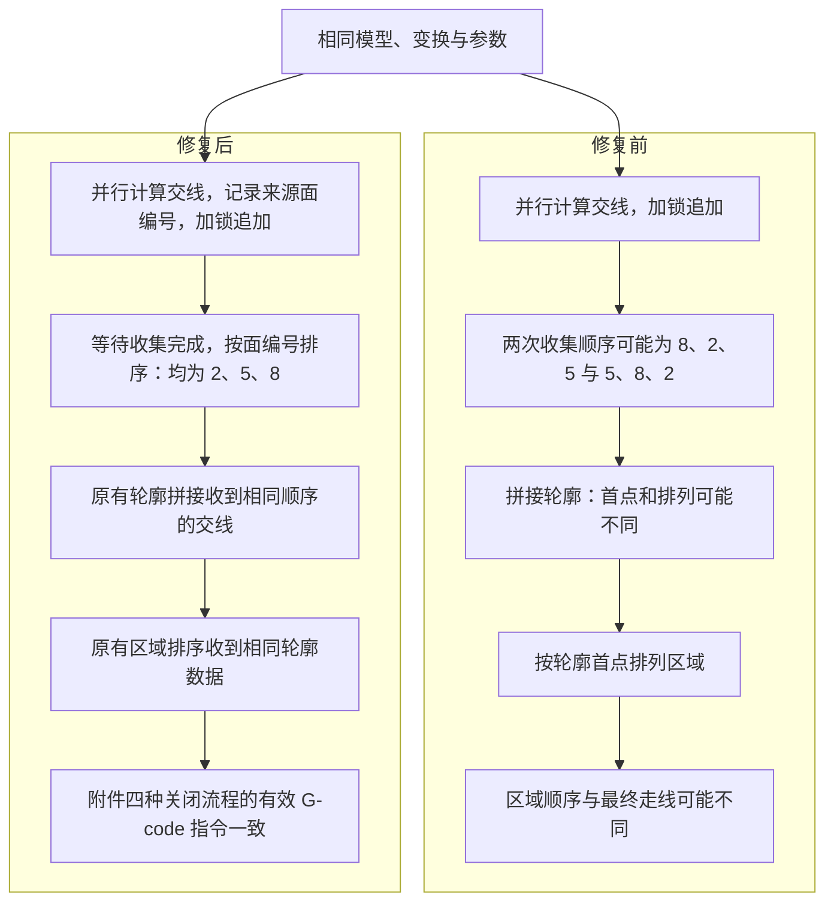

# Bug 18005：ZAA 开启后关闭与直接关闭的切片路径不一致

## 1. 基本信息

- Bug ID：`18005`
- 反馈标题：`【急】【ZAA】先开启再关闭和默认进来直接关闭 ZAA，路径不一致`
- 文档日期：`2026-09-20`
- 产品 / 分支：`Creality Print / release-260930`
- 影响模块：网格并行切片、轮廓拼接、层内区域排序及 G-code 路径生成。
- 验证源码基线：`c2fb000b0d1bccc79102250153c1c48dc1c8cfaf` 加本次修复。
- 反馈人、处理人、禅道链接：未提供；不推测禅道中的实际状态和版本计划。
- 当前状态：源码修复、专项回归及附件引擎对照已完成；待 GUI 复测和受控性能基准。
- 修复 Commit / Change-Id：以最终提交和评审记录为准。

建议提交说明：

```text
fix[#18005]: 固定并行切片交线顺序，修复 ZAA 开关前后路径不一致
```

## 2. 问题现象与复现

### 2.1 测试反馈步骤

1. 导入附件 `i7-ZAA.3mf`。
2. 开启 ZAA 并切片。
3. 关闭 ZAA，重新切片并保存 `gcode1`。
4. 以 STL 形式导入附件。
5. 不勾选 ZAA，切片并保存 `gcode2`。
6. 对比两份 G-code：ZAA 均已关闭，但路径不同。

期望：相同模型、变换及切片参数，在 ZAA 最终关闭时，不应因开关历史或线程完成先后改变切片路径。

### 2.2 附件与控制变量

- 本机附件：`C:/Users/118388/Downloads/i7-ZAA.3mf`。
- SHA-256：`FCA97923E80895CB996583451DEB1C381C49D78E0582C7449E99C7139F322CB1`。
- 一个对象、两个 model-part 体积；层高 `0.2 mm`，共 `237` 层。
- 保持模型位置、缩放及其他参数一致，仅改变 ZAA 状态或对象创建 / 模型加载方式。
- 引擎验证按“从同一个 3MF 仅导入模型，不加载工程配置”理解截图的“以 STL 形式导入”，再应用相同全局配置。未执行实际导出 STL 后重新导入的往返流程。
- GUI 尝试过程中桌面抓取失败，以下结果来自真实引擎接口验证，不表述为已经完成 GUI 逐按钮复现。

### 2.3 实际引擎对照

诊断程序调用 `Model::read_from_archive()`、`Print::apply()`、`Print::process()` 和 `Print::export_gcode()`，依次执行：

| 阶段 | 对象与配置 | 目的 |
|---|---|---|
| `off-baseline` | 初始关闭 ZAA | 建立关闭基线 |
| `on` | 同一个 Print 开启 ZAA | 形成真实开关历史 |
| `off-after-on` | 同一个 Print 再关闭 ZAA | 覆盖测试反馈的开关流程 |
| `off-fresh` | 全新 Print，ZAA 关闭 | 排除必须存在旧缓存 / ZAA 历史的假设 |
| `off-geometry-only` | 仅加载模型，全新 Print，应用相同配置且关闭 ZAA | 对照模型导入入口 |

修复前，关闭基线与开启后关闭分别生成 `552183`、`552241` 条归一化指令。全新关闭流程与关闭基线虽然均为 `552183` 条，指令哈希仍不同，差异出现在打印高度 `1.0 / 1.2 / 1.4 / 3.2 mm` 的层。

例如 `off-baseline.gcode` 与 `off-fresh.gcode` 的第 16005 行起，前者前往 `X196.708 Y128.188` 附近，后者前往 `X190.986 Y245.703` 附近，随后在不同位置挤出。差异属于实际移动和挤出路径，不只是时间戳或注释。

## 3. 引入历史追溯

| 项目 | 结果 |
|---|---|
| 本仓库最早引入相关逻辑的提交 | `da9f607fbc0ffdbee0bf3559994dab374bbc9668` |
| Author | `anoob` |
| AuthorDate | `2023-12-21 18:40:17 +0800` |
| Subject 原文 | `feature:[]orca` |
| Change-Id | 该提交正文未包含 |
| 首版 ZAA 集成提交 | `606addb1574ac4738ec171c5caeef631d3c4899c`，`2026-08-18` |
| ZAA 提交标题 | `feat: 合并完的首版zaa，在K2Plus上复验了一次。` |

通过 `git blame`、文件新增历史及原提交内容核对，2023 年引入的代码已经包含并行追加交线、按首条可用交线选种子、按轮廓首点排列区域及依次输出区域路径的链路。

这里确认的是问题机制进入本仓库的时间，不是原始上游作者或上游首次引入时间。该提交属于整批代码引入，不能据此归责原始算法作者；也未编译 2023 年版本验证本附件，不声称该附件在当年发行版上必现。

## 4. 根因分析

### 4.1 锁保证写入安全，但没有保证结果顺序

`slice_make_lines()` 使用 `tbb::parallel_for` 遍历三角面。`slice_facet_at_zs()` 计算交线后，在层互斥锁保护下执行 `lines[slice_id].emplace_back(il)`。

锁避免容器并发写入损坏，但交线仍按线程取得锁的先后追加。同一模型重新计算时，交线数组的排列可能变化。这是顺序不确定性，不是该数组存在未加锁写入的数据竞争。

### 4.2 交线顺序如何传到打印路径

1. `chain_lines_by_triangle_connectivity()` 从 `lines.begin()` 寻找第一条可用交线，并以 `first_line->a` 初始化轮廓点列。输入顺序影响轮廓首点及发现顺序。
2. `Layer::make_slices()` 取各轮廓的 `contour.first_point()`，调用 `chain_points()` 排列层内独立区域，再写入 `lslices`。
3. `GCode` 按区域索引将挤出路径分组到 `islands[island_idx]`，随后依次遍历区域输出墙和填充。

相同多边形可以有不同的循环起点，形状不变并不意味着用于区域排序的代表点不变。轮廓首点也不直接等于最终接缝点，后续还有接缝及路径处理。顺序差异可能被后续处理消除，因此并非每次重新切片都会产生不同 G-code。

主要代码入口：

| 文件 | 函数 / 关键逻辑 |
|---|---|
| `src/libslic3r/TriangleMeshSlicer.cpp` | `slice_facet_at_zs()`、`slice_make_lines()`、`chain_lines_by_triangle_connectivity()` |
| `src/libslic3r/Layer.cpp` | `Layer::make_slices()` 中的 `first_point()` 和 `chain_points()` |
| `src/libslic3r/GCode.cpp` | 按 `island_idx` 分组、遍历 `object_by_extruder.islands` 输出 |

### 4.3 为什么不是 ZAA 缓存残留

- 修复前，全新 Print 在从未开启 ZAA 的情况下也产生了不同路径，不需要旧缓存或缓存失效才能触发。
- 所有关闭流程的切片平面相对层中面的最大偏差均为 `0`；开启流程最大偏差约为 `0.05 mm`，符合工程配置。
- 修复只固定交线顺序，没有修改 ZAA 偏移或缓存清理，附件四种关闭流程的有效指令即恢复一致。

因此本次根因属于共用底层切片逻辑。ZAA 开关触发重切，使原有不确定性暴露；修改层高、重新导入或新建 Print 后首次切片同样可能触发。复用切片缓存反而可能掩盖问题。此结论不扩展为“所有 ZAA 缓存逻辑均无缺陷”。

## 5. 修复方案与数据流

### 5.1 实现

1. 在内部 `IntersectionLine` 末尾增加 `int source_face_id { -1 };`，保持既有 slab 投影聚合初始化的字段对应关系。
2. 将并行循环的 `face_idx` 传入 `slice_facet_at_zs()`，在交线加入数组前记录编号。
3. 等待并行交线收集完成，再对每层交线按 `source_face_id` 升序排序，之后进入原有 `make_loops()`。
4. 各层排序仍并行执行，并在逐层处理时检查取消请求。

当前流程每个三角面在每层最多输出一条交线，面编号足以唯一确定层内顺序。修复恢复原串行面遍历顺序，不改变交点坐标、层高、ZAA 偏移或缓存失效逻辑，也没有将切片整体改为单线程。

```cpp
il.source_face_id = source_face_id;
// 原有加锁追加流程保持不变。

// 收集完成后，每层执行：
std::sort(lines[layer_id].begin(), lines[layer_id].end(),
    [](const IntersectionLine &a, const IntersectionLine &b) {
        return a.source_face_id < b.source_face_id;
    });
```

### 5.2 修复前后数据流

图中数字为交线来源面编号，不表示喷头直接按三角面编号打印。



## 6. 代码改动摘要

| 文件 | 本次修改 |
|---|---|
| `src/libslic3r/TriangleMeshSlicer.cpp` | 来源面编号、参数传递及每层排序；生产补丁为增加 16 行、删除 1 行 |
| `tests/fff_print/test_slice_determinism.cpp` | 新增串行 / 并行轮廓顺序一致性回归 |
| `tests/fff_print/CMakeLists.txt` | 将新测试源注册到普通 fff_print 和工作区已有 ZAA 专项目标；本次仅增加两条源文件记录 |
| `doc/bugfixes/bug-18005-zaa-toggle-path-determinism.md` | 本修复记录 |

工作区已有其他修改及 ZAA 测试目标，未将其归入本次补丁，也未撤销或重写其他任务的更改。

## 7. Bambu / Orca 方案对比

### 7.1 调查范围与证据

| 对象 | 检查来源 / 版本 | 结论 |
|---|---|---|
| BambuStudio | 本机 `D:/competitor dev/BambuStudio`，提交 `926a7192574bcb9b3a732e1ec59a46d79cb45466`，日期 `2026-08-20`，标题 `ci: update build version to 02.08.02.61` | 本地版本保留不稳定顺序传递链，未发现对应确定性排序 |
| 本地 OrcaSlicer | `D:/competitor dev/OrcaSlicer` 仅有 `.git`，无提交和源码 | 不能对本地版本作结论 |
| Orca 官方源码 | 2026-09-20 调查中读取的官方 `main` 源码页面 | 观察到同一位置增加交线属性排序；未取得固定提交 SHA、修复日期或所属发行版 |

Bambu 本地证据位于 `src/libslic3r/`：`TriangleMeshSlicer.cpp:505` 加锁追加、`:512` 并行收集后直接返回、`:1081` 从数组开头选种子；`Layer.cpp:64` 用轮廓首点排列区域；`GCode.cpp:5431` 依次遍历区域输出。

Orca 在 `slice_make_lines()` 的并行收集结束后、返回之前，增加逐层排序。排序键依次包含交线两端的边编号、顶点编号、XY 坐标、边类型和标志，使用现有数据形成确定顺序。其注释说明了线程调度、交线排列、轮廓起点及区域顺序之间的关系。

官方来源：[TriangleMeshSlicer.cpp](https://github.com/OrcaSlicer/OrcaSlicer/blob/main/src/libslic3r/TriangleMeshSlicer.cpp)、[原始源码](https://raw.githubusercontent.com/OrcaSlicer/OrcaSlicer/main/src/libslic3r/TriangleMeshSlicer.cpp)。链接指向可变分支，后续复核应固定提交；本文不把网页查询结果表述为本地 Orca 仓库状态或已发布版本保证。

竞品仅进行了源码对照，未编译运行附件，不声称已完成竞品成品复现。

### 7.2 与本项目修复的取舍

| 维度 | Orca 所查实现 | 本次实现 |
|---|---|---|
| 修复位置 | 并行收集后、轮廓拼接前 | 相同 |
| 排序依据 | 已有交线属性组成的组合键 | 来源三角面编号 |
| 额外成员 | 不增加交线成员 | 增加一个 `int`，实际结构体增量受对齐影响 |
| 单次比较 | 按字段依次比较，遇到差异结束 | 一个整数比较 |
| 历史结果参照 | 定义按交线属性排列的固定顺序 | 恢复原串行面遍历顺序 |
| 维护前提 | 交线语义变化时需审视组合键 | 保持每面每层最多一条交线且来源编号正确 |
| 并行与复杂度 | 各层并行排序，每层 `O(N log N)` | 相同 |
| 本次验证 | 源码审查 | 本附件及专项引擎回归已完成 |

两者针对同一个已确认根因。当前选择面编号方案，是因为排序规则简单、有旧串行行为作为参照，并已有本附件验证。不能仅凭单次比较简单就宣称整体更快，新增成员也可能增加内存访问和搬移成本。

两种方案均依赖网格编号，不保证模型重新三角化或面 / 边 / 顶点重新编号后仍输出完全相同路径。若改用 Orca 方案，需要重新验证路径和性能，不能把“都具有确定性”理解为“生成完全相同的 G-code”。

## 8. 验证结果与回归清单

### 8.1 已完成

- [x] MSVC 重建实际验证使用的 `libslic3r` 引擎库成功。
- [x] 新测试由 64 个独立立方体组成，覆盖 6 个切片平面及 Regular、EvenOdd、Positive、PositiveLargestContour 四种模式；以单线程结果为基线，8 线程重复 12 次，逐点及逐轮廓比较。
- [x] 新测试修复前首轮失败 180 项断言，修复后 344 项断言全部通过。失败数受线程调度影响，不是固定触发次数。
- [x] 新测试与既有 ZAA 查询、所有权及共享对象导出测试合计 4 个用例、856 项断言通过。
- [x] 附件五个阶段全部完成 237 层切片和 G-code 导出，进程退出码为 0。
- [x] 四种关闭流程的完整层 / 轮廓数据及顺序一致；开启、关闭状态各自对比修复前后，轮廓几何均未改变。
- [x] 四种关闭流程各有 `552241` 条归一化指令，逐层及逐指令均无差异。
- [x] 所有关闭流程切片平面偏差为 0；开启时最大偏差为 `0.050000000000004263 mm`。
- [x] 生产源文件保持 UTF-8 无 BOM、CRLF，无 NUL 或替换字符；本次生产补丁空白检查通过。

四种关闭流程的归一化指令 SHA-256：

```text
87c595f7bee3c0688e0818060d8a4dc7b3701a03951e9a87ed212c08f7c39f3e
```

四种关闭流程的层 / 轮廓转储 SHA-256：

```text
F6547806D0DBAB5E33FCD593B6E44CA4EE80D5B136F56908F50FD49E57FB60CC
```

归一化比较去除注释、空行、`M73` 进度和 `EXCLUDE_OBJECT_` 元数据，不删除运动、速度或挤出指令。上述哈希不是完整原始 G-code 文件哈希，也不要求导出时间或对象标识完全一致。

### 8.2 既有失败与验证边界

扩展网格 / 测试辅助 runner 有两项既有用例失败：`test_trianglemesh.cpp:151` 直接比较浮点面积相等；`test_data.cpp` 的通用配置缺少完整喷嘴映射。这两项在使用修改前切片实现时也失败，未为使测试通过而修改无关代码。不能将本次结果表述为全量测试通过。

测试翻译单元使用 MSVC Release，实际引擎沿用 local-debug 的 `/Od /Ob0` 配置。此前验证期间有并行编译及其他任务，耗时不能作为受控性能基准。本轮未重新构建并复测所有产品二进制，验证结论对应上述基线和诊断引擎。

### 8.3 待发版回归

- [ ] 在产品 GUI 中按测试截图完整操作，检查预览及导出路径。
- [ ] 如测试实际指“导出 STL 再导入”，补充该往返流程，并核对网格及配置是否仍相同。
- [ ] 在无竞争负载、相同 Release 配置及固定线程数下，交替多轮运行修复前后版本，比较切片耗时与峰值内存。
- [ ] 覆盖大网格、多层数、多独立区域、孔洞、多材料、支撑及 modifier 等发版组合。
- [ ] 实机打印检查；本轮没有实机打印证据。

## 9. 影响范围、性能与回退

- 修改位于共用多层网格切片流程，ZAA 开启、关闭都会增加排序开销。每层 N 条交线，新增排序复杂度为 `O(N log N)`，仍按层并行处理。
- 交线新增一个整数成员，排序在原数组内进行。实际内存增量和整体时间影响尚未量化，不承诺性能零回退。
- 恢复固定顺序可能改变旧多线程版本某次偶然产生的走线，不应以与任意旧输出逐字节一致为验收条件。本附件已确认轮廓形状不变、四种目标流程路径一致。
- 若以后每面每层产生多条交线，应补充次级排序键并更新测试；当前面编号唯一性前提不能无条件推广。
- 本补丁针对普通多层切片交线收集，不声明所有其他并行几何流程、slab 投影或整个切片器均已消除不确定性。
- 回退应仅撤回本次面编号传递、排序、新测试及两处测试源注册，保留工作区已有 ZAA 测试目标和其他任务改动。撤回生产修复会重新暴露本问题，不以强制清缓存代替修复。

## 10. 证据与复核入口

本机诊断产物位于 `out/bug18005/`，不随文档提交大体积二进制和 G-code：

| 路径（相对诊断目录） | 内容 |
|---|---|
| `probe.cpp`、`geometry.cpp` | 完整导出与轮廓对照的五阶段引擎入口 |
| `run.log`、`off-*.gcode`、`on.gcode` | 修复前运行和导出 |
| `gcode-comparison.json`、`gcode-fresh-comparison.json` | 修复前开关及全新对象差异 |
| `slices-comparison.json`、`slices-fresh-comparison.json` | 修复前层轮廓差异 |
| `after/run.log`、`after/*.gcode` | 修复后五阶段运行及输出 |
| `after/toggle-comparison.json`、`after/fresh-comparison.json`、`after/geometry-only-comparison.json` | 修复后有效指令一致性 |
| `after-geometry/off-*.slices` | 修复后四种关闭流程完整轮廓转储 |
| `off-geometry-preservation.json`、`on-geometry-preservation.json` | 修复前后轮廓几何等价检查 |
| `unit-before.log`、`unit-after.log`、`regression-focused.log` | 新增测试失败 / 通过及 856 项专项断言 |
| `regression-before.log`、`regression-current.log` | 既有失败的修改前后对照 |
| `build-fixed.log` | 引擎构建结果 |
| `compare.py`、`compare_slices.py` | 指令归一化、逐层比较及轮廓几何比较工具 |

复核指令示例（仓库根目录执行，需保留上述本机产物）：

```powershell
python out/bug18005/compare.py out/bug18005/after/off-baseline.gcode out/bug18005/after/off-after-on.gcode
python out/bug18005/compare.py out/bug18005/after/off-baseline.gcode out/bug18005/after/off-geometry-only.gcode
```

专项测试可在配置好依赖和运行时 DLL 的测试环境中，通过 `zaa_regression_tests "[18005],[zaa-lookup]"` 运行。测试及诊断输出与源码基线绑定，后续代码变化后应重新验证，不沿用本文数字作为新版本通过证据。
