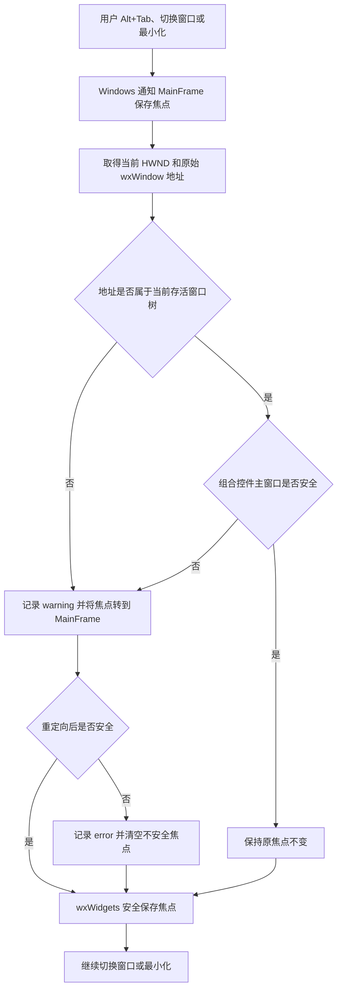

# 崩溃系统top10：wxTopLevelWindowMSW::DoSaveLastFocus 悬空焦点防护补全

## 1. 基本信息

- Bug ID：禅道 #17250（历史问题）+ 崩溃系统 top10 自动采集
- 标题：崩溃系统top10：`wxTopLevelWindowMSW::DoSaveLastFocus` 悬空焦点防护补全
- 崩溃版本：7.2.1.5476
- 影响平台：Windows
- 反馈人：崩溃收集系统
- 处理人：
- 影响模块/影响文件：`src/slic3r/GUI/MainFrame.cpp`
- 前一版修复：提交 `2b37fb97e9c3655860760fee3a92a3c3c14c8cac`，Change-Id `I2d20e06270ed1190e728ff60843237b404fa781f`
- 数据口径：汇总文件包含 473 个条目，其中 364 条有可用堆栈、109 条堆栈缺失；3 个转储文件名各重复一次，因此共有 470 个唯一转储文件名。本地另收集了其中 100 份完整 dump、原始堆栈和日志。

## 2. 现象与堆栈分类

- 表面场景：用户删除模型、切换设置项、关闭或恢复窗口、打开或关闭弹窗、从网页控件返回，随后软件突然退出。这些操作会连带触发设置页、预览或切片刷新，但日志不能证明模型删除或切片算法本身就是崩溃原因。
- 实际结果：364 条有效汇总全部是 `EXCEPTION_ACCESS_VIOLATION_READ`，崩溃位置统一为 `wxTopLevelWindowMSW::DoSaveLastFocus() + 0xc2`。
- 期望结果：切出软件或最小化时，即使当前焦点映射已经失效，也能安全保存焦点并继续运行；正常控件的焦点、选区和光标位置不受影响。

调用栈不是全部完全相同。按 364 条有效堆栈中 `DoSaveLastFocus` 的直接调用者分类如下：

| 类型 | 有效堆栈数量 | 有效堆栈占比 | 全部 473 条占比 |
|---|---:|---:|---:|
| 窗口失活：`OnActivate → DoSaveLastFocus` | 363 | 99.73% | 76.74% |
| 最小化：`MSWWindowProc → DoSaveLastFocus` | 1 | 0.27% | 0.21% |
| 堆栈缺失、无法分类 | — | — | 23.04% |

100 份具有完整原始资料的样本全部属于窗口失活路径。两类核心调用链分别为：

```text
窗口失活：
MainFrame::MSWWindowProc
→ wxFrame::MSWWindowProc
→ wxTopLevelWindowMSW::OnActivate
→ wxTopLevelWindowMSW::DoSaveLastFocus  ← 崩溃点
```

```text
最小化：
MainFrame::MSWWindowProc
→ wxFrame::MSWWindowProc
→ wxTopLevelWindowMSW::MSWWindowProc
→ wxTopLevelWindowMSW::DoSaveLastFocus  ← 崩溃点
```

第二类与 wxWidgets 处理 `WM_SYSCOMMAND / SC_MINIMIZE` 时直接保存焦点的源码路径一致，没有经过 `OnActivate`。

其他特征：

- 364 条有效记录包含 101 种崩溃地址；其中 211 条为 `0xffffffff`，80 条为不大于 `0x1000` 的近空地址，其余为随机地址，符合对象已经释放或内存被复用后的表现。
- 有效记录的进程运行时间为 588～2,080,680 秒，中位数约 9.67 小时。长时间运行可能是放大条件，但缺少对照数据，尚不能证明运行时长会提高发生概率；588 秒的样本也说明长时间运行不是必要条件。
- WebView 是可能产生复杂原生子窗口和生命周期变化的关联因素，但不是已经确认的元凶。在 97 份能够高置信匹配崩溃进程的日志中，没有一份在崩溃前 60 秒内记录 WebView 销毁，不能把二者的历史共现直接写成因果关系。

## 3. 根因分析

- **直接原因**：Windows 当前焦点以 HWND（原生窗口编号）表示。wxWidgets 从内部 HWND 映射表查询焦点时，可能得到一个非空但对应 C++ 对象已经销毁的 `wxWindow*`。`wxWindow::FindFocus()` 会立即通过这个指针调用 `GetMainWindowOfCompositeControl()`，`DoSaveLastFocus()` 随后还会判断窗口归属；在存活性确认前解引用该地址会触发非法内存访问。
- **判断漏洞**：内部映射表返回非空地址，只能说明表里还有登记，不能证明该地址对应的对象仍然存活。旧防护把“查到非空地址”等同于“对象安全”，因此会放过脏映射中的悬空指针。
- **架构层面的根因**：原生 HWND 与 wxWidgets C++ 窗口对象的生命周期记录出现不一致。映射表保存的是裸指针，没有提供可直接判断对象仍然存活的能力。
- **尚未确定**：具体是哪一种窗口的销毁流程没有及时清理映射记录。WebView、弹窗、长期运行以及崩溃前的模型或预览刷新，只能视为相关现象或放大条件。

## 4. 与第一版 #17250 修复的关系

第一版修复在 `WM_ACTIVATE / WA_INACTIVE` 时沿焦点 HWND 的父窗口链查询 wxWidgets 窗口：完全找不到映射时，将焦点重定向到 MainFrame。它正确保护了“映射不存在”的外部窗口焦点，但有两个边界未覆盖：

1. 映射表返回的是非空悬空指针时，旧代码会认为已经找到窗口并直接放行。
2. wxWidgets 在最小化时会从 `MSWWindowProc` 直接调用 `DoSaveLastFocus()`，不会进入旧防护所在的 `WM_ACTIVATE` 分支。

本批次 364 条有效堆栈全部经过包含第一版防护的 `MainFrame.cpp:881`。其中一个长时间运行样本还记录过第一版 Guard 成功重定向非 wxWidgets 焦点，之后仍在同一进程中发生本次崩溃。这说明第一版修复已经合入且能处理原目标场景，本次问题是防护范围不完整，并非旧修复被回退，也不是旧修复引入了崩溃。

## 5. 修复方案

修复原则是在不修改 wxWidgets 依赖、不介入各业务窗口生命周期的前提下，在 MainFrame 即将把失活或最小化消息交给 wxWidgets 基类前，先完成一次安全的焦点存活性检查。

修改点均位于 Windows 专属的 `MainFrame.cpp`：

1. 使用 `wxWindow::DoFindFocus()` 取得原始指针值，不调用会立即解引用结果的 `FindFocus()`。
2. 从 `wxTopLevelWindows` 出发遍历所有当前存活的顶层窗口、对话框和子窗口树，只用地址比较判断原始指针是否属于存活集合；确认匹配后才读取该对象。
3. 原始对象存活后，再调用 `GetMainWindowOfCompositeControl()` 解析组合控件，并对返回的主控件地址再次执行存活校验。
4. 在进入 wxWidgets 基类处理前同时覆盖两个焦点保存入口：
   - `WM_ACTIVATE + WA_INACTIVE`，日志标记 `trigger=deactivate`；
   - `WM_SYSCOMMAND + SC_MINIMIZE`，日志标记 `trigger=minimize`。
5. 指针不安全时，将焦点重定向到 MainFrame；重定向后再次检查。如果设置焦点失败且当前焦点仍不安全，则清空焦点，使后续 wxWidgets 得到安全的 `nullptr`。
6. 正常路径不输出日志、不调用 `SetFocus`。异常重定向记录 warning，二次兜底记录 error；日志包含触发入口、焦点 HWND、原始 wx 指针、组合控件指针、窗口类名、父窗口类名和遍历数量。

核心判断顺序如下：

```text
DoFindFocus 取得原始地址
→ 只按地址查询存活窗口树
→ 原始地址存活后才解析组合控件
→ 再次校验组合控件地址
→ 安全则保持原焦点；不安全则重定向到 MainFrame
```

## 6. 影响范围与风险

- 正向影响：新增防护的两个入口与 363 条窗口失活有效堆栈和 1 条最小化有效堆栈相对应，预计可阻断这些堆栈中存活校验失败的悬空指针路径。
- 正常行为：普通输入框、下拉框、对话框等焦点对象仍在存活窗口树中时，只进行地址检查，不修改焦点、选区和光标位置。
- 异常行为：悬空映射或完全不受 wxWidgets 管理的原生焦点会改为保存 MainFrame。用户切回软件后最多需要重新点击一次目标控件，以轻微的焦点体验退化换取避免软件闪退。
- 性能影响：窗口树扫描复杂度为 `O(N)`，N 为当时存活的 wxWidgets 窗口数量；只在切出软件或最小化时运行，不进入输入、鼠标移动、切片或逐帧渲染热路径。未做专项耗时基准，因此不把具体微秒或毫秒数作为实测结论。
- 平台范围：全部新增逻辑位于 `#ifdef __WXMSW__` 内，macOS 和 Linux 不受影响。
- 已知边界：本次是针对已知调用入口的崩溃边界防护，没有找到并修复产生脏 HWND 映射的具体窗口销毁元凶。其他不经过 MainFrame 的独立顶层窗口若自行进入相同 wxWidgets 路径，不在本次保护范围内；当前 364 条有效堆栈均经过 MainFrame。
- 理论风险：若一个已释放对象的地址恰好被新的存活 `wxWindow` 原址复用，单纯地址校验无法区分新旧对象；此时访问的是存活对象，不会重现本批次的非法解引用，但保存的焦点语义可能不是原对象。

## 7. 回归与验证

已完成验证：

- `git diff --check` 通过，`MainFrame.cpp` 的全部差异均属于本次存活校验、入口补全、诊断日志和旧防护替换，没有发现同文件内的无关修改。
- `CrealityPrint_Slicer` Release 增量编译、链接成功，命令退出码为 0；生成的 `MainFrame.obj` 和 `CrealityPrint_Slicer.dll` 均包含新的 `DoSaveLastFocus-Guard` 日志字符串。
- 编译时为当前分支既有的 `cp_apple_debug_log` Windows 链接回归增加了本地临时平台屏蔽。该屏蔽与本问题无关，`LoginDialog.cpp`、`LoginDialog.hpp` 不纳入本次提交。
- 正常路径已人工验证：在输入框输入数字并选中中间两个字符，Alt+Tab 到其他软件后进行编辑，再切回切片软件；原输入框仍保持焦点，选区和光标位置不变，可直接继续键盘输入。该结果说明普通输入框焦点恢复路径未发现回归。
- 未人工构造出非空悬空指针，因此不能宣称已经动态复现并验证异常崩溃消失；仍需结合后续线上 Guard 日志和崩溃数据验证实际拦截效果。

后续回归建议：

- 分别在普通文本框、数值框、下拉组合框和弹窗输入框中操作，Alt+Tab 切出并切回，确认焦点与输入行为正常。
- 在输入控件和 WebView 页面获得焦点后最小化、恢复，确认窗口和焦点行为正常。
- 打开和关闭设备页、发送打印页等含 WebView 的页面后切换窗口，确认不崩溃。
- 搜索日志关键字 `[DoSaveLastFocus-Guard]`。正常 wxWidgets 控件通常不应产生该日志；出现 warning 后程序应继续运行。若出现 `MainFrame focus redirect failed`，需保留完整 error 日志用于继续分析。
- 发布后持续观察同一崩溃签名的数量，以及 `trigger=deactivate`、`trigger=minimize` 两类防护命中情况。

## 8. 业务场景（大白话）

用户正在输入参数、操作网页页面或打开弹窗，然后切到别的软件，或者把切片软件最小化。程序后台需要记住“刚才键盘光标在哪个控件”，这样用户回来后可以接着操作。

出问题时，Windows 给程序一个窗口编号，wxWidgets 的登记表也返回一个对象地址，但那个对象实际上已经销毁了，就像通讯录里还保存着已经搬走住户的旧地址。旧防护只检查通讯录里有没有地址，看到非空就认为没有问题。程序随后按照旧地址访问窗口对象，最终读取非法内存并闪退。

修改后，程序不再只相信登记表，而是先到当前所有存活窗口组成的树里核对地址。地址确实属于活窗口时，原焦点、选区和光标完全不动；找不到时，则临时把要保存的焦点改成主窗口，再让 wxWidgets 完成切换或最小化。用户在异常情况下最多需要重新点击一次控件，不会因为访问旧地址直接闪退。


