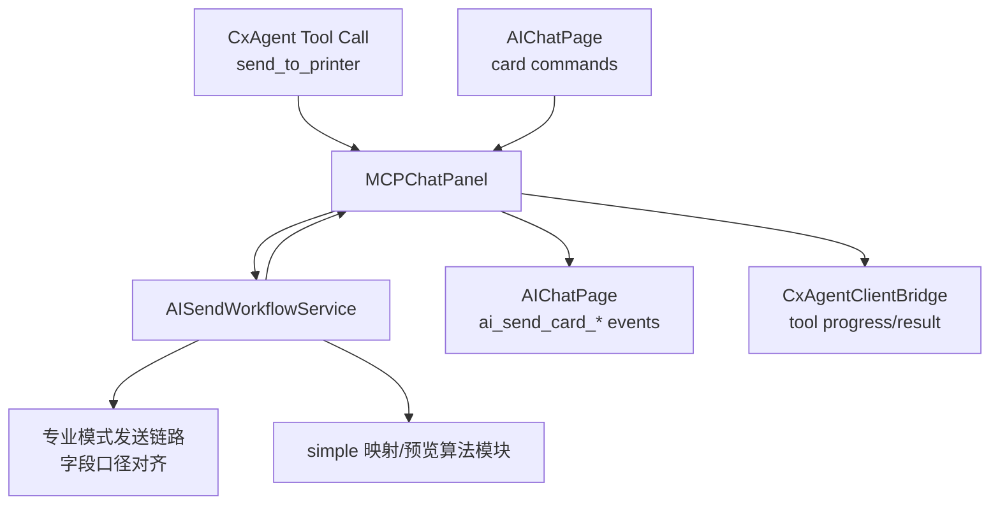
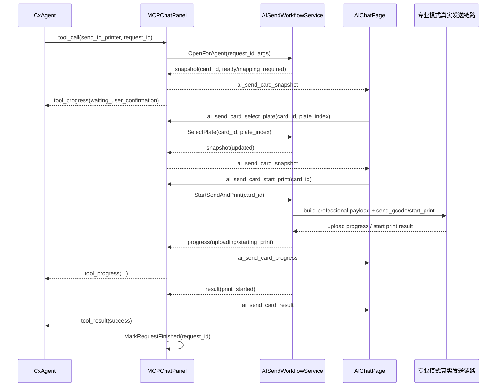

# MCPChatPanel 接入 AISendWorkflowService 落地设计

## 1. 文档目标

本文聚焦 `src/slic3r/GUI/simple/MCPChatPanel.cpp` 这一层，回答三个问题：

- `MCPChatPanel` 应该如何接入 `AISendWorkflowService`
- 哪些入口、回调、事件分发点需要新增或改造
- 如何把现有 `send_to_printer` 的“直接发送”模式改造成“AI 发送卡片 + 用户确认 + 真实发送链路”

这份设计的定位不是重新定义发送业务，而是把我们前面已经确定的架构方案，落到 `MCPChatPanel` 的代码接线层。

---

## 2. 当前代码现状

结合当前实现，`MCPChatPanel` 已经天然具备三类桥接能力：

### 2.1 前端命令入口

- `OnScriptMessage(...)`
  - 负责接收 WebView 发来的 `{ command, data }`
  - 再分发给 `m_commandHandlers`
- `RegisterAllHandlers()`
  - 负责注册 JS -> C++ 的命令处理函数

这意味着 AI 发送卡片的所有用户操作，都适合继续走这一套命令总线，不需要再引入新的 JS/C++ 通讯通道。

### 2.2 Agent 工具调用入口

- `HandleCxAgentMessage(...)`
- `HandleCxAgentToolCall(...)`
- `HandleCxAgentCancelCall(...)`

当前 `send_to_printer` 的工具调用分支是：

1. `MarkRequestStarted(request_id)`
2. `SendToolProgress(..., "Starting send to printer", ...)`
3. 直接执行 `Bridge::SlicerBridge::Instance().Execute(Bridge::ActionID::SEND_TO_PRINTER, {})`
4. 立即回 `SendToolResult`
5. `MarkRequestFinished(request_id)`

这条路径的特点是：

- 非常薄
- 没有 AI 卡片态
- 没有映射修正过程
- 没有盘切换过程
- 没有把“等待用户确认”作为中间状态保留下来

### 2.3 宿主向前端发事件的出口

- `SendCommandToJS(command, data)`
- `SendAgentEvent(event_name, data)`

其中：

- `SendCommandToJS` 适合普通宿主事件
- `SendAgentEvent` 已经是面向 AI 事件流的统一封装

因此，AI 发送卡片协议建议统一通过：

- `SendAgentEvent("ai_send_card_snapshot", ...)`
- `SendAgentEvent("ai_send_card_progress", ...)`
- `SendAgentEvent("ai_send_card_result", ...)`
- `SendAgentEvent("ai_send_card_error", ...)`

### 2.4 当前 `send_to_printer` 的真实落点

`src/slic3r/GUI/simple/bridge/SlicerBridgeActionsProcess.cpp` 中，`DoSendToPrinter(...)` 当前本质上是一个轻量封装：

1. 检查当前设备是否已绑定、在线、空闲
2. 调 `plater->send_to_local_net_printer(false, skip_local_confirmation)`
3. 返回成功或失败

这说明当前 bridge 层的 `send_to_printer` 更像“旧入口快捷调用”，而不是 AI 卡片所需要的可分步、可观测、可重试工作流。

结论：

- AI 模式下不能继续把 `send_to_printer` 只当成一个一步到位动作
- `MCPChatPanel` 需要把它改造成“打开 AI 发送卡片”的工具入口
- 最终真正发送时，仍然要由 `AISendWorkflowService` 组装专业模式口径字段，并接专业模式真实发送链路

---

## 3. 接入原则

### 3.1 `MCPChatPanel` 负责编排，不负责发送业务细节

`MCPChatPanel` 的职责应限定为：

- 接收 Agent 工具调用
- 接收 AIChatPage 卡片操作
- 把操作转给 `AISendWorkflowService`
- 把 `AISendWorkflowService` 的状态回推给前端和 `CxAgentClientBridge`

不应该让 `MCPChatPanel` 自己做：

- 耗材匹配算法
- 预览重着色
- 发送字段拼装
- 上传/开打业务状态机

### 3.2 对外说“AI 卡片协议”，对内说“专业模式业务字段”

对 AIChatPage：

- 只暴露高层卡片命令和卡片事件

对底层发送链路：

- 继续对齐专业模式真实业务口径
- 吸收 `simple` 目录中的映射/预览算法能力

### 3.3 不改动原专业模式页面代码

本阶段不改 `SendToPrinterPage` 页面代码。

AI 模式通过：

- 抽取工作流服务
- 对齐发送字段
- 复用底层发送链路

来达到“业务复用、页面不耦合”的目的。

### 3.4 首版允许单卡片 UI，后端保留多卡能力

首版前端可以只展示一个活跃的 AI 发送卡片。

但 `MCPChatPanel` 的内部状态结构建议仍然按：

- `request_id`
- `card_id`

双索引设计，为后续多卡并存留余地。

---

## 4. 新增对象关系



推荐关系是：

- `AISendWorkflowService` 作为 `MCPChatPanel` 的私有成员
- `MCPChatPanel` 作为 `AISendWorkflowService` 的事件宿主
- `AISendWorkflowService` 不直接操作 WebView，也不直接碰 `CxAgentClientBridge`

---

## 5. `MCPChatPanel.hpp` 改造建议

## 5.1 头文件依赖

建议新增：

```cpp
#include "AISendWorkflowService.hpp"
```

位置建议放在：

- `bridge/CxAgentClientBridge.hpp`
- `bridge/SlicerBridge.hpp`

之后。

## 5.2 新增状态结构

建议在 `MCPChatPanel` 内新增一组专门管理 AI 发送会话绑定关系的结构，而不是把这些状态塞进已有的 `m_pending_slice_request`。

```cpp
struct PendingAISendToolCall {
    std::string     request_id;
    std::string     card_id;
    std::string     tool_name = "send_to_printer";
    nlohmann::json  tool_args = nlohmann::json::object();

    bool            from_agent = true;
    bool            waiting_user_action = true;
    bool            terminal_reported = false;
};
```

建议新增成员：

```cpp
std::unique_ptr<AISendWorkflowService> m_ai_send_workflow;
std::unordered_map<std::string, PendingAISendToolCall> m_pending_ai_send_calls_by_request;
std::unordered_map<std::string, std::string> m_ai_send_request_by_card;
```

说明：

- `AISendWorkflowService` 自己管理发送会话
- `MCPChatPanel` 只保留“card_id <-> request_id <-> tool_call”映射
- 这样可以把 UI 卡片生命周期和 Agent 工具调用生命周期绑定起来

## 5.3 新增私有方法

建议在 `HandleCxAgentCancelCall(...)` 后面新增下面这组方法：

```cpp
void BindAISendWorkflowCallbacks();
void ReplayAISendCardsToJS();

void HandleAISendCardOpen(const nlohmann::json& data);
void HandleAISendCardSelectPlate(const nlohmann::json& data);
void HandleAISendCardAutoMatch(const nlohmann::json& data);
void HandleAISendCardUpdateMapping(const nlohmann::json& data);
void HandleAISendCardSendOnly(const nlohmann::json& data);
void HandleAISendCardStartPrint(const nlohmann::json& data);
void HandleAISendCardCancel(const nlohmann::json& data);
void HandleAISendCardRetry(const nlohmann::json& data);

void OnAISendSnapshot(const nlohmann::json& envelope);
void OnAISendProgress(const nlohmann::json& envelope);
void OnAISendResult(const nlohmann::json& envelope);
void OnAISendError(const nlohmann::json& envelope);

void FinishAISendToolCallSuccess(
    const std::string& card_id,
    const nlohmann::json& result_payload);

void FinishAISendToolCallFailure(
    const std::string& card_id,
    const nlohmann::json& error_payload);

void FinishAISendToolCallCanceled(
    const std::string& card_id,
    const nlohmann::json& result_payload);
```

设计意图：

- `HandleAISendCard*` 是前端入口
- `OnAISend*` 是工作流服务回调入口
- `FinishAISendToolCall*` 是对 `CxAgentClientBridge` 的统一收口

## 5.4 构造函数初始化点

在 `MCPChatPanel::MCPChatPanel(...)` 中，建议在 `m_cxagent_bridge` 初始化完成后，立即创建并绑定 AI 发送工作流：

```cpp
m_ai_send_workflow = std::make_unique<AISendWorkflowService>();
BindAISendWorkflowCallbacks();
```

这样做的原因：

- `m_cxagent_bridge` 和 `m_ai_send_workflow` 都是 `MCPChatPanel` 的桥接成员
- 二者都需要通过 `CallAfter(...)` 回到 UI 线程
- 放在构造期绑定，后续所有入口都能直接使用

---

## 6. `RegisterAllHandlers()` 新增前端命令

AIChatPage 不建议继续直接发 `send_to_printer` 这种低层 bridge action，而应该显式发 AI 卡片命令。

建议在 `RegisterAllHandlers()` 中新增：

| JS 命令 | 作用 | MCPChatPanel 方法 |
|---|---|---|
| `ai_send_card_open` | 打开 AI 发送卡片 | `HandleAISendCardOpen` |
| `ai_send_card_select_plate` | 切换盘 | `HandleAISendCardSelectPlate` |
| `ai_send_card_auto_match` | 触发自动映射 | `HandleAISendCardAutoMatch` |
| `ai_send_card_update_mapping` | 手动修改映射 | `HandleAISendCardUpdateMapping` |
| `ai_send_card_send_only` | 仅发送 | `HandleAISendCardSendOnly` |
| `ai_send_card_start_print` | 发送并开打 | `HandleAISendCardStartPrint` |
| `ai_send_card_cancel` | 用户取消 | `HandleAISendCardCancel` |
| `ai_send_card_retry` | 失败后重试 | `HandleAISendCardRetry` |

建议代码形态：

```cpp
RegisterHandler("ai_send_card_open",         [this](const json& d) { HandleAISendCardOpen(d); });
RegisterHandler("ai_send_card_select_plate", [this](const json& d) { HandleAISendCardSelectPlate(d); });
RegisterHandler("ai_send_card_auto_match",   [this](const json& d) { HandleAISendCardAutoMatch(d); });
RegisterHandler("ai_send_card_update_mapping",[this](const json& d) { HandleAISendCardUpdateMapping(d); });
RegisterHandler("ai_send_card_send_only",    [this](const json& d) { HandleAISendCardSendOnly(d); });
RegisterHandler("ai_send_card_start_print",  [this](const json& d) { HandleAISendCardStartPrint(d); });
RegisterHandler("ai_send_card_cancel",       [this](const json& d) { HandleAISendCardCancel(d); });
RegisterHandler("ai_send_card_retry",        [this](const json& d) { HandleAISendCardRetry(d); });
```

### 6.1 是否保留原 `ActionID::SEND_TO_PRINTER`

建议：

- 保留现有 `RegisterHandler(ActionID::SEND_TO_PRINTER, ...)`
- 但 AIChatPage 新代码不要再直接使用它

原因：

- 这是一个现有 bridge action，可能还有其他路径会用
- AI 模式应该走高层卡片命令，而不是绕过卡片直接进旧发送入口

---

## 7. `HandleCxAgentToolCall()` 的核心改造

## 7.1 改造目标

把当前：

- “收到 `send_to_printer` -> 立即开始发送 -> 立即返回结果”

改成：

- “收到 `send_to_printer` -> 创建 AI 发送卡片 -> 等用户确认 -> 用户点击发送后再进入真实发送链路 -> 最终回 Agent”

## 7.2 推荐流程

### 阶段 A：收到工具调用，打开卡片

当 `tool == "send_to_printer"` 时：

1. `MarkRequestStarted(request_id)`
2. `SendToolProgress(request_id, 5, "Preparing AI send card", "building_snapshot", "waiting")`
3. 调 `m_ai_send_workflow->OpenForAgent(...)`
4. 拿到 `card_id`
5. 建立 `request_id <-> card_id` 绑定
6. 由工作流服务产出首个 `snapshot`
7. `MCPChatPanel` 转发 `ai_send_card_snapshot`
8. 再向 Agent 发一条“等待用户确认”的 `progress`
9. 不调用 `MarkRequestFinished(request_id)`

这一阶段的关键是：

- 工具调用进入“挂起但活跃”的中间态
- 真正结束要等卡片发出 `result` 或 `error`

### 阶段 B：用户在卡片上操作

用户可能做的事：

- 切盘
- 自动映射
- 手动改映射
- 仅发送
- 发送并打印
- 取消

这些都不再经过 `HandleCxAgentToolCall(...)`，而是：

- AIChatPage -> `OnScriptMessage(...)`
- `RegisterAllHandlers()` -> `HandleAISendCard*`
- `HandleAISendCard*` -> `AISendWorkflowService`

### 阶段 C：工作流服务回推终态

当 `AISendWorkflowService` 发出：

- `result`
- `error`

时，`MCPChatPanel` 才真正对 `CxAgentClientBridge` 做：

- `SendToolResult(...)`
- `MarkRequestFinished(request_id)`

## 7.3 推荐伪代码

```cpp
if (tool == "send_to_printer") {
    m_cxagent_bridge->MarkRequestStarted(request_id);
    m_cxagent_bridge->SendToolProgress(
        request_id,
        5,
        "Preparing AI send card",
        "building_snapshot",
        "waiting");

    CallAfter([this, request_id, args]() {
        auto open_result = m_ai_send_workflow->OpenForAgent(request_id, args);
        if (!open_result.success) {
            m_cxagent_bridge->SendToolResult(request_id, false, {
                {"code", open_result.code},
                {"message", open_result.message}
            });
            m_cxagent_bridge->MarkRequestFinished(request_id);
            NotifyCxAgentStatus();
            return;
        }

        PendingAISendToolCall pending;
        pending.request_id = request_id;
        pending.card_id = open_result.card_id;
        pending.tool_args = args;
        pending.waiting_user_action = true;

        m_pending_ai_send_calls_by_request[request_id] = pending;
        m_ai_send_request_by_card[open_result.card_id] = request_id;

        m_cxagent_bridge->SendToolProgress(
            request_id,
            15,
            "Send card ready, waiting for user confirmation",
            "awaiting_user_confirmation",
            "waiting");

        NotifyCxAgentStatus();
    });
    return;
}
```

### 7.4 为什么这里不直接调用 `Bridge::ActionID::SEND_TO_PRINTER`

因为这个 action 当前只是“老发送入口”的快捷薄封装，不满足 AI 卡片场景的要求：

- 无法暴露盘切换
- 无法暴露映射修正
- 无法暴露预览图更新
- 无法把“等待用户确认”保留为一个显式状态

因此：

- `HandleCxAgentToolCall(send_to_printer)` 的职责应该是“开卡片”
- 真正的发送动作应该延迟到 `HandleAISendCardSendOnly/StartPrint`

---

## 8. `HandleCxAgentCancelCall()` 改造建议

当前 `HandleCxAgentCancelCall(...)` 只覆盖切片取消逻辑，判断依据是：

- `m_pending_slice_request.active`
- `m_pending_slice_request.request_id == request_id`

接入 AI 发送工作流后，建议改成双分支：

### 8.1 优先判断是否为 AI 发送请求

```cpp
auto it = m_pending_ai_send_calls_by_request.find(request_id);
if (it != m_pending_ai_send_calls_by_request.end()) {
    const std::string card_id = it->second.card_id;
    m_ai_send_workflow->Cancel(card_id, /*from_agent=*/true);
    return;
}
```

这里不要在 `HandleCxAgentCancelCall(...)` 里直接 `MarkRequestFinished`，而要让：

- `AISendWorkflowService`
- -> `OnAISendResult(result_type=canceled)` 或 `OnAISendError(...)`
- -> `FinishAISendToolCallCanceled/Failure(...)`

来统一收口。

### 8.2 未命中 AI 发送请求时，再回落到现有切片取消逻辑

这样可以保证：

- 老的切片取消流程不受影响
- 新的 AI 发送取消有独立状态机

---

## 9. `AISendWorkflowService -> MCPChatPanel` 回调设计

推荐不要让服务层直接依赖 WebView 或 `CxAgentClientBridge`，而是让它只把标准事件回调给 `MCPChatPanel`。

## 9.1 建议的回调绑定方式

可以是接口，也可以是 lambda。

如果想接线成本最低，建议直接用 lambda：

```cpp
void MCPChatPanel::BindAISendWorkflowCallbacks()
{
    m_ai_send_workflow->SetSnapshotCallback(
        [this](const json& envelope) {
            wxGetApp().CallAfter([this, envelope]() { OnAISendSnapshot(envelope); });
        });

    m_ai_send_workflow->SetProgressCallback(
        [this](const json& envelope) {
            wxGetApp().CallAfter([this, envelope]() { OnAISendProgress(envelope); });
        });

    m_ai_send_workflow->SetResultCallback(
        [this](const json& envelope) {
            wxGetApp().CallAfter([this, envelope]() { OnAISendResult(envelope); });
        });

    m_ai_send_workflow->SetErrorCallback(
        [this](const json& envelope) {
            wxGetApp().CallAfter([this, envelope]() { OnAISendError(envelope); });
        });
}
```

## 9.2 回调后的职责分工

### `OnAISendSnapshot`

职责：

- `SendAgentEvent("ai_send_card_snapshot", envelope["data"])`
- 如果此卡片绑定了 `request_id`，顺手给 Agent 一条“卡片已刷新”的进度

### `OnAISendProgress`

职责：

- `SendAgentEvent("ai_send_card_progress", envelope["data"])`
- 把进度同步映射为 `m_cxagent_bridge->SendToolProgress(...)`

### `OnAISendResult`

职责：

- `SendAgentEvent("ai_send_card_result", envelope["data"])`
- 根据 `card_id` 找回 `request_id`
- `SendToolResult(request_id, true, ...)`
- `MarkRequestFinished(request_id)`
- 清理 `m_pending_ai_send_calls_by_request / m_ai_send_request_by_card`

### `OnAISendError`

职责：

- `SendAgentEvent("ai_send_card_error", envelope["data"])`
- 根据 `card_id` 找回 `request_id`
- `SendToolResult(request_id, false, ...)`
- `MarkRequestFinished(request_id)`
- 清理绑定关系

---

## 10. `MCPChatPanel -> AISendWorkflowService` 入口清单

建议把前端卡片操作映射成下面这组工作流服务调用：

| MCPChatPanel 方法 | 服务调用 | 说明 |
|---|---|---|
| `HandleAISendCardOpen` | `OpenFromUI(...)` | 用户主动打开卡片 |
| `HandleAISendCardSelectPlate` | `SelectPlate(card_id, plate_index)` | 切盘并重建快照 |
| `HandleAISendCardAutoMatch` | `AutoMatch(card_id)` | 自动重跑映射 |
| `HandleAISendCardUpdateMapping` | `UpdateMapping(card_id, extruder_id, selection_token)` | 手动修正映射 |
| `HandleAISendCardSendOnly` | `StartSendOnly(card_id)` | 进入上传链路 |
| `HandleAISendCardStartPrint` | `StartSendAndPrint(card_id)` | 上传后发开打命令 |
| `HandleAISendCardCancel` | `Cancel(card_id, false)` | 用户取消 |
| `HandleAISendCardRetry` | `Retry(card_id)` | 错误恢复 |

建议每个 `HandleAISendCard*` 都做三件事：

1. 校验 `card_id`
2. 尽量只做参数解析，不写业务逻辑
3. 失败时统一回 `ai_send_card_error`

---

## 11. 前端事件分发点清单

这一节是实现时最关键的“事件图”。

## 11.1 Agent -> MCPChatPanel

入口：

- `HandleCxAgentToolCall(...)`

关注工具：

- `send_to_printer`

动作：

- 打开卡片
- 绑定 `request_id`
- 进入等待用户确认状态

## 11.2 AIChatPage -> MCPChatPanel

入口：

- `OnScriptMessage(...)`
- `RegisterAllHandlers()`

关注命令：

- `ai_send_card_open`
- `ai_send_card_select_plate`
- `ai_send_card_auto_match`
- `ai_send_card_update_mapping`
- `ai_send_card_send_only`
- `ai_send_card_start_print`
- `ai_send_card_cancel`
- `ai_send_card_retry`

## 11.3 MCPChatPanel -> AIChatPage

统一出口：

- `SendAgentEvent(...)`

关注事件：

- `ai_send_card_snapshot`
- `ai_send_card_progress`
- `ai_send_card_result`
- `ai_send_card_error`

## 11.4 AISendWorkflowService -> MCPChatPanel

入口：

- `OnAISendSnapshot`
- `OnAISendProgress`
- `OnAISendResult`
- `OnAISendError`

## 11.5 MCPChatPanel -> CxAgentClientBridge

统一收口：

- `SendToolProgress(...)`
- `SendToolResult(...)`
- `MarkRequestFinished(...)`

重要原则：

- 只有终态事件 `result/error` 才真正结束 tool call
- `snapshot/progress` 都只是过程态

---

## 12. 页面刷新与重入恢复

这是 `MCPChatPanel` 接线层里一个很容易漏掉，但非常重要的点。

当前 `chat_ready` 已经会做：

- `NotifyGatewayUser()`
- `GET_SLICER_STATE`
- `action_list`
- `NotifyCxAgentStatus()`

建议在 `chat_ready` 分支最后追加：

```cpp
ReplayAISendCardsToJS();
```

`ReplayAISendCardsToJS()` 的职责：

- 从 `AISendWorkflowService` 取出当前活跃卡片快照
- 逐张重新发 `ai_send_card_snapshot`

这样可以覆盖：

- WebView 刷新
- AIChatPage 热更新
- 聊天窗口重新打开

否则用户可能已经处于上传中，但页面上卡片消失。

---

## 13. 典型时序图



---

## 14. 分阶段实施建议

为了降低接线风险，建议按下面顺序落地：

### 第一阶段：先把桥接骨架接上

- 新增 `m_ai_send_workflow`
- 新增 `PendingAISendToolCall`
- 新增 `BindAISendWorkflowCallbacks()`
- 新增 `HandleAISendCard*` 空实现
- 新增 `ReplayAISendCardsToJS()`

目标：

- 编译通过
- `MCPChatPanel` 有独立 AI 发送通道

### 第二阶段：先打通“开卡片，不发送”

- 改造 `HandleCxAgentToolCall(send_to_printer)`
- 先只做到：
  - 打开卡片
  - 发首个 `snapshot`
  - tool call 挂起等待

目标：

- Agent 触发后能看到 AI 发送卡片
- 但还不进入真实发送

### 第三阶段：接入卡片交互

- 接上：
  - 切盘
  - 自动映射
  - 手动映射
  - 取消
  - 重试

目标：

- AI 卡片本身成为一个完整可操作状态机

### 第四阶段：接入真实发送链路

- `StartSendOnly`
- `StartSendAndPrint`
- 进度
- 终态
- Agent tool result 收口

目标：

- 从 Agent -> 卡片 -> 真发 -> 回 Agent 全链路闭环

---

## 15. 首版实现边界建议

为了尽快落地，建议首版明确这几个边界：

- 仅支持单盘 G-code 发送
- 仅支持当前默认设备
- 不在卡片里做设备选择
- 卡片重点展示：
  - 当前盘预览图
  - 盘切换
  - 耗材映射
  - 仅发送 / 发送并打印

这与当前 AI 版面向“小白用户”的定位是一致的。

---

## 16. 一句话总结

`MCPChatPanel` 的改造核心不是“再加一个发送按钮”，而是把它从“工具调用转发器”升级成“AI 发送工作流编排层”：

- Agent 的 `send_to_printer` 不再直发
- 而是先开 AI 发送卡片
- 卡片操作统一回到 `MCPChatPanel`
- `MCPChatPanel` 把业务动作交给 `AISendWorkflowService`
- 再把过程态和终态分别回给 AIChatPage 与 `CxAgentClientBridge`

这样一来，AI 模式既能复用专业模式的真实发送链路，又不会把专业模式复杂页面逻辑直接搬进 AI 页面。
