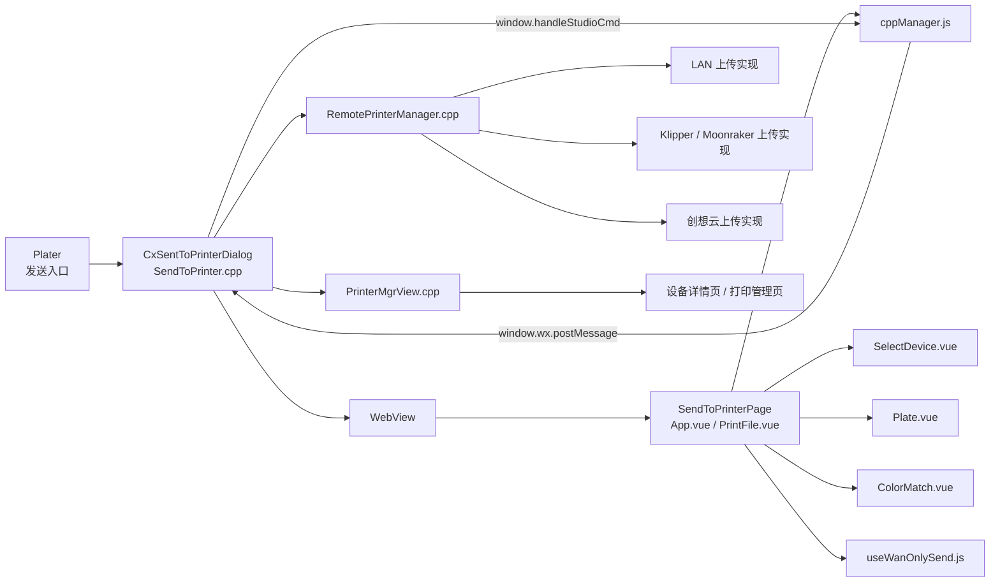
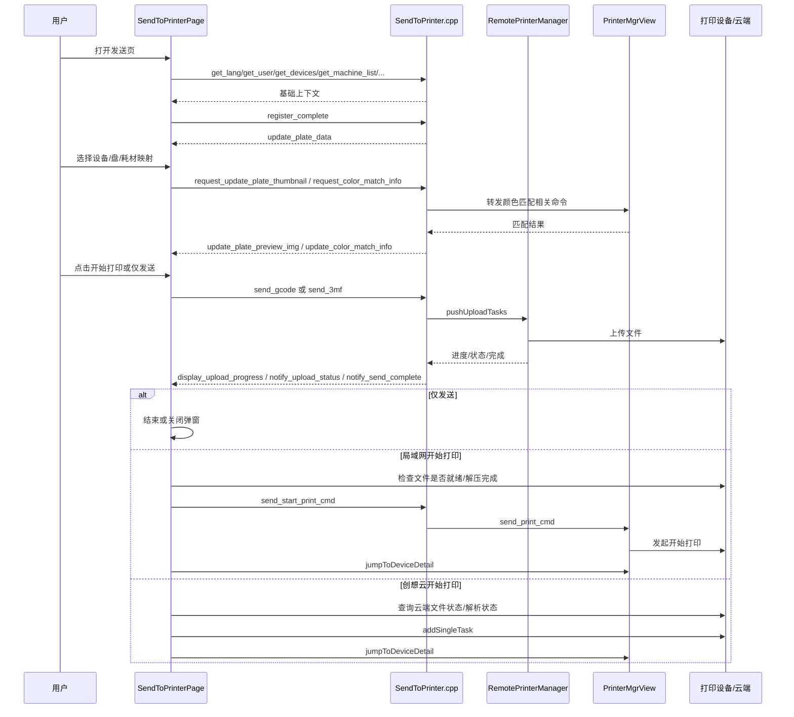

# 专业模式发送流程全链路梳理

## 1. 文档目的

本文面向后续 AI 简易模式复用“专业模式发送能力”的设计与改造，系统梳理以下链路：

- `SendToPrinterPage` 前端页面如何组织发送流程
- `src/slic3r/GUI/print_manage/App/SendToPrinter.cpp` 如何作为 Vue 与 C++ 的桥接层
- `PrinterMgrView`、`RemotePrinterManager` 以及更下游打印发送路径如何承接上传与开始打印

本文聚焦“单机发送/开始打印”主流程，同时覆盖：

- 单盘 / 全盘
- GCode / 3MF
- 局域网设备 / 创想云设备
- 仅发送 / 发送并开始打印
- 颜色映射、预览更新、取消、重试、失败回退

## 2. 涉及项目与核心文件

### 2.1 C3DSlicer 侧

- 发送入口：`src/slic3r/GUI/Plater.cpp`
- 发送对话框桥接层：`src/slic3r/GUI/print_manage/App/SendToPrinter.cpp`
- 发送对话框声明：`src/slic3r/GUI/print_manage/App/SendToPrinter.hpp`
- 打印管理页桥接层：`src/slic3r/GUI/print_manage/App/PrinterMgrView.cpp`
- 上传调度器：`src/slic3r/GUI/print_manage/RemotePrinterManager.cpp`

### 2.2 SendToPrinterPage 前端侧

以下路径相对于 `SendToPrinterPage` 项目根目录：

- 页面入口：`src/App.vue`
- C++ 通信桥：`src/cppManager.js`
- 单机发送主页面：`src/views/PrintFile.vue`
- 盘/文件信息组件：`src/views/Plate.vue`
- 设备选择组件：`src/views/SelectDevice.vue`
- 耗材映射组件：`src/views/ColorMatch.vue`
- 创想云“仅发送”状态机：`src/views/composables/useWanOnlySend.js`

## 3. 整体职责分层

### 3.1 前端 Vue 页面不是“纯展示层”

专业模式的 `SendToPrinterPage` 实际上是发送业务的编排器，负责：

- 页面初始化
- 设备轮询与默认设备选择
- 盘数据展示、文件名编辑、单盘/全盘切换
- 耗材匹配与预览图刷新
- 上传进度展示
- 上传成功后进入不同的打印启动路径
- 局域网失败后切换创想云通道
- 创想云仅发送时的状态机控制

### 3.2 SendToPrinter.cpp 不是“简单转发器”

`CxSentToPrinterDialog` 同时承担：

- WebView 容器
- JS <-> C++ 协议桥
- 盘数据、预览图、预设、耗材信息封装
- 上传任务发起
- 上传进度/状态/完成事件回推
- 与 `PrinterMgrView` 的二次桥接
- 打点与关闭/取消清理

### 3.3 PrinterMgrView / RemotePrinterManager 才是底层发送执行层

- `PrinterMgrView` 负责承接发送页面发来的“开始打印”“颜色匹配”“心跳”等命令
- `RemotePrinterManager` 负责真正排队、判型、选择协议实现并上传文件

## 4. 主调用关系图



## 5. JS 与 C++ 的协议模型

### 5.1 前端发给 C++

前端统一通过：

```js
window.wx.postMessage(JSON.stringify(msgObj))
```

发送命令。核心命令包括：

- `get_lang`
- `get_user`
- `get_machine_list`
- `get_devices`
- `register_complete`
- `set_current_plate_index`
- `send_gcode`
- `send_3mf`
- `send_start_print_cmd`
- `cancel_send`
- `request_update_plate_thumbnail`
- `request_color_match_info`
- `start_heartbeat_cmd`
- `stop_heartbeat_cmd`
- `request_user_operation_state`

### 5.2 C++ 回推给前端

C++ 统一通过：

```js
window.handleStudioCmd(...)
```

回推事件。关键事件包括：

- `update_plate_data`
- `update_plate_preview_img`
- `update_color_match_info`
- `display_upload_progress`
- `notify_upload_status`
- `notify_send_complete`
- `get_lang`
- `get_user`
- `get_devices`
- `get_machine_list`
- `request_user_operation_state`

### 5.3 一个很关键的事实

专业模式的通信协议是“事件风格”的，而不是“领域接口风格”的。  
这意味着前端要自己拼命令、自己消费状态事件、自己做状态机，导致页面逻辑非常重。

## 6. 发送入口与页面初始化流程

### 6.1 C++ 入口

`Plater.cpp` 中用户点击“发送到打印机”后，会创建：

- `CxSentToPrinterDialog(..., SendType::Single, filament_map_string)`

这里的 `filament_map_string` 会进入发送页，用于后续的耗材映射初始化。

### 6.2 页面启动

`SendToPrinterPage/src/App.vue` 在 `onMounted` 中完成：

1. 从 URL 获取 `sendtype`
2. 注册 `cppManager.onReceiveMsgFromCpp`
3. 主动向 C++ 请求：
   - `getSystemId`
   - `getLang`
   - `getTheme`
   - `getUser`
   - `getMachineList`
   - `getDevices`
   - `getUserOperationState`
4. 启动设备轮询，每 2 秒调用一次 `getDevices`

### 6.3 页面初始化后，盘数据何时注入

`Plate.vue` 挂载后会立即调用：

- `cppManager.get3MFName()`
- `cppManager.registerComplete()`

`SendToPrinter.cpp` 收到 `register_complete` 后调用：

- `update_send_page_content()`

然后根据当前模式选择：

- `get_onlygcode_plate_data_on_show()`
- `get_plate_data_on_show()`

最终向前端发送 `update_plate_data`。

## 7. 盘数据与预览图链路

### 7.1 `update_plate_data` 的内容来源

`SendToPrinter.cpp` 在组装盘数据时，会把以下信息一次性打包给前端：

- `plates`
- `current_plate_index`
- `extruder_colors`
- `filament_types`
- `filament_maps`
- `printer_model`
- `preset_name`
- `slice_type`
- `is_only_gcode_mode`

每个 plate 内又包含：

- `image`
- `plate_index`
- `upload_gcode__name`
- `plate_extruders`
- `total_weight`
- `print_time`
- `filament_length`
- `max_nozzle_temperature`
- `max_bed_temperature`
- `nozzle_diameter`

### 7.2 单盘 / 全盘切换的真实含义

`Plate.vue` 中：

- `plateType = 1` 表示按单盘发送，产物偏向 `.gcode`
- `plateType = 2` 表示按全部盘发送，产物偏向 `_gcode.3mf`

它不是简单 UI 开关，而是直接影响后续：

- 文件名
- 上传文件类型
- 开始打印命令中的 `allPlate`

### 7.3 切盘时发生什么

轮播切换盘后，`Plate.vue` 会调用：

- `cppManager.setCurrentPlateIndex(plate.index)`

随后 C++ 端回发 `set_current_plate_index`，前端再触发一次：

- `registerComplete()`

于是当前盘的数据会重新走一遍 `update_send_page_content()`。

这也是专业模式“切盘即刷新上下文”的关键机制。

## 8. 设备列表、默认设备与自动切换

### 8.1 设备数据来源

`App.vue` 每 2 秒请求一次 `get_devices`，数据进入 store。

### 8.2 `SelectDevice.vue` 做的事情很多

它不只是展示设备，而是在做业务编排：

- 对设备按在线状态、机型、状态优先级排序
- 尝试优先选中当前设备
- 如果当前设备不匹配，则找与当前切片 preset 最匹配的设备
- 合并同一台机器的“局域网设备”和“创想云设备”
- 当当前通道离线、备用通道在线时自动切换

### 8.3 设备合并逻辑的意义

对同一个 `mac`，页面可能拿到两类设备：

- `deviceType = 0`：局域网设备
- `deviceType = 1`：创想云设备

`SelectDevice.vue` 会把它们合并成“一个逻辑设备视图”，并记录：

- `isExistInCxy`
- `isExistInLocal`
- `cxyOnline`
- `localOnline`

这一层正是后面“局域网失败切创想云”的前提。

### 8.4 同 MAC 双通道场景下，`current_device` 不等于“合并视图”

这里需要特别补充一个容易误判的点：

- 页面展示层可以把同一台机器的局域网设备与创想云设备合并成一个逻辑视图
- 但发送执行层真正落到 `DM::DataCenter::current_device` 时，仍然只会选中一个具体设备实体
- 当前代码下，如果同一个 `mac` 同时存在 `deviceType = 0` 与 `deviceType = 1`，且本地设备在线，则会优先把 `current_device` 落到本地设备

对应实现可重点看：

- `src/slic3r/GUI/print_manage/data/DataCenter.cpp::find_printer_by_mac(...)`
- `src/slic3r/GUI/print_manage/data/DataCenter.cpp::_get_acive_device(...)`

这意味着：

- “设备管理页看起来是一台云设备”不等于“本次发送一定走云链路”
- 如果同 MAC 的本地通道也在线，专业模式很多时候会先把它当作当前发送设备
- 后续是否进入云链路，还要继续看上传与开始打印阶段的实际分支判断

## 9. 耗材映射与预览图更新链路

### 9.1 ColorMatch 组件的职责

`ColorMatch.vue` 负责：

- 根据模型挤出机颜色与设备耗材盒信息进行匹配
- 匹配 CFS、外挂料架、CFS-Mini
- 判断材质是否匹配
- 判断耗材余量是否足够
- 在用户切换映射后刷新预览图

### 9.2 前端请求更新盘预览图

当前端计算出新的映射关系后，会调用：

- `cppManager.updatePlateImg(plateIndex, matchInfo)`

其中 `matchInfo` 为：

```json
[
  { "extruderId": 1, "matchColor": "#RRGGBB" },
  { "extruderId": 2, "matchColor": "#RRGGBB" }
]
```

### 9.3 C++ 如何刷新缩略图

`SendToPrinter.cpp` 收到 `request_update_plate_thumbnail` 后会：

1. 解析 `matchInfo`
2. 调 `post_notify_event(...)`
3. 由 `plater()->update_plate_thumbnail(...)` 更新盘缩略图
4. 再通过 `update_plate_preview_img_on_send_page()` 把新的缩略图回推给页面

对应前端事件为：

- `update_plate_preview_img`

### 9.4 请求打印机侧颜色匹配信息

当需要结合设备实际耗材信息进行匹配时，前端会触发：

- `request_color_match_info`

然后 `SendToPrinter.cpp` 通过 `build_match_color_cmd_info(...)` 把：

- 打印机 IP
- 当前盘使用的挤出机颜色
- 挤出机对应耗材类型

转发给 `PrinterMgrView`，后续返回：

- `update_color_match_info`

这条链路说明：专业模式的颜色映射并不完全是前端本地计算，而是“前端 + C++ + 打印机管理页”联合完成。

## 10. 上传阶段主链路

### 10.1 用户点击“开始打印”

`PrintFile.vue` 的 `onStartPrint()` 会先做一系列前置校验：

- 设备耗材是否为空
- 用户确认平台无模型
- 是否开启延时摄影
- 机型/喷嘴/温度是否匹配

通过后才调用：

- `utils.sendPrintFile()`

### 10.2 用户点击“仅发送”

`onOnlySend()` 会走：

- 埋点
- `wanOnlySend.onOnlySend()`

对创想云设备，“仅发送”专门交给 `useWanOnlySend.js` 管理；  
对普通场景，最终还是会落到 `sendPrintFile()`。

### 10.3 `sendPrintFile()` 的真实作用

这个函数只做“上传文件”，不负责开始打印。

它会根据当前页面状态决定调用：

- `cppManager.sendGcodeFile(data)`
- `cppManager.send3mfFile(data)`

也就是说：

- 单盘更偏向 `send_gcode`
- 全盘更偏向 `send_3mf`

## 11. C++ 上传执行链路

### 11.1 GCode 上传

`SendToPrinter.cpp::handle_send_gcode(...)` 会：

1. 读取 `plateIndex / ipAddress / uploadName / oldPrinter / moonrakerPort / uploadTaskId`
2. 判断是否局域网旧设备、Klipper、创想云设备
3. 确定上传文件路径
4. 调 `RemotePrinterManager::pushUploadTasks(...)`

### 11.2 3MF 上传

`handle_send_3mf(...)` 会：

1. 如果不是 only-gcode 模式，先导出临时 3MF
2. 调 `pushUploadTasks(...)`

### 11.3 `RemotePrinterManager` 在做什么

`RemotePrinterManager::pushUploadTasks(...)` 并不立即上传，而是：

- 放入上传队列
- 通知后台线程取任务

之后 `pushFile(...)` 会根据 IP/端口特征判型：

- 旧局域网设备 -> `REMOTE_PRINTER_TYPE_LAN`
- 映射了 Moonraker 端口 -> `REMOTE_PRINTER_TYPE_KLIPPER`
- IP 里有点号且走新通道 -> `REMOTE_PRINTER_TYPE_KLIPPER4408`
- 否则视作创想云 -> `REMOTE_PRINTER_TYPE_CX`

然后选择对应上传实现。

### 11.4 上传过程中的前端事件

上传期间，C++ 会持续回推：

- `display_upload_progress`
- `notify_upload_status`
- `notify_send_complete`

其中职责要分清：

- `display_upload_progress`：进度与速度
- `notify_upload_status`：中途状态码，含失败/取消
- `notify_send_complete`：上传完成后的“进入下一阶段”事件

## 12. 上传完成后的分流逻辑

这是专业模式最关键、也最复杂的部分。

### 12.1 仅发送

在 `PrintFile.vue` 的 `notify_send_complete` 处理里：

- 如果 `state.isOnlySend === true`
- 且不是特定创想云特殊场景

通常直接关闭弹窗，流程结束。

### 12.2 局域网设备：上传完成不等于立即可打印

对 `deviceType == 0` 的局域网设备，上传完成后前端不会立刻发送打印命令，而是：

1. 文案切成 `Under decompression`
2. 周期检查设备侧文件是否就绪
3. 文件确认就绪后再调用 `sendPrintCmd()`

这说明专业模式把“上传完成”和“设备可打印”拆成了两个阶段。

### 12.3 创想云设备：还要经历下载/解析/建任务

对 `deviceType == 1` 的创想云设备，`notify_send_complete` 后还会继续：

1. 从返回值中取 `id / filekey / name`
2. 生成 `gcodeFilePath`
3. 必要时解析多色信息
4. 查询云侧文件状态
5. 多色机可能需要继续等待解析完成
6. 最终调用 `cxApi.addSingleTask(...)`
7. 再跳转设备详情页

也就是说，创想云“开始打印”实际上是“上传成功 -> 云端文件就绪 -> 云端建任务 -> 跳转详情页”。

## 13. `send_start_print_cmd` 与真正“开始打印”

### 13.1 前端什么时候调用

局域网链路在确认文件已就绪后，`PrintFile.vue::sendPrintCmd()` 会调用：

- `cppManager.sendStartPrintCmd(data)`

注意这一步不是上传，而是上传后的“启动打印”。

### 13.2 前端传给 C++ 的关键字段

前端会传：

- `name`
- `ipAddress`
- `openCfs`
- `colorMatchInfo`
- `printCalibration`
- `allPlate`

其中：

- `name` 对 GCode 是最终文件名
- 对 3MF 会拼成 `xxx_gcode.3mf/xxx_gcode_plate_n.gcode`

### 13.3 `SendToPrinter.cpp` 如何处理

`handle_send_start_print_cmd(...)` 会把命令改写成：

- `command = send_print_cmd`

然后转发给 `PrinterMgrView`。

### 13.4 `PrinterMgrView` 再次接力

`PrinterMgrView.cpp` 收到 `send_start_print_cmd` 后，也会整理参数并执行：

- `ExecuteScriptCommand(send_print_cmd)`

所以“开始打印”实际上是：

`SendToPrinterPage -> SendToPrinter.cpp -> PrinterMgrView -> 打印管理页/设备详情页`

这条链并没有在 `SendToPrinterDialog` 里直接完成。

## 14. 取消、失败、重试、通道回退

### 14.1 取消发送

前端调用：

- `cancel_send`

C++ 进入：

- `handle_cancel_send(...)`
- `RemotePrinterManager::cancelUpload(ip)`

取消成功后会回推状态码：

- `601`

前端将其识别为“取消成功”。

### 14.2 `RemotePrinterManager::cancelUpload(...)` 的两个层次

取消逻辑分两步：

1. 如果任务还在队列中，直接从队列删除并回调 `601`
2. 如果任务已经在执行，则设置取消标志，并调用底层接口取消

### 14.3 局域网失败切创想云

`PrintFile.vue::uploadState(...)` 中有一个很重要的回退策略：

- 如果当前发送的是 GCode
- 当前局域网设备失败
- 存在同 MAC 的创想云设备
- 创想云设备在线
- 当前还没尝试过云通道

则会：

1. 自动切换当前设备到创想云设备
2. 保持弹窗不关闭
3. 更新提示文案
4. 重新调用 `sendPrintFile()`

这就是专业模式里最有价值的“发送业务韧性”之一。

同时也要注意，专业模式的真实策略不是简单的“云优先”：

- 在同 MAC 且本地在线的场景下，前面设备解析阶段往往先命中本地设备
- 到真正发起打印时，底层执行也会优先尝试 LAN 直连条件是否成立
- 只有当 LAN 上传/发送失败，或者本地条件不满足时，才会切到创想云后半段流程

对应执行层可以继续顺着这些代码看：

- `src/slic3r/GUI/Jobs/PrintJob.cpp`
- `start_local_print_with_record(...)`
- `start_print(...)`

因此，专业模式更准确的描述应当是：

`同 MAC 双通道场景 = 页面合并展示 + 执行层本地优先 + 失败后回退到云`

### 14.4 创想云仅发送有独立状态机

`useWanOnlySend.js` 单独接管：

- `notify_send_complete`
- `notify_upload_status`
- `display_upload_progress`
- `onOnlySend`
- `onCancelSend`
- `onRetrySendGCode`

说明“创想云仅发送”已经复杂到不适合继续塞在 `PrintFile.vue` 主逻辑里。

## 15. GCode 与 3MF 的关键差异

### 15.1 上传物

- GCode：直接上传 `.gcode`
- 3MF：上传 `_gcode.3mf`

### 15.2 开始打印命令中的文件路径

- GCode：直接使用目标 GCode 文件名
- 3MF：开始打印时要指向 3MF 包内对应盘的 GCode 路径

### 15.3 only-gcode 模式

`get_onlygcode_plate_data_on_show()` 与普通 `get_plate_data_on_show()` 的数据来源不一样：

- only-gcode 模式更多依赖 `GCodeProcessorResult`
- 普通模式更多依赖切片盘对象与切片结果

这意味着后续 AI 模式如果只做“单盘 GCode 发送”，可以显著收敛数据模型。

## 16. 专业模式的真实全链路时序



## 17. 对 AI 模式复用的启示

### 17.1 必须复用的，不应重写

后续 AI 版如果要复用专业模式发送能力，最值得保留的是：

- `send_gcode / send_3mf / send_start_print_cmd / cancel_send` 这些 C++ 命令
- `update_plate_data / progress / status / complete` 这套事件链
- `RemotePrinterManager` 的上传能力与判型逻辑
- 局域网失败切创想云的回退能力
- 颜色映射驱动预览图更新的机制

### 17.2 不建议直接复用整个专业模式页面

因为专业模式页面把太多复杂状态耦合在一起：

- 设备轮询
- 默认设备选择
- 多设备/多通道合并
- 创想云仅发送状态机
- 多色耗材复杂校验
- 大量 UI 状态与命令事件直接混写

如果 AI 版是“小白单盘发送”，更合理的方向是：

- 复用底层业务能力
- 抽离出一个更小的发送领域模型
- 在 AI 卡片里只暴露必要状态和操作

### 17.3 AI 版最适合抽出来的能力块

建议后续从专业模式中抽出以下“领域服务”而不是直接复制页面：

- `SendSession`
  - 当前发送对象、当前盘、当前文件、当前设备、上传状态、打印状态
- `PlateSnapshotService`
  - 生成单盘预览、重量、耗时、耗材长度、温度信息
- `MaterialMappingService`
  - 输入设备耗材盒信息与模型挤出机信息，输出映射结果与预览刷新请求
- `UploadService`
  - 屏蔽 GCode/3MF 差异，统一暴露进度/状态/完成事件
- `StartPrintService`
  - 屏蔽局域网/创想云分支，统一暴露“开始打印”能力

## 18. 结论

专业模式发送流程本质上是一个“跨前端、WebView 桥、C++ 容器、上传调度器、设备详情页”的复合状态机，而不是单纯的“点一下上传文件”。

它最核心的结构特征是：

- 前端负责业务编排
- `SendToPrinter.cpp` 负责协议桥接与上下文封装
- `RemotePrinterManager` 负责上传执行
- `PrinterMgrView` 负责打印启动与设备页联动

后续 AI 版如果希望“尽量复用专业模式业务流程”，正确方向不是搬整个页面，而是：

- 先把专业模式完整拆成领域能力块
- 保持底层命令与事件协议兼容
- 在 AI 卡片上只复用单盘发送所需的那部分能力

这也是后续做“AI 发送卡片”时，既能最大化复用已有业务，又能避免把专业模式复杂度原样带进来的一条更稳妥的路径。
