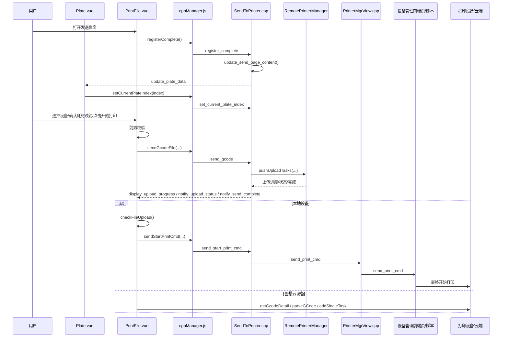

# 专业模式单盘 GCode 发送流程梳理

## 1. 文档目标

本文聚焦梳理专业模式下“发送单盘 GCode”这条完整业务链路，覆盖：

- 前端项目 `SendToPrinterPage`
- C++ 宿主与发送页桥接 `SendToPrinter.cpp/.hpp`
- 设备管理宿主 `PrinterMgrView.cpp`
- 耗材映射、预览图更新、上传进度、开始打印等关键分支

本文不展开多盘 3MF、批量发送、多设备打印等旁路流程，只在必要处说明它们与单盘 GCode 的差异。

---

## 2. 先给结论

专业模式下的“单盘 GCode 发送打印”不是一次命令直达，而是一个分阶段流程：

1. `SendToPrinterPage` 初始化页面，向 C++ 请求当前盘、设备、耗材等基础数据。
2. 用户在前端完成设备选择、盘选择、耗材映射确认。
3. 点击“开始打印”后，前端先发起 `send_gcode`，由 C++ 执行真实上传。
4. 上传完成后，前端根据设备类型分流：
   - 本地设备：轮询确认文件已落到设备，再发送开始打印命令。
   - 创想云设备：前端继续走云端 GCode 就绪与建任务流程。
5. 对本地设备来说，`SendToPrinter.cpp` 并不直接调用最终设备打印接口，而是把 `send_print_cmd` 再转发给 `PrinterMgrView` 及其承载的设备管理前端体系。

一句话概括：

`专业模式单盘 GCode = 前端编排 + C++ 上传 + 上传完成后的本地/云分流 + 最终打印下发`

这里需要特别强调一条后续 AI 模式复用时不能遗漏的事实：

- 这条单盘 GCode 发送链路从一开始就是同时覆盖两类目标设备：
- 局域网设备（LAN device）
- 创想云设备（CX / Cloud device）

因此，任何“AI 模式复用专业模式发送流程”的设计，都不能只复用局域网设备路径，也不能只做上传层复用而忽略云端上传完成后的后半段打印任务链路。

---

## 3. 关键文件与职责划分

### 3.1 前端

#### `SendToPrinterPage/src/views/Plate.vue`

职责：

- 接收 C++ 推送的 `update_plate_data`
- 展示当前盘/所有盘
- 管理单盘与多盘切换
- 管理当前盘文件名
- 将盘切换同步回 C++

关键点：

- 收到 `update_plate_data` 后初始化 `plates`、`current_plate_index`、`upload_gcode__name`
- 用户切换盘后调用 `cppManager.setCurrentPlateIndex(...)`

#### `SendToPrinterPage/src/views/PrintFile.vue`

职责：

- 编排“发送并打印 / 仅发送”主流程
- 处理发送前校验
- 响应 C++ 上传进度和上传完成事件
- 在本地设备与创想云设备之间做分流
- 最终决定什么时候发起“开始打印”

关键点：

- `actions.onStartPrint()`
- `utils.sendPrintFile()`
- `onReceiveMsgFromCpp()`
- `utils.checkFileUpload()`
- `utils.cxGcodeState()`
- `utils.sendPrintCmd()`

#### `SendToPrinterPage/src/views/ColorMatch.vue`

职责：

- 维护当前盘耗材映射结果
- 根据设备耗材槽位自动匹配
- 更新 `store.matchColorInfos`
- 映射变更后通知 C++ 重绘盘预览图

#### `SendToPrinterPage/src/cppManager.js`

职责：

- 统一封装前端到 C++ 的桥接命令
- 统一接收 C++ 回推消息 `window.handleStudioCmd`

与单盘 GCode 直接相关的桥接命令：

- `registerComplete()`
- `setCurrentPlateIndex()`
- `sendGcodeFile()`
- `sendStartPrintCmd()`
- `updatePlateImg()`

### 3.2 C++

#### `src/slic3r/GUI/print_manage/App/SendToPrinter.hpp`

职责：

- 定义发送对话框 `CxSentToPrinterDialog`
- 定义发送类型枚举：
  - `Single = 1`
  - `Multi = 2`

#### `src/slic3r/GUI/print_manage/App/SendToPrinter.cpp`

职责：

- 创建并承载发送页 WebView
- 注册发送页前端桥接命令
- 向前端推送盘数据
- 处理单盘 GCode 上传
- 处理耗材映射请求和盘预览图更新
- 将“开始打印”命令转发给设备管理体系

#### `src/slic3r/GUI/print_manage/App/PrinterMgrView.cpp`

职责：

- 承接来自 `SendToPrinter.cpp` 的打印相关命令
- 再把 `send_print_cmd` 注入到设备管理 WebView
- 作为“设备管理前端页”的宿主层

注意：

`PrinterMgrView.cpp` 也不是最终的设备打印 API 终点，它本质仍是“WebView 宿主 + 命令转发层”。

---

## 4. 单盘 GCode 全链路时序



---

## 5. 页面初始化阶段

### 5.1 发送页对话框创建

入口：

- `src/slic3r/GUI/print_manage/App/SendToPrinter.cpp`
- `CxSentToPrinterDialog::CxSentToPrinterDialog(...)`

行为：

- 创建发送页 WebView
- 调用 `bind_events()`
- 加载发送页 URL

调试模式：

- `_DEBUG1` 下加载 `http://localhost:5174/...`

正式模式：

- 加载 `resources/web/sendToPrinterPage/index.html?...`

### 5.2 前端注册完成

前端：

- `cppManager.registerComplete()`

对应 C++：

- `handle_register_complete(...)`

后续动作：

- `update_send_page_content()`

### 5.3 C++ 推送盘数据

`update_send_page_content()` 根据当前模式分两路：

- 普通切片项目：`get_plate_data_on_show()`
- 仅 GCode 模式：`get_onlygcode_plate_data_on_show()`

最终统一推送命令：

- `update_plate_data`

前端接收：

- `Plate.vue -> onReceiveMsgFromCpp()`

核心字段包括：

- `plates`
- `slice_type`
- `printer_model`
- `preset_name`
- `filament_types`
- `extruder_colors`
- `filament_maps`
- `current_plate_index`
- `is_only_gcode_mode`

---

## 6. 当前盘选择与文件名确定

### 6.1 `Plate.vue` 如何确定当前盘

`Plate.vue` 在收到 `update_plate_data` 后：

- 构造 `state.plates`
- 找到 `current_plate_index`
- 设置 `state.selectPlateIndex`
- 向父组件抛出当前选中盘 `select-plate`

### 6.2 文件名如何确定

单盘模式下：

- 文件名取当前盘的 `uploadGCodeName`

多盘模式下：

- 文件名使用项目名 `_3mfName`

### 6.3 用户切换盘如何同步到 C++

用户在轮播里切盘时：

- `Plate.vue -> actions.onChangePlate(activeIndex)`
- 调用 `cppManager.setCurrentPlateIndex(state.plates[activeIndex].index)`

对应 C++ 实际处理在：

- `src/slic3r/GUI/print_manage/Routes/DeviceMgrRoutes.cpp`

作用：

- 同步 slicer 当前盘
- 更新 `plater()->select_sliced_plate(index)`

这意味着：

专业模式的当前盘不是前端本地状态，而是前后端一致维护的状态。

---

## 7. 发送前校验阶段

入口：

- `PrintFile.vue -> actions.onStartPrint()`

在真正上传前，前端会串行完成多项校验：

### 7.1 外挂耗材类型检查

会检查：

- 当前设备外置料架耗材类型是否为空
- 当前文件所需耗材类型是否与设备侧已有耗材类型不匹配

### 7.2 空料架打印风险确认

方法：

- `utils.validRackEmptyPrint(callFn)`

如果处于特定设备耗材检测条件下，会先弹窗二次确认。

### 7.3 平台安全确认

会弹出确认框，提醒用户平台上不得遗留模型。

### 7.4 设备能力与文件兼容性校验

`fileCheckDialog(state)` 会做：

- slicer 机型与设备机型匹配校验
- 喷嘴直径匹配校验
- 喷嘴/热床温度上限校验

### 7.5 可选的延时摄影配置

如果设备支持，会先配置：

- 局域网设备：WebSocket 设置
- 创想云设备：云端接口设置

前置校验全部通过之后，才进入真正上传：

- `utils.sendPrintFile()`

---

## 8. 单盘 GCode 上传阶段

### 8.1 前端发起上传

前端方法：

- `PrintFile.vue -> utils.sendPrintFile()`

若当前为 GCode 文件：

- 调 `cppManager.sendGcodeFile(data)`

桥接命令：

```json
{
  "command": "send_gcode",
  "ipAddress": "...",
  "plateIndex": 0,
  "uploadName": "xxx.gcode",
  "oldPrinter": false,
  "moonrakerPort": 0,
  "uploadTaskId": "optional"
}
```

### 8.2 C++ 接收上传命令

入口：

- `SendToPrinter.cpp -> handle_send_gcode(const nlohmann::json&)`

这一步会解析：

- `plateIndex`
- `ipAddress`
- `uploadName`
- `oldPrinter`
- `moonrakerPort`
- `uploadTaskId`

### 8.3 C++ 如何决定上传哪个 GCode 文件

分两种情况：

#### 仅导入 GCode 模式

从：

- `plate->get_slice_result()->filename`

直接取原始 GCode 文件路径。

#### 普通切片项目

从：

- `plate->get_tmp_gcode_path()`

取当前盘临时切片生成的 `.gcode`。

### 8.4 真正上传执行者

上传由：

- `RemotePrint::RemotePrinterManager::getInstance().pushUploadTasks(...)`

执行。

这说明专业模式“上传文件”这件事的核心能力在 C++，而不是前端。

### 8.5 上传过程中 C++ 回推哪些事件

`pushUploadTasks(...)` 的回调会向前端发送三类消息：

- `display_upload_progress`
- `notify_upload_status`
- `notify_send_complete`

前端统一在：

- `PrintFile.vue -> onReceiveMsgFromCpp(msgObj)`

中处理。

---

## 9. 上传完成后的分流

这是专业模式里最重要、也最复杂的一段。

这一段同时也是 AI 模式复用专业模式时必须原样尊重的业务事实：

- 上传完成之后并不存在一条统一的“直接开始打印”路径
- 而是必须根据设备类型分成“局域网设备路径”和“创想云设备路径”
- 两条路径在“上传后的确认动作”“最终开始打印动作”“页面跳转动作”上都不完全相同

### 9.1 本地设备路径

条件：

- `printer.deviceType == 0`

收到 `notify_send_complete` 后，前端不会立刻开始打印，而是先做文件存在性确认：

- 构造最终文件名
- 周期轮询 `utils.checkFileUpload(uploadFileName)`

`checkFileUpload()` 会在设备返回的文件列表中查找上传目标文件：

- 找到后调用 `utils.sendPrintCmd()`
- 超时后也会兜底进入 `sendPrintCmd()`

也就是说，本地设备链路是：

`上传完成 -> 确认文件已落到设备 -> 再开始打印`

### 9.2 创想云设备路径

条件：

- `printer.deviceType === 1`

收到 `notify_send_complete` 后，前端会拿上传返回的：

- `id`
- `filekey`
- `name`

然后继续执行：

1. `cxApi.getGcodeDetail(id)` 轮询文件状态
2. 多色设备需要 `parseGCode(...)`
3. 最终通过 `cxApi.addSingleTask(...)` 建立打印任务

也就是说，创想云设备不是通过 `send_start_print_cmd -> C++ -> 本地设备` 的路径开始打印，而是前端继续走云 API 完成后半段流程。

### 9.2.1 同 MAC 同时存在局域网设备与创想云设备时的实际优先级

这里需要补充一个和测试判断直接相关的事实：

- 页面上看到的“一个设备卡片”，可能是同一台机器的局域网通道与创想云通道合并后的结果
- 但真正进入发送执行时，`current_device` 仍然只会指向一个具体设备对象
- 当前专业模式代码下，如果同一个 `mac` 的本地设备在线，则通常会优先命中 `deviceType = 0`

对应代码主要在：

- `src/slic3r/GUI/print_manage/data/DataCenter.cpp::find_printer_by_mac(...)`
- `src/slic3r/GUI/print_manage/data/DataCenter.cpp::_get_acive_device(...)`

所以不能简单根据设备页是否展示了创想云状态，就推断“这次单盘发送一定直接走云链路”。

### 9.3 对 AI 模式复用的直接约束

如果 AI 模式后续复用这条单盘 GCode 流程，至少要满足以下约束：

- AI 卡片打开、映射、上传、进度展示可以统一
- 但上传完成后的打印分流必须保留局域网设备与创想云设备两条通路
- `AISendWorkflowService` 或 `EasyPrintSender` 不能假设“上传成功 = 可以直接 send_print_cmd`
- 对局域网设备，需要考虑专业模式现有的“文件落盘确认/设备就绪确认”语义
- 对创想云设备，需要考虑专业模式现有的 `getGcodeDetail / parseGCode / addSingleTask` 这一类后半段任务语义
- 后续如果只先落地局域网设备路径，也必须在文档和代码里明确“云端路径尚未补齐”，不能默默退化成错误的统一流程

再补一条和现网行为一致的约束：

- 专业模式在同 MAC 双通道场景下，更接近“LAN 优先尝试，失败再回退 Cloud”，而不是“只要绑定云设备就直接走云”
- 因此 AI 小白模式如果想复用专业模式发送闭环，必须明确自己是要继承这套优先级，还是要人为改成云优先，否则测试现象会和预期不一致

---

## 10. 本地设备“开始打印”命令链

### 10.1 前端构造开始打印命令

方法：

- `PrintFile.vue -> utils.sendPrintCmd()`

会构造数据：

- `name`
- `colorMatchInfo`
- `ipAddress`
- `openCfs`
- `printCalibration`
- `allPlate`

然后调用：

- `cppManager.sendStartPrintCmd(data)`

桥接命令结构：

```json
{
  "command": "send_start_print_cmd",
  "data": {
    "open_cfs": 1,
    "printer_ip": "...",
    "upload_gcode_name": "xxx.gcode",
    "color_match_info": [],
    "print_calibration": 1,
    "allPlate": false
  }
}
```

### 10.2 `SendToPrinter.cpp` 如何处理

入口：

- `handle_send_start_print_cmd(...)`

行为非常明确：

- 不直接打印
- 把命令转成 `send_print_cmd`
- 转发给 `PrinterMgrView`

也就是说，`SendToPrinter.cpp` 在“开始打印”这一步的角色是：

`打印命令转发器`

### 10.3 `PrinterMgrView.cpp` 如何处理

在：

- `PrinterMgrView.cpp`

收到 `send_start_print_cmd` 后，会再次组装成：

- `send_print_cmd`

然后通过自己的 WebView 命令执行通道下发。

因此本地设备的最后几跳是：

`PrintFile.vue -> cppManager -> SendToPrinter.cpp -> PrinterMgrView.cpp -> 设备管理前端页/脚本 -> 真正设备接口`

### 10.4 关于“最终设备接口”位置的说明

当前已经确认：

- `SendToPrinter.cpp` 不是最终设备打印调用点
- `PrinterMgrView.cpp` 也只是继续把 `send_print_cmd` 注入设备管理 WebView

因此更底层的实际设备打印动作位于设备管理前端页或其打包后的脚本逻辑中。

这个结论已经足够支撑 AI 模式复用设计：

专业模式的“上传能力”主要在 C++
专业模式的“最终本地设备打印下发”则依赖设备管理页面体系

---

## 11. 耗材映射与盘预览图更新

### 11.1 耗材映射请求

`SendToPrinter.cpp` 中：

- `build_match_color_cmd_info(...)`

会基于当前盘，整理出：

- `extruder_id`
- `extruder_color`
- `filament_type`

并通过：

- `req_match_color_info`

向设备管理体系发起颜色匹配请求。

### 11.2 前端映射结果维护

`ColorMatch.vue` 会：

- 根据设备料盒信息生成匹配结果
- 更新 `store.matchColorInfos`
- 标记是否存在未匹配/类型冲突

### 11.3 预览图更新

当映射结果变化后，前端会调用：

- `cppManager.updatePlateImg(plateIndex, matchInfo)`

对应 C++：

- `SendToPrinter.cpp -> handle_request_update_plate_thumbnail(...)`

这会：

- 触发 plater 重绘当前盘缩略图
- 再通过前端消息更新 `Plate.vue` 中的盘预览图

所以耗材映射不是纯 UI，它会影响：

- 映射状态
- 盘预览图
- 最终 `color_match_info`
- 最终开始打印命令

---

## 12. 单盘 GCode 相关关键命令表

| 方向 | 命令 | 用途 |
| --- | --- | --- |
| 前端 -> C++ | `register_complete` | 通知发送页前端初始化完成 |
| C++ -> 前端 | `update_plate_data` | 推送当前盘、文件名、耗材等基础数据 |
| 前端 -> C++ | `set_current_plate_index` | 切换当前盘 |
| 前端 -> C++ | `send_gcode` | 发起单盘 GCode 上传 |
| C++ -> 前端 | `display_upload_progress` | 上传进度 |
| C++ -> 前端 | `notify_upload_status` | 上传状态码 |
| C++ -> 前端 | `notify_send_complete` | 上传完成 |
| 前端 -> C++ | `request_color_match_info` | 请求耗材颜色匹配 |
| 前端 -> C++ | `request_update_plate_thumbnail` | 请求更新盘缩略图 |
| 前端 -> C++ | `send_start_print_cmd` | 发起开始打印 |
| `SendToPrinter.cpp` -> `PrinterMgrView` | `send_print_cmd` | 向设备管理体系转发打印命令 |

---

## 13. 单盘 GCode 与多盘 3MF 的差异

### 13.1 文件载体不同

单盘 GCode：

- 上传的是单个 `.gcode`

多盘 3MF：

- 上传的是 `_gcode.3mf`

### 13.2 打印命令中的文件路径不同

单盘 GCode：

- `upload_gcode_name` 指向 `.gcode`

多盘 3MF：

- 最终打印时通常会拼出某一盘对应的 `..._gcode_plate_X.gcode`

### 13.3 上传后的落盘确认逻辑不同

单盘 GCode：

- 更直接围绕 `.gcode` 文件名确认

多盘 3MF：

- 通常还包含解压、子文件定位等过程

---

## 14. 对 AI 模式复用的启发

如果后续 AI 模式要复用专业模式发送能力，最值得复用的是以下几层：

### 14.1 强烈建议复用

- `SendToPrinter.cpp` 中的盘数据构造能力
- `handle_send_gcode()` 的上传能力
- `display_upload_progress / notify_upload_status / notify_send_complete` 这一套上传事件
- 耗材映射后的盘预览图更新能力
- `send_start_print_cmd` 的字段口径

### 14.2 不建议整体搬运

- `PrintFile.vue` 整页复杂编排
- 专业模式里过于复杂的设备选择与多分支 UI
- 多盘/批量/云端补偿逻辑直接暴露给 AI 新手场景

### 14.3 更适合 AI 模式的抽象方式

建议把专业模式拆成几个“可复用服务能力”：

1. 盘数据快照服务
2. 耗材映射服务
3. 单盘 GCode 上传服务
4. 本地设备开始打印转发服务
5. 上传进度与结果事件服务

这样 AI 模式前端卡片只需要做：

- 展示
- 少量交互
- 发起动作

而不必复刻整个专业模式页面。

---

## 15. 当前文档的使用建议

如果后续继续做 AI 模式发送抽象，建议以本文作为“专业模式事实基线”，再往下拆两份文档：

1. `AI 模式复用专业模式发送流程的最小抽象方案`
2. `AISendWorkflowService 字段口径与事件协议设计`

这样可以避免后续 AI 版与专业版在：

- 上传字段
- 耗材映射字段
- 开始打印字段
- 本地设备/云设备分流规则

上逐步偏离。
